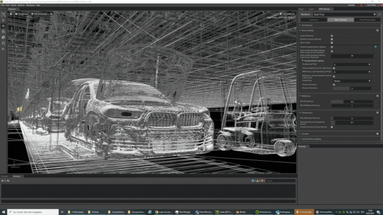

# 冷眼重看元宇宙：工业元宇宙

​     揭开价值的本来面目，是火爆的一塌糊涂概念：元宇宙。

​    18年前终结的《黑客帝国》三部曲又要重启了，上映日期很有意思，是今年的12月22日。在预报片里，曾经的男神女神已经衰老，他们再见面的时候，尼奥握住崔妮蒂的手略长了一会儿，崔妮蒂谨慎的抽离。问：我们认识？  看到这里，星空君已经麻木的心抽搐了一下：两个曾经把命交给彼此的深深爱着的人，竟然变的如此陌生。或许，过去和未来，都只是一厢情愿的梦境。《黑客帝国》系列是把元宇宙概念介绍的最为栩栩如生的电影，其实《黑客帝国》的世界观在向1989年就开始连载的漫画《攻壳机动队》致敬。

​     在《攻壳机动队》的世界里，打通了人脑和互联网的屏障，技术模糊了现实世界和虚拟世界的边界。很长一段时间，星空君对元宇宙的认知，主要停留在基于增强现实的游戏领域。和手机不同，VR/AR设备携带并不方便，所以元宇宙不太可能出现手机游戏、APP这类应用的爆发式的增长。所以对这个概念的认知，以炒作为主。直到有一天，星空君发现，Nvidia搞了一个虚拟协作平台Omniverse。Omniverse能做什么？以宝马为例。虚拟工厂包含了大量细节，甚至在同一时间可以模式300辆汽车，每辆汽车的数据大小就有10GB左右。基于这个的一个数字工厂，宝马可以让全球的工程师、设计师、专家等融合到一个场景中协作，共同进行产品规划、设计、模拟等等复杂的工作，甚至在数字工厂中完成整套产品规划，到最终上市的流程。根据宝马汽车管委会的声明，基于Omniverse平台的生产效率比以往高30%，宝马汽车的目标是在全球31家工厂建立数字化版本。除了宝马，爱立信、沃尔沃、Adobe、Epic Games在内的众多公司都正在与Omniverse合作。这不是星空君理解的那个元宇宙了，这是工业互联网升级版，工业元宇宙！换言之，元宇宙最广泛的应用，很可能不是面向广大C端消费者，而是工业互联网相关的B端客户。从这个角度看，那么元宇宙概念，需要优先关注的行业，就偏向工业领域。

​    1、人工智能

商汤科技、云从科技、依图科技、旷视科技，传说中的AI四小龙，商汤在招股书里着重分析了公司的元宇宙布局。商汤在工业企业领域布局比较深，很多传统工业企业都开始和商汤有合作。科大讯飞作为AI老牌概念，现在主要应用的领域是政府机关和教育领域，工业领域接触比较少。除此之外，还有海康威视和大华股份。二者的摄像头几乎覆盖了绝大多数工业企业和线下零售企业，随着产业结构升级，基于摄像头的人工智能需求越来越强烈，倒逼海康威视和大华股份在这方面投入大量的资源进行研发。如今，海康和大华已经成为人工智能领域，隐藏的巨头。

​    2、芯片

元宇宙主要用的是显示芯片，所以是黄老邪的Nvidia和AMD的天下，Intel恐怕是被时代抛下了。寒武纪的AI芯片也许会有些许机会。

​    3、基于工业互联网的软件

游戏软件先缓一缓，工业应用的软件来说，用友、东软等工业互联网相关的软件公司，机会比较多。主要原因是它们长期和工业企业深度合作，可以在元宇宙平台上进行无缝升级。

​    4、VR/AR硬件

歌尔股份比较早的卡位这个赛道，但工业元宇宙启动后，歌尔应该不是唯一选择。会有更多的电子类硬件企业进入这个领域，尤其是有工业级电子设备生产经验的企业，更有优势。

​    5、耐心等待

​    从目前行业应用来看，即便是Omniverse，也是非常超前的小范围试用。虽说这是一个比较确定的方向，但距离大规模商用还有非常遥远的距离。现在具体关注哪家公司，还为时尚早，但是这个方向一定要留意。或许，一次漫不经心的技术革命后，工业元宇宙就迅速崛起。正如《基督山伯爵》最后一句，人类的一切智慧是包含在这四个字里面：“等待”和“希望”。

