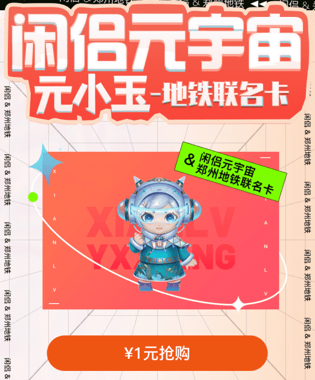
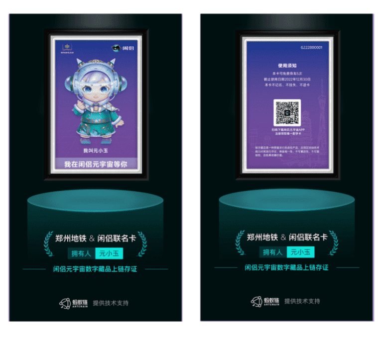

# 闲侣元宇宙首发数字藏品 联手郑州地铁探索新风口

2021年正式进入元宇宙元年，中国元宇宙核心市场及相关产业飞速发展，随之而来的数字藏品、区块链、虚拟人等相关产业应运而生。2022年2月1日闲侣APP正式上线，以元宇宙为核心，星域社交为属性，立志成为你的元宇宙彼岸的摆渡者。上线五个月，注册用户已达百万，在元宇宙的发展道路上稳步前进，为回馈广大用户，闲侣和郑州地铁合作推出数字藏品。

**闲侣元宇宙对数字藏品的探索**

闲侣&郑州地铁联名计次卡将于2022年7月22日15:00登陆闲侣APP，一元即可获取，限量1000份，先到先得，购买的数字藏品也会上链存证，保证藏品的独家专属权益，除此以外，还将获得一张实体联名计次卡，价值28元，可使用5次，不限里程，不限路线，随意换乘。在联名卡的正面是闲侣元宇宙吉祥物元小玉的专属形象，头戴耳机样式的未来科技感头盔加上国潮元素的蓝绿色系服饰，而渐变蓝紫色星空背景，加入散射状的白色线条，更将科幻感表露无疑。

此次闲侣推出的第一款数字藏品，不仅符合Z世代年轻人的潮流属性，而且更兼具实用性，让大众在收藏的同时获得体验感，并为后续上线的数字藏品顺利发行做保证。未来元宇宙商业模式会经历各种各样的变化，科技创新发展会将社会逐步带入数字化经济时代。

在未来元宇宙时代发展背景下，闲侣未来将打造满足不同人群的虚拟场景，依托元宇宙的概念，将数字藏品和实物有机结合，打造全新数字化元宇宙模式，让收藏用户在获得数字藏品和实物藏品的同时，获得更多的藏品附加价值。

**元宇宙对未来社会的重要影响**

元宇宙作为科技发展下的时代产物，将引发新一轮工业革命，创造新的经济增长模式，并成为数字经济发展新的增长点和强大的推动力，助力实体经济更好发展。

元宇宙的发展，对未来产业及社会发展具有重要意义。变革人们的工作、娱乐、购物和学习体验，还将对教育、建筑、工业、医疗等行业产生深远影响并引导未来数十年的技术变化，在未来平行世界与平行控制的概念将进一步发展，虚拟与现实的时空隧道也将实现互联互通。

就元宇宙目前的发展而言，目前市面上可实行的技术还无法实现小说里“脑机结合”，对于当下来说，5G、大数据、AI、VR的发展，加速了元宇宙概念的落地期，闲侣元宇宙以社交为媒介，数字藏品作为内容载体，致力于构建全新的元宇宙数字世界。

闲侣此次联名郑州地铁推出【元小玉】系列数字藏品第一期，是虚拟数字世界与现实科技的有机结合，也是闲侣走向数字藏品领域的第一次探索，未来闲侣还会带来更多具有收藏价值和潮流属性的数字藏品，持续给数字藏品赛道赋能，希望大家多多期待和关注闲侣，看到闲侣元宇宙的无限可能。

河南七进制网络科技有限公司作为闲侣APP的独家运营商，为顺应互联网行业发展趋势，提升科创文化的产业升维，助推河南元宇宙生态产业的加速迈进，凭借自身科技创新实力，进军元宇宙这个未来的万亿级市场，致力于打造一个元宇宙社交平台，将虚拟世界与现实世界在经济领域、社交领域、场景化应用领域上密切融合，为每一个用户，每一个行业带来全新的赋能体验，开启颠覆式的全新模式。公司以数字化世界的构建者，虚拟与现实的连接者为愿景，旨在针对元宇宙相关领域的长期性和开放性进行探索与研究，实现对未来数字化发展的构想，致力于成中国元宇宙头部企业之一。
