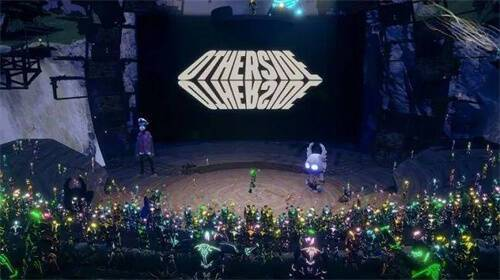

# 百度元宇宙项目推出直播平台 云宇宙NFT最新动态

**百度智能云将推出数字人直播平台**

近日，由百度与央视新闻联合举办的2022百度世界大会将在线上召开，本届百度世界大会以“AI深耕，万物生长”为主题，探索AI走向工厂车间、田间地头的路径，百度智能云将推出数字人直播平台，可实现超逼真的数字人24小时纯AI直播，支持任意切换妆发、服装、场景。

届时，百度世界大会将在央视新闻客户端、百度APP、爱奇艺、好看视频等多个核心媒体平台，以及央视新闻全媒体平台账号、百度全媒体平台账号同步播出，并在元宇宙希壤设置会场。

数字主播相比真主播，数字主播可以不受人员、时间和空间的限制，无需中控人员的支持，无需过多的硬件设备，将至少为商家降低直播成本30%以上。

**无聊猿的元宇宙项目Otherside 发布了白皮书**

Yuga Labs在其元宇宙项目Otherside测试成功后，发布了其项目的 Litepaper。据该公司称，该文档可作为 Otherside 的入门指南，因为它涵盖了平台的基本操作方法、开发人员以及社区共建方案。该白皮书涉及该项目的八个重点领域（加上附录），包括：简介、原则、航海者和开发人员、ODK、引擎、Agora、ApeCoin 和进程时间表 .

Yuga Labs从Otherdeed Land NFT的持有者中抽出4300名幸运者对元宇宙项目Otherside 进行“首次旅行”（又名测试演示），参与测试演示的 4,300 名航海者在Otherside里，受到了一只巨大的无聊猿和一只名为“蓝色”的 Koda 的欢迎。

**中国邮政数字藏品平台将正式上线，并推出中秋数字藏品**

中国邮政文创数字藏品平台将于7月23日上线试运行，开启“元宇宙”初体验，该平台由腾讯至信链提供区块链技术支持打造，是中国邮政迈向“元宇宙”、推动文创数字化产业高质量发展的有益尝试。

中国邮政将以“中秋”为主题发行中邮文创首款限量数字藏品，限量发行1万份。

