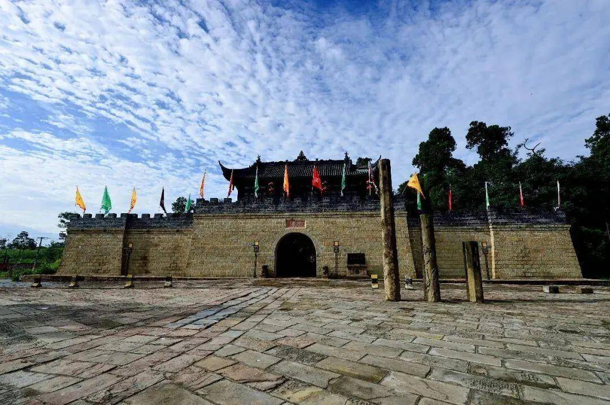

# 庞统祠博物馆入局元宇宙，独家授权魔洞Art发布首批NFT数字藏品

2022年6月6日，国家文物局第二季度例行新闻发布会首次以网络直播的形式在线召开，会上公布了今年文化和自然遗产日的主题为“文物保护：时代共进、人民共享”，宣传口号包括 “让文物活起来，提升中华文化影响力” “文物融入生活，展现时代风采”等。

自2006年开始，每年6月的第二个星期六为我国“文化遗产日”，遗产日期间全国各地文物文化单位都会组织开展丰富的当地文物展示与传播互动活动，其目的是让大家了解身边的历史文化遗产，弘扬中国上下五千年传统文化内涵，倡导大家保护传统文物的理念。

国务院批准设立“文化遗产日”的同一年，2006年5月，四川省庞统祠博物馆被国务院批准为全国重点文物保护单位。作为全国唯一为纪念三国时期政治家、军事家庞统(号凤雏)而设立的专祠，始建于东汉末年，经过时光流转几经兴废，屡次培修、重建，最终形成现有的规模，是研究三国时期蜀汉政权的重要实物资料，具有重要的历史、军事、交通、文化、艺术、科研价值，在全国三国遗迹中都占有重要地位。

“加强非物质文化遗产保护和传承，积极培养传承人，让非物质文化遗产绽放出更加迷人的光彩”，践行非物质文物保护和传承、推动经济社会可持续发展、打造中国文化传承弘扬展示示范区、建设国际知名文化旅游目的地为各地文物文化单位的首要目标。

庞统祠博物馆所在的白马关AAAA级风景区积极推进当地文旅融合发展。以庞统祠博物馆为中心向周边辐射，将其具备的三国文化、佛教文化和自然生态优势整合，目前已建成五丁谷、倒湾古镇、五美寨等多个或有历史、或有文化、或有故事的特色古镇;沿金牛古道还有凤雏湖、倒湾古镇、八卦谷、落凤坡和庞统血坟，每年都会定期举办源自后汉流传而来的庞统祠庙会，闯奇阵、拜血坟、游古镇、观祠堂等贴合本地民俗特色的互动活动，丰富人们的生活;此外，风景区内近两年还先后举办了帐篷音乐节、全国山地自行车精英挑战赛、中国全地形车(ATV)锦标赛、新春仿古祭祀、庖汤民俗文化美食节等大型赛事和文化活动。

**元宇宙赋能文旅，带动产业发展消费新场景** 

社会在进步，互联网的现代化发展带领人们进入了信息大爆炸时代，大众的目光被触手可及的新鲜事物和丰富多样的热门潮物所吸引，对于“沉睡”在博物馆中历经千年岁月淬炼的中华文物却失去了探索的欲望。而中华文物作为历史和文化的载体，凝聚了一代又一代祖先们的智慧，证实了中华上下五千多年的辉煌文明史。历史文化的传承是文物保护最重要的意义，文物不应该只是一件“沉睡”的物品，而应该“活起来“”诉说”历史，进入大众生活，丰富大众文化内涵，为大众构建更多元和多彩的社会生活环境。

从去年元宇宙元年发展初期到如今文娱领域、实体产业等纷纷布局入场，特别是在文博圈掀起的“博物+元宇宙”风潮，无疑是为各行各业打开了市场新赛道。而近期，庞统祠博物馆也宣布涉足全行业火爆的元宇宙领域，与魔洞数藏(重庆)科技有限公司签订相关合作协议，正式开启数字化发展道路。此次合作将共同展开推动庞统祠博物馆IP成品在魔洞Art数字藏品交易平台的NFT相关宣传、发售、线上/线下推广活动，后期还将合力打造开放化数字博物馆、VR沉浸式虚拟展厅，数字人体感互动等最新潮的区块链和技术赋能文旅。

四川省庞统祠博物馆携手魔洞Art联合推出的“庞统策蜀定国基”数字藏品，将于7月20日下午16:30在魔洞Art数字潮流艺术平台开启不限购发售，三国文化爱好者千万不要错过。
