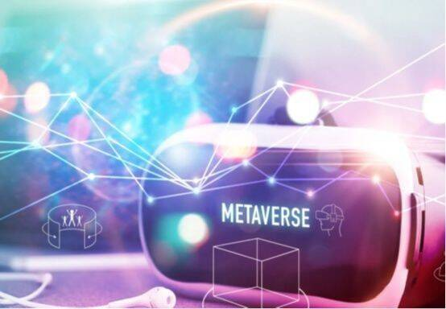

# 元宇宙发展趋势

元宇宙作为虚拟与现实交汇融合的未来世界新图景，具有虚拟世界与现实世界，数字技术与实体产业，人工智能与人类智慧深度融合的新趋向新特点。研究探讨元宇宙未来发展趋势,客观审视元宇宙变革发展的巨大影响，深刻洞悉元宇宙给人类社会带来的挑战机遇，旨在推动元宇宙与人类社会发展同频共振，互促共进。

**技术趋势**

元宇宙作为虚拟与现实交汇融合的未来世界新图景，具有虚拟世界与现实世界，数字技术与实体产业，人工智能与人类智慧深度融合的新趋向新特点。研究探讨元宇宙未来发展趋势,客观审视元宇宙变革发展的巨大影响，深刻洞悉元宇宙给人类社会带来的挑战机遇，旨在推动元宇宙与人类社会发展同频共振，互促共进。

元宇宙汇集了一系列下一代技术，从云计算到人工智能 (AI)、区块链、加密货币、网络安全、物联网(IoT)、虚拟现实(VR)、增强现实(AR)、数字孪生和广告技术。

**虚拟现实和增强现实。**元宇宙是数字媒体的下一个大主题，VR和AR是推动其发展的关键技术。这两项技术将使虚拟世界身临其境，并允许用户与虚拟对象、人和环境进行交互。尽管VR和AR都处于发展的初期阶段，并且元宇宙在很大程度上仍是概念性的，但AR在短期内将比VR更具优势。这是因为与笨重的VR耳机相比，AR可以通过网络浏览器和智能手机访问。元宇宙（Meta）、微软和联想等公司正在大力投资开发与元界相关的VR和AR。2021年，元界投资100亿美元开发VR和AR硬件和软件，以实现其元宇宙愿景。2022年4月，联想宣布了一项五年计划，将投资150亿美元用于虚拟现实和云服务的元宇宙研究。在消费者方面，AR和VR元宇宙专注于游戏、电子商务、社交媒体和现场活动。未来三年进VR和AR的相当一部分投资将集中在开发元界体验和平台上。

**人工智能。**人工智能是元宇宙的重要工具，影响着价值链的各个方面。它将支持半导体中的计算能力，处理设备上生成的用户数据，在软件平台中创建虚拟世界和化身，并允许在体验中创建内容和交互，使虚拟世界具有沉浸感和吸引力。科技巨头正在投资开发人工智能来构建他们的元宇宙能力。2022年3月，高通宣布了一项1亿美元的基金，用于支持将AR和AI集成到其元宇宙平台和体验中的开发人员和公司。元宇宙还致力于开发可以理解多种模式的统一AI模型，这意味着它们可以在聆听的同时阅读嘴唇，以获得更好的语音识别，或者通过同时分析文本、图像和视频来识别违反政策的社交媒体帖子。游戏开发商正在使用AI来提高非游戏角色的智能，而社交媒体公司则使用AI来进行内容审核、安全和隐私以及内容创建辅助。随着AR和VR等技术的成熟，越来越多的用户注册元界，以及未来几年出现新的用例，人工智能的重要性将会增加。元宇宙产生的海量数据也需要人工智能进行解释和分析。

**云计算。**虚拟世界的沉浸式和无处不在的方面将越来越需要云计算工具来处理、存储和分析平台上生成的数据。如果元宇宙平台无法提供无缝的用户体验或难以扩展，它就不会成功。2022年3月，英伟达（Nvidia）推出全方位云（Omniverse Cloud），这是一套云服务，让艺术家、创作者、设计师和开发人员可以访问全方位，以进行3D设计协作和模拟。亚马逊、谷歌、微软、IBM和阿里巴巴等云服务提供商将受益于不断增长的元界主题。他们将记录迫切需要访问按需计算、存储和分析服务的元宇宙平台对其服务的需求增加。随着未来三年元界的扩展，平台所有者也将需要边缘计算解决方案。

**网络3（Web3）。**网络3是一种与元宇宙底层基础设施相关的意识形态。它将严重依赖区块链技术，并由社区设计和管理。网络3将为网络2的一些限制提供解决方案，特别是与内容和数据的所有权和控制权相关的问题。这是对元宇宙、谷歌母公司、亚马逊和阿里巴巴等大型科技公司所拥有的封闭式生态系统的反应，这些公司不允许用户拥有内容所有权或了解其数据的使用方式。网络3和元宇宙经常被误解为相同，因为两者都集成了类似的技术，例如区块链、人工智能和云。结果，尽管它们存在根本差异，但默认情况下，一个的发展将推动另一个的进步。

**不可替代货币（NFT）。**来自饮料、音乐、电子商务、娱乐、体育和旅游等行业的大公司也对不可替代货币感兴趣。这些公司正在让投资者、媒体和消费者关注不可替代货币和元宇宙。根据Dapper实验室的数据，全美篮球协会（NBA）的热门行业是一个购买、出售和收集NBA NFT的市场，在2019年至2021年8月期间产生了超过7亿美元的销售额。根据 NFT 数据聚合商加密货币的数据，随着虚拟形象和数字艺术越来越受欢迎，2021年不可替代货币的销售额达到185亿美元，比2020年增长了570倍。预测表明，2022年新的不可替代货币市场将超过300亿美元，许多品牌将不可替代货币视为进入元宇宙的门户和新的收入来源。

**宏观经济趋势**

游戏和社交媒体公司处于元界发展的前沿，但未来三年企业将引领潮流。这种转变将受到从零售到医疗保健和金融服务等各个行业正在进行的未来工作和数字化转型计划的推动。大数据技术正在倡导元宇宙，微软和元宇宙将其作为支持混合工作的理想环境进行宣传。

**元宇宙炒作。**元宇宙在很大程度上仍然是概念性的，但对它的投资越来越多，源于人们相信它是互联网的未来。元宇宙、微软和英佩数码（Epic Games）等公司的大胆声明夸大了市场预期。此外，网络3爱好者借此机会通过承诺用户拥有其数据和内容的所有权，发起了一场针对大科技的所谓革命。虽然一些支持虚拟世界的技术，如人工智能 (AI)，多年来已经相当成熟，但其他技术仍在发展中。也就是说，推动创建元宇宙将促进这些技术的成熟度。

**消费者采用。**目前消费者对元宇宙的认知度很低，许多人认为这纯粹是营销炒作。营销自动化平台“克拉维约”在2022年2月对1,000多名美国人进行了调查，发现49%的人不知道元宇宙是什么？在听说过元宇宙的受访者中，大多数人对它的发展方式持怀疑态度，78% 的人将其称为炒作。该研究还强调，45% 的18-24岁的人不知道不可替代的代币(NFT)，甚至那些知道的人也不那么感兴趣。埃森哲在2022年对 16个国家/地区的11,000多名消费者进行的另一项调查显示，2021年，64%的受访者已经购买了虚拟商品或参与了虚拟体验。调查还发现，42%的受访者曾在购买实体商品时，虚拟世界获得建议、付款或浏览产品，而 56%的人计划在2022年这样做。

**广告。**广告将成为以消费者为中心的虚拟世界的主要收入来源。服装和餐饮服务等行业的品牌已经试图抓住这个机会。一些品牌与“堡垒之夜”（Fortnite）和“罗布乐思”（Roblox）等平台合作以扩大其广告机会，而另一些品牌则在The Sandbox和Decentraland购买虚拟土地。因此，Publicis.Poke、S4资本（S4 Capital）和韦纳尔媒体（Vayner Media）等广告公司正在创建部门来了解元宇宙并帮助品牌发现未来的机会。

**企业采用。**未来三年，企业将成为元界开发者的主要市场。随着Nvidia、Microsoft和Meta增强其元界能力，以及初创企业围绕数据可视化、协作和培训开发解决方案，新的用例将会出现。来自不同行业的公司正在关注增强现实 (AR) 和虚拟现实 (VR)或3D可视化，这将推动企业元界平台的发展。IT服务供应商Infosys 和Tech Mahindra推出了元界平台，以帮助客户探索主题中的机会并支持他们的数字化转型计划。在大型企业将元宇宙合法化的同时，开发用例将使更多的中小型企业在未来进入主题。

**未来的工作。**全球数据的未来工作主题框架包括五个主要类别：可视化、连接性、自动化、协作和解释。AR、VR、数字孪生、可穿戴技术、人工智能、5G和协作工具等未来工作技术正在推动虚拟世界的发展。微软、英伟达和元宇宙等大型科技公司，以及Varjo、Virbela和Spatial等初创公司，都将元宇宙视为工作场所协作的下一个阶段。虽然大多数企业元界平台都专注于协作，但有些平台使用数字孪生来复制物理位置。在采用方面，来自技术、银行、广告和专业服务等各个领域的大公司正在进入虚拟世界，重点关注工作的未来。然而，许多大公司正在采取观望态度。PixelMax和NextMeet等初创公司正在虚拟世界中开发虚拟工作场所。它们允许用户在家工作时在虚拟办公室中与同事的化身见面，以进行社交、协作和游戏化学习活动。一些初创公司也在为企业创造可用于元宇宙的技术。

**元宇宙安全。**安全是虚拟世界中的一个关键问题。要解决的关键问题之一是性侵犯，这在现有的虚拟平台上很普遍。在2021年的试验期间报告了元宇宙的地平线会场中的性骚扰。另一个挑战与儿童有关。父母很难确保他们的孩子留在适合年龄的虚拟世界中。平台开发人员必须从根本上整合安全搜索、亵渎过滤器和父母对儿童活动的监控等设置。与元宇宙相关的底层技术，如社交媒体平台，已经被视为对许多人造成广泛破坏。不幸的是，归因于这些平台的问题可能会在元宇宙中扩展甚至加剧。它不仅会遵循类似的基于广告的模式，而且会更加身临其境，更深入地融入用户生活的大部分方面，并且更难监管。

元宇宙已经在致力于缓和其虚拟世界中的有毒行为。它为两个VR应用程序（Horizon Worlds 和 Horizon Venues）添加了一个名为个人边界的安全功能。个人边界功能允许化身在其周围添加一个半径为两英尺的气泡，从而阻止用户近距离接触。但鉴于元宇宙还不是主流，还有很多工作要做。元界开发人员必须将调节行为视为一个基本方面。

**监管趋势**

元宇宙将使数字媒体体验比今天更加身临其境、更具包容性和可访问性。然而，它会引发从数据隐私到其他形式的在线伤害等社会问题。

**网络中立。**网络中立性是指电信网络应该是互联网的中立网关，而不是有权决定哪些内容可用或内容以何种速度传输的看门人。流经世界电信管道的绝大多数数据来自超大规模数据中心，由大型科技公司的互联网生态系统拥有和运营。根据网络中立规则，许多国家的电信运营商和有线电视运营商不得就其消耗的大量互联网带宽向奈飞公司、谷歌、亚马逊、元宇宙、微软、阿里巴巴和腾讯等公司收取商业价格。在过去的二十年里，这些规则的影响是科技行业的权力平衡发生了巨大的转变，从电信运营商转向了大型科技公司。元界对互联网带宽的需求将比今天的互联网流量水平上升几个数量级。除非他们着手进行重大的宽带基础设施投资计划，否则这几乎肯定会使电信网络过载。然而，如果他们继续补贴大型科技公司对其网络的使用，这不太可能。

**元界和数据隐私。**增强现实(AR)、虚拟现实(VR)和广告的使用将成为虚拟世界中不可或缺的一部分，这反过来又会引发数据隐私问题。监管机构将推动元界公司解决与底层技术相关的已知隐私问题。尽管平台开发人员将通过设计采用隐私来安抚监管机构，但随着这些平台在未来几年的成熟，数据隐私问题将越来越多地浮出水面。专注于消费者或企业使用的多个元节正在开发中。元界开发人员将拥有自己的数据保护政策，并且更愿意在平台商业化的最初几天进行自我监管。虽然今天没有虚拟世界法规，但现有的立法可以应用于虚拟世界，这将引发公司需要考虑的问题。欧盟 (EU) 的《通用数据保护条例》(GDPR) 就是最好的例子，因为它考虑了保护个人数据，包括生物特征数据。

AR和VR设备将生成和处理大量个人数据，包括来自眼球追踪和身体追踪技术的生物特征数据。过去，欧盟监管机构曾对公司，尤其是大型科技公司处以与数据隐私相关的罚款。因此，预计元界将接受严格审查。世界各地的监管机构将迫使Metaverse平台开发人员解决与为Metaverse提供支持的底层技术相关的现有或已知隐私问题。也就是说，数据隐私法规在地理上是分散的，因此平台开发人员必须确保在其运营的任何地方都遵守当地法律。

**中国科技监管机构。**由于其庞大且日益富裕的用户群，中国对于虚拟世界来说是一个潜在的利润丰厚的市场。中国的大型科技公司和著名的初创企业拥有能够帮助建立元界平台和体验的使能技术、成熟的消费者基础和显着的全球合作伙伴关系。例如，腾讯拥有Epic Games 40%的股份，是元界开发的先锋。游戏、社交媒体和电子商务可能是最受中国公司和消费者关注的虚拟世界应用。随后，随着主题的发展和底层技术的成熟，现场活动和企业协作也将获得关注。这些公司将主要根据经验进行竞争。例如，预计腾讯将挑战网易的游戏特定元世界，同时也挑战阿里巴巴的电子商务产品。字节跳动，一个影响力越来越大的颠覆者，将在社交媒体、企业协作和游戏等领域挑战腾讯和阿里巴巴。

中国对加密货币的禁令反映了其对去中心化货币的反对。这迫使消费者投资法定货币来交易不可替代的代币（NFT），从而使政府能够监督交易。最后，中国保护未成年人的心理健康和国家传统，这或将影响中国游戏和“虚拟偶像”行业的法规。随着元界平台上出现新的体验，监管机构将采取措施防止对年轻人和社会造成任何固有风险。
