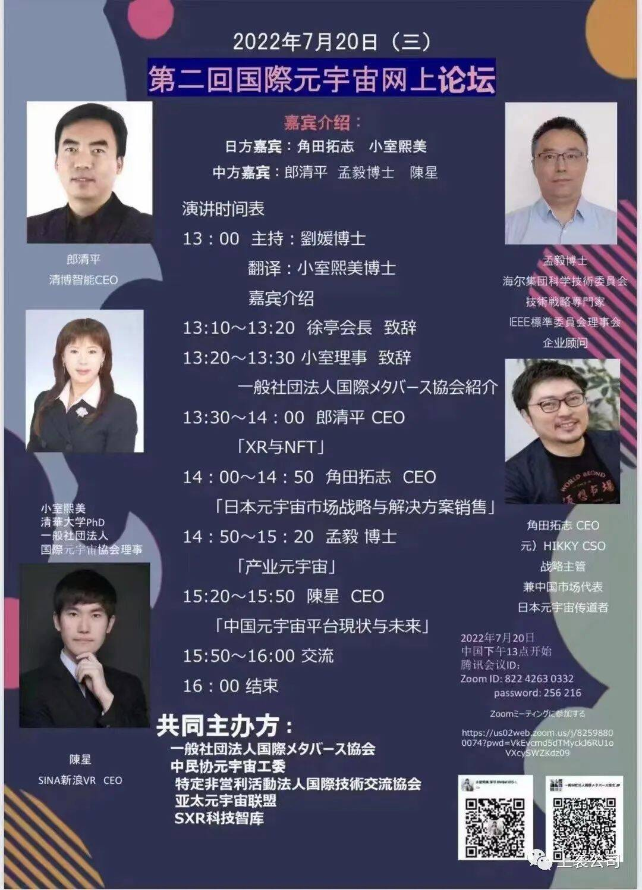

# 致辞 | 徐亭：让元宇宙更好赋能实体经济

cSXR科技智库创始人及理事长、中民协元宇宙工委联席会长徐亭出席致辞，提出让元宇宙更好赋能实体经济，他希望中日双方以及世界范围内有更多的有识之士参与到元宇宙产业化和产业元宇宙化的深度融合中来，共同推动数字经济与实体经济深度融合发展。

.jpg)

.jpg)

.jpg)

**图为SXR科技智库创始人及理事长、中民协元宇宙工委联席会长徐亭出席第二届中日国际元宇宙高峰论坛致辞**

**在第二届中日国际元宇宙高峰论坛致辞**

徐亭

SXR科技智库创始人及理事长

中国民营科技实业家协会元宇宙工委联席会长

中国未来研究会元宇宙与未来产业分会联席会长

中国电子商会人工智能委员会联席会长

（2022年7月20日）

各位嘉宾，下午好。

我是SXR科技智库创始人及理事长、中国民协元宇宙工委联席会长、中国电子商会人工智能委员会联席会长徐亭，非常高兴受小室熙美理事长邀请邀出席本次峰会。首先我代表中国民营科技实业家协会元宇宙工作委员会，向出席本次论坛的各位嘉宾、朋友们表示热烈欢迎，向筹备本次论坛的中日双方合作伙伴表示感谢。

我目前主要从事智能+产业融合、元宇宙+产业融合，以及产业链与创新链融合等领域的研究。随着元宇宙不断创新发展，元宇宙从概念到落地已经取得重要进展。当前，元宇宙与产业的融合发展，是个极具挑战性的主题。建议各行各业都要以创新的思维模式，利用元宇宙相关的支撑技术，基于元宇宙工程方法论，从策划、设计、实施到验收，对传统业务进行改造和提升，助力产业发展，最终让元宇宙更好的赋能实体经济。

今年6月23日，“以科技向上，创新逆袭”为主题，2022上袭数字论坛举办，论坛专设了数字元宇宙平行论坛，邀请了几位重要院士专家做了主旨演讲，与会院士专家一致认为:元宇宙是一个数字空间，其本质上是对现实世界虚拟化、数字化的过程，是下一代互联网技术的汇聚。产业界如何推广应用元宇宙技术，是一个值得研究的课题。元宇宙就要通过人工智能、区块链、大数据等技术，来促进人们的体验更真实，决策更精准，能够更加高效的指导我们的生产过程、指导我们的生活方式等等。从PC机互联网到移动互联网、到元宇宙，人与人、人与信息、人与商品、人与服务的关系发生了深刻的改变，带来了场景的革命。

因此，研究元宇宙的多种支持技术，如物联网、工业互联网、区块链、人工智能、虚拟现实、数字孪生、虚拟人、动作捕捉、智能家居、智能建筑、信息模型（BIM）、虚拟现实、仿真系统等技术，从而让元宇宙技术更好的赋能实体经济，为科技人员、中小企业、管理层、工薪阶层、创业者、设计师、自媒体等对传统业务进行改造和提升，开拓新的业务领域，具有重要意义。

基于此，由中民协元宇宙工委牵头编著的《产业元宇宙》一书即将出版，这本书重点介绍了元宇宙的本质和内涵，元宇宙的底层经济系统；产业元宇宙的相关技术和典型应用场景；对产业元宇宙的几个重点问题进行分析，以及元宇宙工程的建设和实施，特别是对元宇宙的设计师和架构师及元宇宙体系的七大模块、创建元宇宙的科学方法论进行了全面介绍，尤其对元宇宙发展及产业融合存在的问题、机遇和挑战进行了概述和分析。《产业元宇宙》一书阐述了元媒体、游戏化思维、元宇宙工程、元宇宙架构师等概念，描述了元宇宙技术的产业应用，包括在工业、能源、农业、金融、房地产、教育等领域应用，从而为研究、推广、应用元宇宙技术的科技人员提供了参考。通过对产业元宇宙的多视野、多角度的深入分析，为读者了解、学习、参与产业元宇宙的创新实践提供了非常好的工具书和参考读物。

希望更多的有识之士参与到元宇宙产业化和产业元宇宙化的深度融合中来，建议中日双方有识之士可以战略合作，共同推动数字经济与实体经济深度融合发展。

