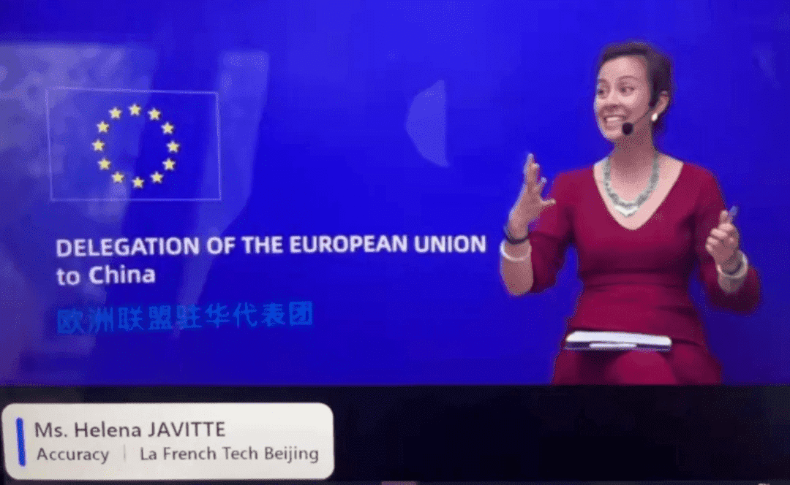

# 元宇宙在中国：为什么重要？

5月25日，**安可锐咨询** 参与并支持了**欧盟驻华代表团**组织的活动。安可锐是**法国科创驻北京**(French Tech Beijing) **的赞助商之一**。作为 **安可锐** 北京办公室的创新经理，Helena Javitte 主持了此次网络研讨会，主题为***“元宇宙在中国：为什么重要？”******。\***本篇文章回顾了本次研讨会的精彩内容，并进行了核心观点总结。

.jpg)

此次活动由**法国大使馆**协办，活动举办时，**法国正担任欧盟理事会轮值主席国。欧盟驻华大使 Nicolas Chapuis**，和**法国驻华大使 Laurent Bili** 也大力支持并出席了本次网络研讨会。

.png)

*欧盟驻华大使尼古拉斯·查普伊斯*

本次活动中，策纬咨询公司（Trivium ）技术政策研究主管 **Kendra Schaefer**女士分享了她在中国政策方面的经验与知识，海银资本创始合伙人**王煜全先生**介绍了他认为初创公司成功的所需满足的技术要求，法国智奥会展（GL events ）大中华区联席总裁 **In****è****s Ginon****女士**阐述了元宇宙正在如何影响娱乐和活动行业。

法国科创驻北京总裁兼安可锐咨询创新经理**Helena Javitte**女士向嘉宾们提出了五个问题：

**1. 中国是如何定义元宇宙的？**

**2. 元宇宙能否提供线下世界无法提供的体验？**

**3. 中国与世界其他地区的元宇宙有何不同？**

**4.** ***\*适应数字化世界的大前提是什么？\****

**5.** **元宇宙行业的玩家应该注意什么？**

Kendra 首先解释了中国为**规范元宇宙产业**所做的努力，虽然元宇宙还没有被完全定义。Kendra 认为 中国肯定意识到了元宇宙的潜力，并注意到了它对**社会和政治**可能产生的影响。因此，中国目前已经进入了**政策准备阶段**，成立了中国第一个关于元宇宙的专业协会（中国移动通信联合会元宇宙产业委员会），其清晰地描绘了在他们看来目前中国元宇宙处于什么阶段。**中国移动通信联合会元宇宙产业委员会****由国家发改委新基建主管单位领导**，他们一直在不断邀请来自多个领域（游戏、学术界、新闻、电商等）的新成员。

**中国现代国际关系研究院**表明，中国对构建一个代替宇宙的风险持谨慎态度，该研究院是一个直接向国家安全部报告的智库，在6 个月前，其概述了元宇宙可能带来的国家风险。

中国的目标很明确：**建立标准以便在全球发挥领导作用。**

其后，海银资本创始合伙人王煜全先生阐释了元宇宙能为商业带来的好处。首先，我们都知道可以利用数字孪生**对城市规划、城市管理或虚拟旅游进行模拟**，但王先生还强调，数字孪生可以用于**测试法律及其对社会的影响**；另外，由于中国对元宇宙在治理方面的将产生的影响很感兴趣，元宇宙还可能会被用来模拟群体行为反应；最后，从产品的角度来看，人们可以利用元宇宙创建数字版产品，并可以**轻松地测试和更新产品**，而不必再像目前那样利用硬件和原型测试。

Inès女士坚持认为, 娱乐行业是第一个受到元宇宙影响的行业，因为元宇宙的第一优势就是帮助人们超越距离，去现实生活中本不能去的地方，遇到本不能见到的人，并能以不同的方式与产品互动：比如在汽车发布期间，参与者现在可以虚拟地测试汽车，而不仅仅从远处看汽车。

**中国 vs 世界其他地区**

中国和西方应用元宇宙的方式实际上是**不同和互补的**。王煜全先生解释说，西方更专注于**开发保证元宇宙无缝运行所需的基础设施**，例如构建解决方案以保证数据安全，而**中国则热衷于探索更具体的商业应用场景**。因此，王先生认为，如果中国和西方能够以互补性为基础建立合作，将会十分理想。

Kendra 也认为中国与世界其他地区之间的合作将是很理想的，但这种合作**最有可能仅在硬件上进行**，因为硬件不如元宇宙的基础设施敏感。Kendra说明，由于中国仍在努力打造技术霸权，涉及到国家利益的部分仍会被每个国家或地区控制。她还谈到，由于对**数据隐私**的不同看法，西方和中国的元宇宙可能呈现出不同的样子。在西方，法律站在用户一边，保护他们的数据不受到公司或黑客的侵害。在中国，政府也在保护用户，但政府也可以直接接触到元宇宙收集的数据。在中国的互联网上，人们不可能保持匿名，因为数字身份会与电话号码、微信、银行账户和身份证相关联。

另一个不同点可能关于，在中国，**私人空间和公共空间的界限在哪里**。实际上，**元宇宙上共享的内容到底应该被视为私人空间还是公共空间的问题，还需要进一步确定。****西方创造出的元宇宙很可能被定义为严格的私人空间，也就是说，从现实世界中很难接触到，或者禁止接触；****相较而言，****中国的元宇宙最终可能会成为现实世界向数字世界的延伸，****并且应用类似现实世界的规则。**

**建立数字世界的挑战**

作为一个投资科技行业的风险投资人，王煜全先生密切关注着元宇宙初创公司盈利的必要条件。他认为，就目前而言，**需要更多时间，技术才能完全成熟，想要盈利的元宇宙初创公司可能首先需要依靠投资者才能生存下去**。在技术方面，**除了与将要生成的数据量**（语音数据、生物特征信息、个人信息、数据传输等）**作斗争之外**，**不统一的标准和格式**也是一个巨大的挑战。如果没有共同的标准，**各个元宇宙的内容和项目就不能被无缝共享**。可以想象一下，如果几位中国的设计师在元宇宙中一起设计一辆汽车，然后他们决定将这个数字原型放到活动组织者的元宇宙平台上来用于进行汽车发布会，但这个元宇宙是在巴黎的云上构建的。如果没有统一的标准，他们很难把这辆数字版汽车带到西方的元宇宙平台，也就失去了建造数字汽车的好处。

**元宇宙行业玩家应该注意什么？**

关于公众对元宇宙的普遍担忧，王煜全先生说：担心未知的事情是很正常的，每当一项新技术和其应用出现时，都会发生这种情况。比如网购刚出现时，很多人常常担心在网上买东西是否真的可靠，担心被骗或者买不到高质量的产品，但总的来说，现在我们已经制定了较完备的保护网购用户的规则。他也提醒我们，其实你也不能确定你在商店买的东西是不是质量就好！

更重要的是，王先生还强调了“谁拥有数据”以及“如何使用数据”的问题。他认为，随着用户共享的数据越来越多，**他们有权并需要了解共享个人数据会带来的价值，这其中不仅包括了个人信息，也包括他们的在线行为。比起免费共享这些数据，他们应该有权拒绝共享，或者因共享数据而获得收益。**

Kendra 认为，元宇宙行业玩家应该记住，我们目前**还不清楚国家会如何监管元宇宙行业**。她建议可以**分行业**来看待监管的问题，因为每个行业都有特定的特征。在未来的5 到 10年，一旦国家更明确地定义了中国的元宇宙，大家可以看看哪些领域会被政府推动的资金和项目鼓励。

法国智奥会展（GL events) 大中华区联席总裁Inès女士邀请元宇宙行业的所有玩家参加 **11 月 21 日至 25 日举办的世界元宇宙博览会**，此次博览会将汇集所有玩家，以架起供需之间的桥梁。他们预计在百度平台“希壤”的支持下，此次博览会将汇聚约200家参展商。
