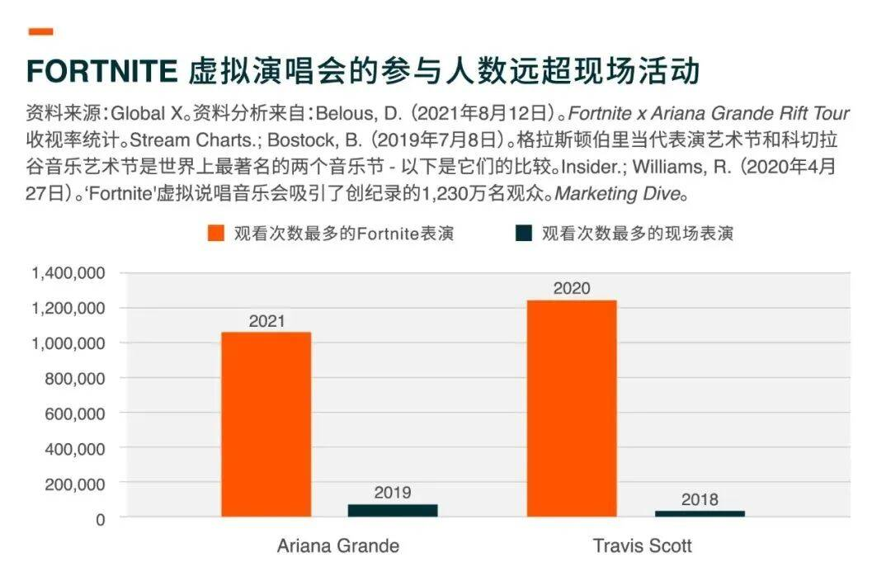

# 市场分析 | 关于元宇宙，看这篇就够了

过去6个月，世界各地的公司在他们的财报电话会议中超过240次提到「元宇宙」这个词。为什么这么多公司迷恋这个词语？

因为许多人预料元宇宙将兴起，成为互联网的下一轮进化，为现今领先的平台及科技巨头带来价值万亿美元的机会。

但是，什么是元宇宙？为什么它可能成为现今互联网的继任者？哪些细分市场最能从进化中受益？

在这篇文章中，我们将探讨这些问题以及更多内容，并讨论元宇宙可如何重塑我们在未来数码世界的体验。

**关键要点**

.png)

元宇宙代表了一个互联网，用户在其中犹如身临其境，并虚拟存在。元宇宙有几个关键特色，包括实时持久性、经济体、社区、数码替身和跨越多种设备的功能。

.png)

已经存在的元宇宙早期版本已崭露头角，让投资者一睹其巨大的潜力。假以时日，我们预计最成功的元宇宙将具有由区块链技术支持的去中心化开放式架构平台。

.png)

随着其持续发展，我们相信元宇宙可以为横跨多个垂直行业的公司创造收入机会，尤其是对于那些参与构建虚拟现实(VR)、拓展现实(AR)和混合实境(MR)的硬件及软件公司而言。

**定义元宇宙**

在现今的互联网，数码平台通常有助于促进实体世界体验。我们在亚马逊上购买商品，并运送到我们家中，在Instagram上分享我们最近外出吃晚饭的照片，以及在线购买麦迪逊广场花园演唱会的门票，与朋友一起观看。

在元宇宙中，数码平台促进数码世界的体验。利用虚拟现实耳机进入尤如身临其境的体验，我们将能够工作、玩电子游戏、购买数码商品、与朋友进行社交活动和进行媒体消费。元宇宙本身并不是一种技术，而是与我们世界互动新方式的一个愿景。简而言之，Meta Platforms的扎克伯格将元宇宙描述为一个虚拟环境，您可以与他人一起存在于数码空间中。[3］

广义来说，定义元宇宙的六个主要特征如下：

.png)

**身份：**虽然以数码形式存在于元宇宙中，但用户可以将自己表达为他们想利用替身成为的任何人或任何东西。科幻电影《头号玩家》描绘一个名为绿洲的无限元宇宙，引用其话如下：「人们来到绿洲是为了他们能做的所有事情，但他们留在绿洲是为了他们能成为的所有东西：高大、美丽、可怕、不同的性别、不同的物种、真人、卡通，全由你决定。」

.png)

**多种设备：**无论是手机、个人计算机、平板计算机还是其他设备，能够从任何地方进入元宇宙是一项关键功能。沉浸式虚拟现实体验可能是最大的跃进者之一，利用头戴式显示器让用户沉浸在计算机生成的环境中，在那里他们可以操纵虚拟对象。利用传统的屏幕和设备也可以进入较轻巧版本的元宇宙。

.png)

**身临其境****：**真正身临其境的体验涉及一个人的所有感官：视觉、听觉、触觉、嗅觉和味觉。现今，虚拟现实主要涉及环绕立体声和图像。新一代虚拟现实设备可能包括触觉衣和全方位跑步机，当用户在数码环境中游走时以电刺激为用户身体提供感觉。

.png)

**经济体：**一个发展成熟的元宇宙具有一个运作良好的经济体，用户可以数码或法定货币赚取收入和消费。具有在线经济体元宇宙的早期例子是游戏平台Roblox及其货币 Robux。购买Robux的用户可以Robux为他们的替身购买体验和物品。开发者和创作者可通过构建引人入胜的体验和用户想买的吸引商品以赚取Robux，并将Robux兑回美元等法定货币。

.png)

**小区：**用户在元宇宙并不孤单。他们互动并互相分享经验。观察元宇宙的早期型态电子游戏，成功的关键似乎是能够实现社交体验。动视暴雪首席执行官鲍比科蒂克指出，在群组与朋友一起玩的玩家比其他玩家花在游戏的时间多出三倍以上，对游戏内容的投资也多出约三倍。[5］

.png)

**实时持久性**：元宇宙预期是实时持久的，无法暂停体验，意味着即使在用户离开后它仍将继续存在并运作。与其他数码体验不同，这一特征将重点放在虚拟世界本身的持续发展上，而不是用户。

**早期发展显出元宇宙潜力**

 

元宇宙不是未来的构想，其早期版本已经存在。Epic Games的Fortnite为Ariana Grande和Travis Scott举行了虚拟演唱会，用户以他们的数码替身参与。这类型的活动取得令人震惊的成功，吸引了数百万粉丝，人数远超现场表演。

2021年8月，Meta Platforms向元宇宙迈出了重要一步，推出“Horizon Workrooms”，这是一个虚拟会议空间，让同事们可以数码替身的形式互动。[6］ 进入工作室需要Oculus虚拟现实耳机，并下载该免费应用程序。以上例子让大家窥视发展成熟的元宇宙最终可能是什么样子。

随着企业进一步投资于有关创建元宇宙的计划，请记着，我们所说的「元宇宙」不一定是集中垄断的，这点是重要的。元宇宙开发目前可能会带来更集中和更独特的体验，但它正在朝着完全去中心化的最终状态而努力。有别于《头号玩家》所描绘的元宇宙，其中真实世界被遗留在无限的虚拟世界之中，我们的世界中可能会出现几个元宇宙。

**未来的元宇宙有望从封闭式转向开放式架构**

现今企业主要通过封闭式架构系统提供元宇宙体验，意味着他们的软件和/或硬件并不兼容其他平台。各个平台通常针对不同的主要用例而设计，例如游戏、工作、购物或社交。

最终，我们预料最成功的元宇宙平台将向更加开放的架构发展，允许多方（若非所有）平等参与，包括用户、开发者和企业。

一个真正开放的元宇宙例子将会是一个由区块链技术支持的去中心化虚拟现实平台。构建于以太坊区块链上的Decentraland、Somnium Space、Sandbox等已经存在这样的概念。与其他虚拟世界和社交网络不同，没有任何一个代理人有权修改这些虚拟世界的软件、土地或其货币经济的规则。小区成员可以创作、体验，以及把内容和应用程序货币化。在某些情况下，小区成员可以购买、开发和出售土地，就像在现实世界中一样，土地是有限的，因此更有价值。

.jpg)

在最受欢迎的元宇宙平台中，我们期望用户能够找到运作良好的经济体，让他们可以消费或赚取货币。许多人将元宇宙视为娱乐和休闲的空间，利用数码空间与朋友会面、购物及/或进行媒体消费。这些类型的平台可能会受惠于网络效应：开始参与元宇宙的用户越多，数码体验就会变得越丰富，继而越多这些用户开始吸引他们的家人、朋友和熟人到平台。但元宇宙并非全是游玩。初期对于开发者和创作者，以及最终对于其他人来说，元宇宙将是他们的工作场所，让他们参与这些虚拟世界的业务。

参与用户只需一个入口点，无论是虚拟现实设备、智能手机还是计算机，以及互联网连接。但新一代硬件可能包括触觉衣、全方位跑步机和大脑感应可穿戴装备，让虚拟世界更加逼真。

**触觉衣：**无论是全身、仅背心还是手套，这些可穿戴装备通过电刺激或振动摩打为用户在虚拟现实和手拓展现实设置中提供触觉。当用户深入体验时，这些套装会模仿感觉，例如拥抱或雨滴。

**全方位跑步机：**向任何方向行走、奔跑和跳跃的能力将为用户的虚拟现实体验带来实体感觉。现今一流的全方位跑步机仅备有行走能力。但是，我们期望未来的技术能够创造更多身临其境的体验。

**大脑感应设备：**用户最终可透过具备分析、解读并将他们自己的神经信号转化为数码指令能力的设备来实时控制虚拟环境。在一些领先的设备中，机器学习算法对大脑活动进行译码，并识别活跃的视觉焦点，使焦点所在的对象在虚拟世界中移动。

**元宇宙可带来价值万亿美元的机会**

有证据显示，元宇宙可以横跨多个垂直行业创造广泛的收入机会，尤其是对于那些参与构建虚拟现实、拓展现实和混合实境的硬件及软件、半导体、以及创作者平台和经济体公司。如果包括广告、社交商务、数码活动、硬件、创建和开发内容等，这个机会可能会超过1万亿美元。[7］以下，我们将说明元宇宙最突出的垂直行业以及一些在行业中处于领先地位的公司。

.png)

**拓展现实、虚拟现实、混合实境及空间计算：**参与开发硬件及/或软件让用户体验或与延展数码实境互动的公司。这些公司包括：参与虚拟现实的公司，这是一种完全身临其境的模拟体验；参与拓展现实的公司，这是一个由计算机生成信息增强的真实世界环境；和参与混合实境的公司，这是一种混合显示，让用户同时体验实体和虚拟世界以及与它们互动。这些技术可以仿真或传递视觉、声音、触觉或动态以及其他信息。

Meta Platforms的Oculus Quest是虚拟现实套装的一个例子。自2019年和2020年分别推出以来，我们估计Oculus Quest 1 和 2 设备的总销量超过1千万台。[8］这些销售总额值得注意，因为Meta Platforms认为，要为开发者创建一个可持续且有利可图的生态系统，恰好需要1千万台设备。[9］虚拟现实生态系统中的应用程序开发远远落后于其他类型的设备（例如智能手机），导致目前缺乏优质内容。随着虚拟现实用户数量增长，开发者支持该空间的诱因也可能随之增加。

.jpg)

.png)

**创作者平台：**参与开发沉浸式数码平台的公司，这些平台使用户能够创建、共享和消费内容和数码商品。内容包括：社交网络；网上电子游戏、电子游戏引擎和电子竞技；直播；数码现场活动；以及在三维模拟、环境或世界中发送内容的其他媒体。

联合技术和Epic虚幻引擎（腾讯拥有40%）提供了一个关于创作者平台如何将内容带给市场的案例研究。这两家公司控制着大约三分之二的游戏和虚拟世界引擎市场。[10］ 他们提供的开箱即用解决方案是虚拟世界发展的基石。在他们各种主要属性中，他们的解决方案有助于降低将电子游戏带给市场所需的总成本和时间。

例如在2021年，联合技术在研发(R&D)上花费了6.96亿美元，该公司将这笔费用分摊给1,052名在这一年产生了超过10万美元销量的开发者。 这些开发者只专注在游戏的创意方面，而不是耗时的引擎构建和维护。这细分市场的商业模式可以有所不同。联合技术每月收取订阅费，而Epic则收取相当于销量5%的费用。

.jpg)

.png)

**创作者经济：**参与开发元宇宙数码支付服务基础设施和应用程序的公司。

.png)

础设施/硬件：**生产以下物品的公司：半导体；边缘运算、云端运算安全等云端运算技术；以及用于数码媒体消费及/或元宇宙及相关设备开发和维护的5G基础设施。

于这细分市场，半导体正为超越智能手机的世界作好准备。半导体乃虚拟现实、拓展现实及混合实境的基础元素，以达成它们的使命，鉴于它们所需的强大运算能力。辉达、三星电子和台积电等公司是这领域不可或缺的。例如，台积电正为苹果的虚拟现实和拓展现实野心订造4纳米和5纳米芯片。[13］

**结论**

就像互联网曾经经历的一样，元宇宙也处于早期阶段。但元宇宙的基础设施已经到位，越来越多公司表达（以言语及资金投放）他们正积极参与其发展。随着每一部分的构建和供应增加，我们预期消费者对于这个互联网新迭代的兴趣将会增加。认识到元宇宙是一个身临其境、实时持久的经济体对元宇宙蓬勃发展十分重要。元宇宙将既是一个经济发展的地方，也是一个休闲和娱乐的地方。完全成型的沉浸式元宇宙体验要变得普及需要几年时间，但我们相信早期投资机会已经出现。
