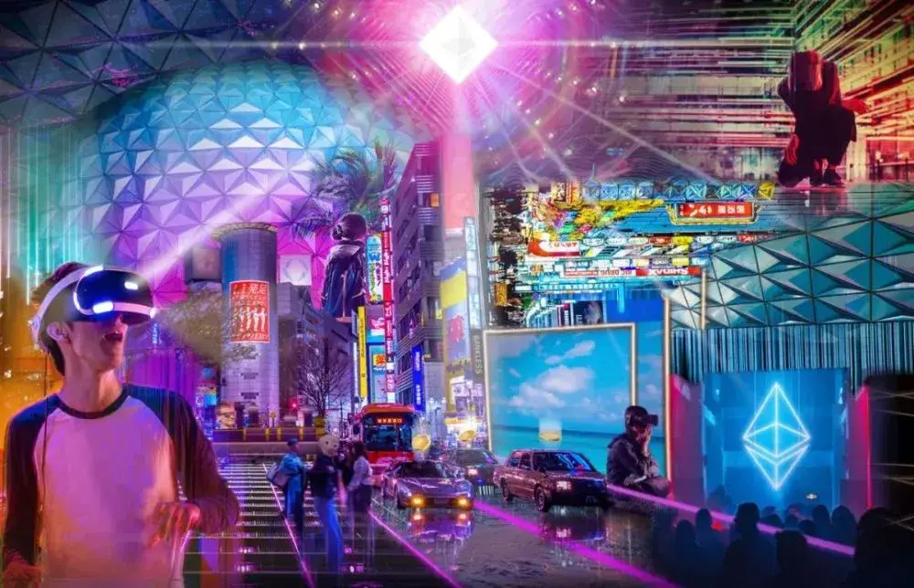

# 区块链如何赋能元宇宙？｜Thought for Today

# 区块链如何赋能元宇宙？｜Thought for Today

元宇宙（Metaverse）正在来临。

什么是元宇宙？这很难定义，有点像努力解释互联网是什么。

最简单的形式，元宇宙是人们在那里生活工作娱乐的虚拟环境。Zoom 视频会议软件是元宇宙的一部分。游戏也是，比如「我的世界」（Minecraft）和「堡垒之夜」（Fortnite）。

你甚至可以说 Facebook 也是元宇宙的一部分。不过，一个真正的元宇宙，类似电影「头号玩家」[1]那种虚拟现实，只可能借助区块链技术才能实现。在解释区块链如何赋能元宇宙之前，让我们来看看三个正在成长的趋势：

1.屏幕时间2.日益增长的技术浸入3.视频游戏

以上趋势促成并加速元宇宙的诞生。

屏幕时间

不久之后，大多数人开始将大部分时间花在虚拟环境中。嗨，如果你正在读这篇文章，你可能已经花费你大部分清醒时间在看（手机/电脑）屏幕了。

最近一项研究[2]表明英国成年人平均花费 34 年在看屏幕（电视、电脑、手机等），而美国的数字据说是 44 年。尽管美国这项研究[3]是一家眼镜公司赞助，我推测这数据差距不大。

而且，我们花费在屏幕的时间没有下降，而在增长。

技术浸入

人们不仅花更多时间盯着屏幕，而且以越来越多的沉浸方式与技术进行交互。如果我们鸟瞰历史回顾我们如何与技术互动的方式，可以很清楚地发现这一趋势。

**1830 年代的电报**：电报需要受训专家来解码那些书写的讯息然后传递给收件人。 **1920 年代的电话**：电话引入了声音通讯，但受限于地面的线路。 **1980 年代的移动电话**：移动电话能让人们在任何地点进行通讯 **1990 年代的互联网**（电子邮件）：Email 能够进行及时且免费的书写通讯。 **1995 年的即时通讯**（AIM，WhatsApp，微信等）：即时通讯让及时免费的书写通讯更方便。 **2010 年的视频电话**（FaceTime，Zoom 等）：视频电话能够进行声音与视频通讯 **2020 年的虚拟现实**：虚拟现实将用户传送至任何虚构或真实的位置，在那里人们可以用音频和 3D 视频进行沟通。

正如你所发现，当技术进步时，沉浸的水平也随之提升。

当我们朝着完全沉浸的方向前进时，所有的感官逐渐被激活。电话首先给我们带来音频，然后视频通话给我们带来了视觉效果。不久，我们将提供触觉套装，以供触摸，甚至可以品尝和嗅觉！

视频游戏

谈到屏幕时间和沉浸式技术，游戏规模庞大。

全世界有 27 亿游戏玩家，游戏市场估计在 1600 亿美元[4]左右。从这个角度来看，如果游戏玩家和游戏市场是一个国家，那么它很容易成为最富裕的国家之一，其 GDP 可以和富有的卡塔尔相媲美。而且这一增长速度也不会减慢。到 2023 年底，游戏市场预计将带来惊人的 2000 亿美元[5]收入。

游戏不仅规模庞大，而且发展到了不仅仅是「游戏」的阶段。如今，游戏可以带来社交体验，创造力和学习能力。当你将区块链投入使用时，可以实现数字价值的整合——游戏可以让用户以此谋生（稍后会详细介绍）。

结合这三个趋势：屏幕时间增加，身临其境的技术和视频游戏，元宇宙的出现就变成了“何时”而不是“是否”的问题。

区块链是元宇宙的关键

需要什么样的关键基础架构或「法律」，才让你有信心在虚拟环境里花费你大部分时间？

答案可能对每个人都不同，但对我来说，答案是财产权。我想知道我在虚拟环境中获得的物品不会被夺走。产权是所有（成功的）经济系统的基础，毫无疑问，产权应该存在于虚拟经济之中。

元宇宙还需要什么呢？

数字稀缺性

如果人们可以将所有内容复制并粘贴到元宇宙内，那么财产权利就不再重要了！

元宇宙内部必须存在数字稀缺性，这一点至关重要。没有人愿意在游戏或虚拟世界中努力劳作，只是因为太多的复制和粘贴而让价值贬值（听起来是否耳熟？[6]）。幸运的是，我们之所以受到保护，是因为区块链能创造使数字稀缺性。

互操作性

当我还是孩子的时候，我永远无法与拥有 PS2 的朋友一起玩视频游戏，因为我拥有的是 Xbox。真实的元宇宙可以让来自一个游戏或环境的资产和用户进入另一个游戏或环境。区块链，例如以太坊，可以实现完全的互操作性。例如，可以从独立艺术家那里获得 NFT 艺术品，并把它带入由初创公司创建的新虚拟世界。

可编程性

今天我购买一件商品时，它保持不变。我的白色 T 恤无法升级为闪烁的彩虹色。但是可编程资产允许任何资产和所有资产都可以升级。这意味着你拥有的物品有更多的用途。一件数字 T 恤可以带到游戏中变成一套盔甲。

可编程性还允许快速迭代和实验，这对于元宇宙是必不可少的。如今，如果实体城市的租金过高，人们将无法简单地通过迅速建造更多的单位来降低价格。过程充满繁文缛节，光政府批准可能需要数年才能完成。

另一方面，元宇宙是可编程的，因此具有无限的可选性。一个虚拟世界可能有一个高度限制和昂贵的价格，但有人可以只需建立另一个高度限制为零且土地便宜的虚拟世界。环境的可编程性、扩展性让用户拥有随心所欲做什么的自由。

轻松获利

想象一下，如果我们只能在周一至周五的银行营业时间内进行交易。

或想象一下，如果在元宇宙里发送款项需要 3-5 个工作日（就像银行电汇一样）。那将是一个糟糕的经历。猜猜我接下来要说什么？区块链解决了这个问题！公链（如以太坊）是全球性的，不可审查的，24/7 全天候金融系统，这正是元宇宙蓬勃发展所需要的。

无需许可的创新

开发堡垒之夜的 Epic Games 正在起诉苹果公司[7] ，因为苹果从应用商店移除了他们的游戏。

Epic Games 希望降低 30％的应用商店费用，以便以较低的价格向用户提供商品。这只是苹果作为看门人阻止像 Epic Games 这样的公司做一些使用户受益的事情的一个例子。区块链的开源性质让这种事不可能再发生。如果企业设置障碍，那么任何人都可以绕开它。区块链让无需许可创新的世界成为可能，这是元宇宙全面发展所必需的。

NFT：元宇宙里的「干货」

非同质通证（Non-fungible token，NFT）是基于区块链的独特资产。用户有史以来第一次可以在虚拟世界和游戏中真正拥有商品。很难解释数字所有权的强大程度，但我认为，它让元宇宙的愿景实现成为可能。

让我们看看元宇宙中的一些 NFT 类别以及区块链如何影响它们。

收藏品

**数字收藏品：**将收藏品数字化并将其放在区块链上，让资产可以触达互联网级别的分销和市场规模。世界上任何地方任何人都可以开始收集和交易数字收藏品。

**实体收藏品：**创建代表实体收藏品的 NFT 证书将释放数十亿美元的价值。高端手表、宝可梦（Pokémon）卡、棒球卡和所有其他收藏品，现在都可以在区块链上拥有与物理版本连接的数字证书。

游戏资产

现在，玩家只需购买和出售 NFT，就可以直接从游戏中赚钱。一直以来只有在流行的大型多人在线游戏（例如「魔兽世界」和「Runescape」）中打金才有可能做到这一点，这并不是一项有趣的活动。

NFT 允许用户真正玩游戏，购买稀有物品并以真钱出售这些物品。这种模式上的转变将让人们能够把游戏作为全职工作。

虚拟世界

基于区块链的虚拟世界现在是最接近元宇宙的事物。这些平台是社交网络、游戏平台、电商平台和创意平台，所有这些都合而为一。

这些世界让用户可以构建他们想要的任何东西。这种可选性和所有权是元宇宙的全部内容。做自己想做的，拥有自己想做的。

加密艺术

把艺术品数字化并将其放在区块链上将被视为艺术史上最重要的发展之一。没有区块链，人们将无法拥有、交易、出售甚至真正为数字艺术品估值。

富有盛名的艺术拍卖行苏富比（Sothebys）使用 10 个因素来评估艺术品，而区块链可以实现 3 个最重要的因素：

1.**稀有度：**收藏者可以查看区块链并确切查看存在多少资产。2.**真实性：**收藏者可以查看区块链并检查艺术家的合约地址，以确保艺术品是真实的并由特定艺术家制作，以杜绝伪造。3.**历史重要性**：收藏者可以确切地知道谁拥有一件艺术品，何时拥有，甚至知道他们花了多少钱。

NFT 解锁元宇宙

有大量在元宇宙中使用 NFT 的其他资产和用例[8] ，例如：

服饰 梗（Memes） 知识产权（播客、视频、博客等） 票务 物业产权 合同（法律、保险等）

还有更多……

元宇宙才刚刚开始。

没有区块链，就无法实现元宇宙，好在现在我们有了这项技术。它将完全释放我们梦寐以求、令人难以置信的全新世界。
