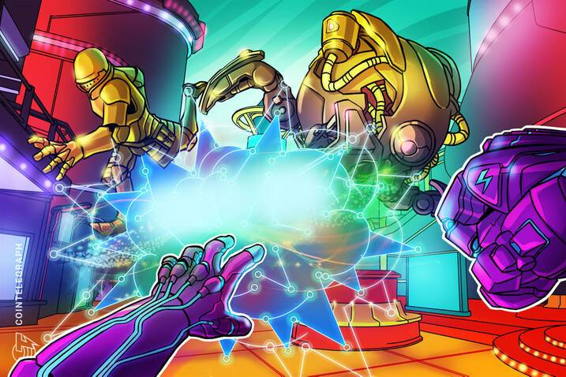

# 元宇宙+区块链，会是互联网的终极形态吗？

# 元宇宙+区块链，会是互联网的终极形态吗？

> “元宇宙”的英文名为“Metaverse”，由“Meta”和“Universe”组成，这一概念最早出现于尼尔·斯蒂芬森的著名科幻小说——《雪崩》。

在传统互联网公司聚焦于区块链、AR、VR等技术时，一个“新”的技术概念——“元宇宙”（Metaverse）——横空出世。

其实，“元宇宙”不算一个新事物，而是一个在沉寂了29年后，直到2021年才被主流重视的互联网形态。

2021年3月10日，在线游戏创作平台Roblox作为“元宇宙”概念股成功登陆纽交所，上市首日市值突破400亿美元。而腾讯在2020年 2 月参投Roblox 1.5 亿美元 G 轮融资，并独家代理 Roblox 中国区产品发行。

4月12日，英伟达CEO黄仁勋宣布英伟达将布局“元宇宙”业务；4月13日，美国游戏公司Epic Games宣布获得10亿美元融资，并声称此次融资主要用于开发“元宇宙”业务。此外，Facebook、微软、字节跳动等巨头也都对“元宇宙”进行投资。

英伟达CEO黄仁勋声称过：“元宇宙——一个一系列相互关联、持久存在、经济自给自足的虚拟世界的术语——就在眼前。我们正处于区块链和NFT支持的元宇宙的“风口浪尖” 。”

那么，“元宇宙”最近火起来了，为什么这么火爆？到底，什么是“元宇宙”？

**“元宇宙”来源于《雪崩》，脱胎于现实世界**

“元宇宙”的英文名为“Metaverse”，由“Meta”和“Universe”组成，这也是“元宇宙”这个词的由来。“元宇宙”这一概念最早出现于尼尔·斯蒂芬森（Neal　Stephenson）的著名科幻小说——《雪崩》（《Snow　Crash》）。

在《雪崩》中，斯蒂芬森创造了一个并非以往想象中的互联网——“元宇宙”（Metaverse），而是和现实世界紧密联系、又脱胎于现实世界的三维数字空间。

在Roblox招股书中，Roblox首席执行官Baszucki指出“元宇宙”应该满足八个关键特征：身份、朋友、沉浸感、低延迟、多元化、随地、经济系统和文明。

元宇宙与现实世界平行，在现实世界中地理位置彼此隔绝的人们可以通过各自在虚拟世界中的“化身”进行交流娱乐，并且每位用户可以自定义自己的“化身”，就好比玩家可以在游戏里可以随意构建自己的人物角色。

人类理想的元宇宙，最终能够实现什么样的本质性需求？或许大家的答案都不一致，或许是对自由的需求。通过创造出数字孪生，元宇宙能够实现对物理时空局限性的突破，甚至实现更高维度上的突破。

科幻作家刘慈欣曾说：《三体》并不是一种幻想，人类的面前有两条路，一条向外，通往星辰大海，一条对内，通往虚拟现实。人类的未来在于前一条路，而后一条将会带来内卷，把人类带向毁灭的境地。

探索浩瀚星空和星辰大海，是人类自古以来不曾停止的梦想。当人类走出地球之后，除了被宇宙的浩瀚震撼之外，也被激发起探索宇宙的热情。如今，人类一方面探索漫天的星辰大海，另一方面，人类逐渐开始通过 VR、AR、数字孪生技术，探索建设虚拟空间。元宇宙，恰恰是最好的呈现形式。

然而，不论是斯蒂芬森，还是《雪崩》的读者们，都未曾预料到在29年之后，首次被提出的“元宇宙”会为如今的互联网带来一阵飓风。

**“元宇宙”——人类理想新世界**

“元宇宙”是数字社会和互联网往前发展的必然，而且“元宇宙”的建造并非一蹴而就。

“元宇宙”是一个承载了很多技术理想实现方式的新世界，包括5G、VR、AR、区块链、人工智能等。

更为具体的说，“元宇宙”就是通过AR与VR技术，应用5G云端传输技术、AI自主生成技术、可穿戴配套硬件设施，来构建一个新宇宙。

对于“元宇宙”，褒贬不一。有人认为，元宇宙可以与当年“互联网”概念的出现比拟，未来将会对人类社会产生颠覆性的影响；也有人认为，“元宇宙”只是用来炒作的新术语，用来吸引资本的投入。

从更深层次讲，“元宇宙”带来了一种可能性——人类通过“元宇宙”能够抵达任何航空火箭和宇宙飞船所抵达不到的更远的宇宙深处。也许，人类社会将因此进入一个全新的阶段。

“元宇宙”实质上是一个虚拟世界，在其中人们能做很多事情，也许未来“元宇宙”的重要性会接近、甚至超过现实世界。甚至，超过 90% 以上的现实世界的活动会发生在元宇宙中。

其实，2018年，美国科幻冒险片《头号玩家》中的虚拟世界“绿洲”就是“元宇宙”。片子里的故事发生在2045年，虚拟现实技术已经渗透到了人类生活的每一个角落。詹姆斯哈利迪一手建造了名为“绿洲”的虚拟现实游戏世界，利用特殊的VR装备就能在跑步机上走遍整个全新的宇宙。即便你只是一个普通人，在“绿洲”里也能成为超级英雄，任何触不可及的梦想都能在其中实现。

**“元宇宙”升维的关键技术——区块链**

从过往来看，“元宇宙”可以不使用区块链技术。

2020年4月，美国歌手Travis Scott在Epic Game旗下的《堡垒之夜》中举办了一场线上虚拟演唱会，吸引了超过1200万名玩家参加。Facebook也推出了VR社交平台Horizon，人们可以在其中创造世界，社交方式将不再局限于打字和语音。网易投资了类似于《第二人生》3D社交平台Imvu，专注于利用VR和3D技术创造虚拟世界的“现实社交”。

这些产品都具有元宇宙属性。不过，它们不是很好的选择。如今，人们更为看重的是资产所有权，不管是实物资产，还是虚拟资产，人们都希望自己能够完全控制自己的资产，而传统互联网巨头是垄断的，无法为人们提供这一便利。

对于这些“元宇宙”产品，人们的资产可能会随着其倒闭而变得一文不值，这种事件屡见不鲜。

然而，使用区块链技术的“元宇宙”真正的颠覆了这一现状。

“元宇宙”的关键要素在于，它并不会被某一个或几个行业巨头掌控，而需要成千上万的人共同构建。

区块链是“元宇宙”实现升维的关键技术，其作用在于保障用户虚拟资产、虚拟身份安全，进行价值交换，并保障“元宇宙”的规则透明。

区块链技术能够迎合“元宇宙”发展所需，必定成为“元宇宙”发展的一大利器。区块链技术拥有去中心化、不可篡改、可扩展等众多优势，使得“元宇宙”完全开源，也可以让“元宇宙”的生态种类变得更加丰富，进而不断的拓展“元宇宙”的想象边界。

通过开放、高效、可靠的去中心化金融系统，“元宇宙”将会加速构建。在区块链世界，人们通过密钥和智能合约，彻底掌控自己的资产，那样就不会再沦为传统互联网巨头的“提线木偶”。

如果“元宇宙”没有与区块链技术相结合，它可能一直是一种以游戏为载体的形态，而区块链 打通了虚拟世界和现实世界的桥梁，它让“元宇宙”从“虚拟世界”变成了“平行宇宙”。

必须要承认的是，理想中的“元宇宙”似乎离我们越来越近。但要跨过“现代互联网”成为“全新的互联网终极形态”，元宇宙道阻且长。

