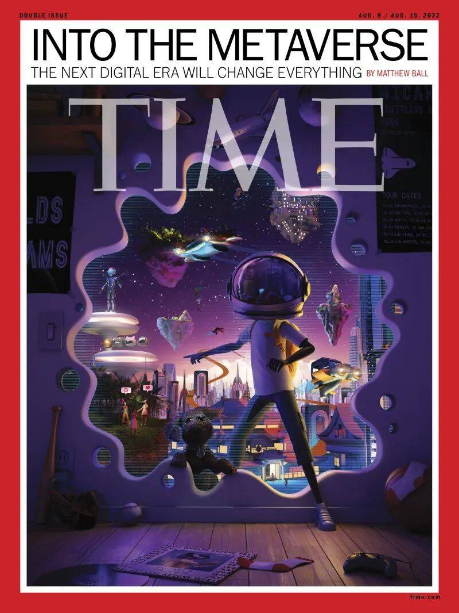

# 元宇宙个登上《时代》周刊封面：将重塑我们的生活

继7月8日，上海发布元宇宙行动方案刷屏中文元宇宙业界，7月19日，元宇宙登上《时代》周刊封面，成为世界范围内火热的概念和话题。

《时代》周刊发布了封面文章《元宇宙将重塑我们的生活，让我们确保元宇宙变得更好》，作者Matthew Ball认为，元宇宙对于人们而言，就像1990年代和2000年代的互联网的概念一样，依然充满未知。

元宇宙世界可以被想象成一个平行空间的虚拟存在层，它跨越了所有的数字技术，甚至会在一定程度上控制现有的世界。元宇宙作为3D互联网，建立它会非常困难，但也可能是值得的。

全球主要国家和地区也纷纷出台各种政策，支持元宇宙产业发展，推动人工智能、区块链、数字孪生、大数据、AR/VR/MR/XR等关键技术的投资、应用和场景落地。

2021年1月，欧盟启动了第九期研发框架计划“欧洲地平线”（2021～2027），鼓励研究扩展现实、人工智能、大数据等数字技术。

2021年6月，美国为加强技术、产业、安全等领域的综合实力，将扩展现实和人工智能等关键技术纳入到《美国创新和竞争法案》之中。

2022年1月，韩国政府发布《元宇宙新产业先导战略》，旨在大力推动元宇宙产业发展，未来五年成为世界第五大虚拟市场。

日本首相岸田文雄表示，与Web3.0相关的增长，包括与元宇宙和NFT相关的开发将成为日本未来战略增长的一部分，并呼吁英国商界领袖支持他的项目。

在中国，武汉、合肥、成都、上海市徐汇区等地区将元宇宙写入新一年度地方政府工作报告，浙江、江苏无锡等省市在相关产业规划中明确了元宇宙领域的发展方向，北京也将推动组建元宇宙新型创新联合体，探索建设元宇宙产业聚集区……

日前，上海市政府发布《培育“元宇宙”新赛道行动方案（2022-2025年）》，其中提出，到2025年，“元宇宙”相关产业规模达到3500亿元，带动全市软件和信息服务业规模超过15000亿元、电子信息制造业规模突破5500亿元。

.jpg)

在移动互联网用户红利已经见顶的今天，“元宇宙”概念的出现让人们看到了“下一代互联网”的曙光，其可能是新时代的流量环境，也可能是未来的交互形式。

全球六家市值最大的上市公司——亚马逊、苹果、谷歌、微软、英伟达、腾讯，都一直忙于为“元宇宙”的到来做准备。他们正在纷纷内部重组、重构产品、并准备发布市场规模可达数十亿美元的新产品。

2021年10月，扎克伯格将公司更名为Meta，全面投入“元宇宙”建设，目标是五年左右转型成为一家“元宇宙”公司。但在初期阶段，元宇宙发展计划就遇到挫折，2021年第四季度财报显示，Meta元宇宙业务“现实实验室”部门在2021年营业亏损超100亿美元（约636亿元人民币）。

英伟达以“芯”为本，着力搭建元宇宙的硬件平台。2021年度GTC大会上，英伟达创始人黄仁勋公布了一系列最新AI技术和产品，并推出承载着其“元宇宙”愿景的全新虚拟化身平台OmniverseAvatar。

字节跳动自2021年收购Pico进军元宇宙以来，在两年内已豪掷数百亿进行投资收购。还曾在抖音推出过现象级虚拟人网红“柳夜熙”。

腾讯不仅投资了多家VR/AR性质的企业，日前更是有媒体称腾讯控股向员工宣布正式成立“扩展现实”(XR)部门，押注全真互联网。

.jpg)

对于未来的应用，Matthew首先提出了教育领域。在元宇宙中，“魔法校车”成为可能。一些现实生活中难以实现的物理或化学实验可以在平台上实现，比如通过比较羽毛和锤子在月球上的下落速度，从而理解重力概念；又比如我们无需真的解剖青蛙，就能了解动物生物结构。无论学校的地理位置如何或学校董事会拥有的资源如何，在元宇宙中，这些都是可实现的。

其次，元宇宙在外科手术上也将有突破性进展。在2021年，约翰·霍普金斯大学的神经外科医生Timothy Witham使用增强现实（AR）头戴式设备进行了医院史上首例交互式手术，这种设备允许外科医生在手术过程中可视化患者的三维脊柱解剖结构。Witham将这台手术比作“拥有GPS”的手术。

Matthew还提到了”3D全息视频“的进化。2021年早些时候，谷歌发布了其Project Starline设备，这个设备使用机器学习、视觉计算机、十几个深度传感器和摄像头以及多层光场显示器，无需使用混合现实（MR）眼镜就能创建3D全息视频。

最后元宇宙在基础设施方面也非常受青睐。香港国际机场如今在基础设施上运行一个实时的数字化场景，允许机场运营商使用实时的3D模拟来正确引导乘客和飞机。此类设计将来或运用在城市项目中，例如交通流量、街心公园的温度显示等。

文章指出，元宇宙世界可能看起来令人生畏，就像1990年代和2000年代对互联网的看法一样，未来的很多事情都是不确定的。“但这个变化是一次人类团结的机会，可以建立一个更平等的全球经济。”
