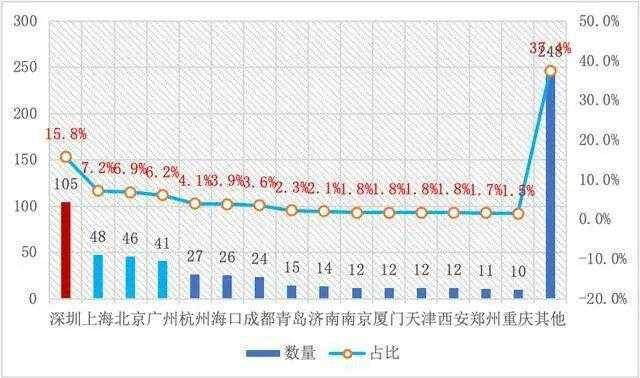
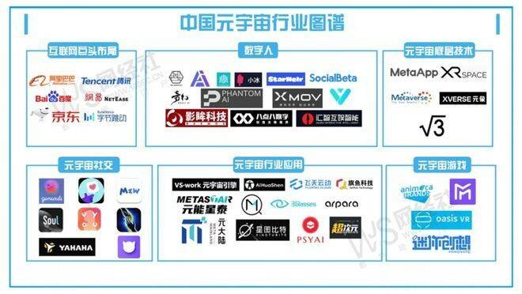

# 元宇宙发展史：六大巨头抢滩登陆，19大城市争先恐后！

# 元宇宙发展史：六大巨头抢滩登陆，19大城市争先恐后！

元宇宙概念的提出：1992年，Neal Stephenson的科幻小说《Snow Crash》中提出了“metaverse(元宇宙，汉译本译为“超元域”）“和”化身（Avatar)“这两个概念。书中情节发生在一个现实人类通过VR设备与虚拟人共同生活在一个虚拟空间的未来设定中。自《Snow Crash》出版以来，斯蒂芬森的元宇宙概念在高科技界（尤其是硅谷）中一直享有持续的普及和强大的影响力。因此，斯蒂芬森成为“一位广受欢迎的未来主义者”，并担任Blue Origin和Magic Leap的未来学家。

2003年，林登实验室推出了第二人生。该项目的既定目标是创建一个用户定义的世界，例如 Metaverse,人们可以在其中互动、玩耍、开展业务和进行其他交流。

2007年，第一本元宇宙相关专著《The Second Life Herald: TheVirtual Tabloid that Witnessed the Dawn of the Metaverse (第二人生使者：见证元界黎明的虚拟小报）》出版。IBM向美国专利局递交了《Rules-based profile switching in metaverse applications》专利申请，这是全球第一个专利标题中提到Metaverse的专利申请。该申请2009年公开，但未授权。目前全球有21个专利申请或授权在专利名称中提到metaverse.

2019年，社交网络公司Facebook推出了一个名为Facebook Horizon的社交VR世界。2021年10月28日，facebook宣布，公司名将更改为元宇宙 “meta”。其董事长马克·扎克伯格宣布公司致力于开发元宇宙。Meta Platforms宣传的许多虚拟现实技术仍有待开发。Facebook举报人Frances Haugen批评了这一举动，并补充说Meta Platforms继续专注于以增长为导向的项目在很大程度上损害了其平台的安全性。Meta Platforms还因平台上发生的性骚扰而面临有关Horizon Worlds的用户安全批评。2021年，Meta在元宇宙开发部门亏损超过100亿美元，马克·扎克伯格表示，他预计2022年运营亏损将“显著增加”。

元宇宙概念是未来6种改变生活工作场景技术的集合，这6种技术分别为区块链（Blockchain）、交互技术（Interactivity）、电子游戏（Game）、人工智能（AI）、网络技术（Network）、物联网技术（IOT），因其英缩写的关系，元宇宙也被戏称为大蚂蚁（Big Ant）。

截至2021年 11月，全国共有663家元宇宙相关企业。从城市情况看，目前全国133个城市已有元宇宙相关企业。元宇宙企业数量排名前十五的城市集中度为62.6％。分别为深圳、上海、北京、广州、杭州、海口、成都、青岛、济南、南京、厦门、天津、西安、郑州、重庆，前十五合计企业数量415家。 除了海口外，其他都已经是中国近十年经济活力表现最好的城市。在前十五之外的宁波、苏州、长沙、武汉数量也接近10家。 “元宇宙”已经成为未来科技发展的新趋势，是产业发展的新风口，其想象空间和对未来经济社会发展的影响巨大。围绕着 “元宇宙”相关技术的探索和场景挖掘已然成为新的技术趋势和 赋能应用场景。

元宇宙最容易形成的产业为游戏领域，但其对政务市场的影 响不容小视，我市应该以敢为人先的精神，在政务领域率先开展元宇宙场景的尝试。不仅要打造元宇宙的政务服务，还要用元宇宙的技术，规范、管理好其他领域的元宇宙场景，确保其健康有序科学的发展。在原有数字城市、智慧城市的基础之上，结合 ５Ｇ 技术、区块链、人工智能、大数据和空间信息技术，基于原有的数字经济应用场 景和正在征集的数字经济应用场景，升级到元宇宙城市。

强化法制建设。当前快速膨胀的元宇宙热潮，已经呈现出脱离现实世界和有效监管，野蛮发展的重大风险隐患，亟需引起高度警惕。应及早研究对炒卖虚拟房产，使用虚拟货币交易等行为作出司法解释，明确法律准则。特别是对虚拟炒房这样真实实现 “房子是用来炒的而不是用来住的”等 “割韭菜”的行为进行打击。其次对于作为一个致力于创造新的虚拟世界、可能对人类发展产生巨大影响的新概念，更不能仅仅从技术和经济的角度看问题，还需要从社会管理、人类发展的高度深入分析、准确把握，应加强相关的法律建设和有效的联合监管，防范化解其可能对现实世界和人类发展带来的危害。为此，应在法律层面，总结提炼在网络平台发展过程中的治理经验，加强元宇宙前瞻性立法研究，关注监管审查、数据安全等问题。
