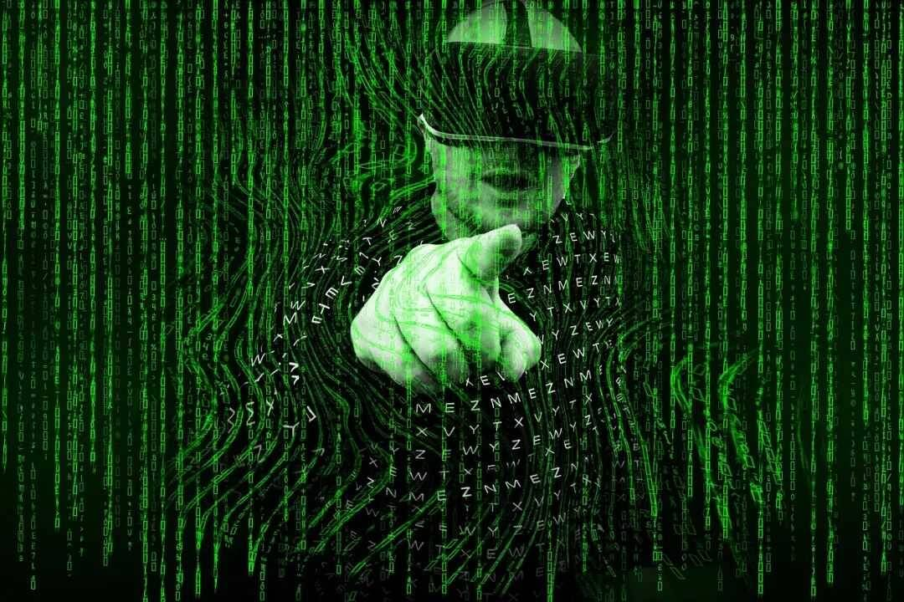

# 元宇宙：技术演进、产业生态与大国博弈

当前，数字技术是全球创新最活跃、竞争最激烈、影响最广泛的领域。如何抢抓数字经济新机遇，引领新一轮产业变革，全面提升产业国际竞争力，是需要持续探索的重大命题。近期，中信改革发展研究基金会邀请相关领域多位专家，研讨“数字时代元宇宙技术的演进与应用”。

元宇宙将带来新一轮信息技术革命的浪潮。很多国家围绕元宇宙的技术创新、产业发展、应用拓展的竞争愈演愈烈，新科技革命带给我们的既有机遇也有挑战，要深入探讨如何使用好“元宇宙”这把双刃剑。

### 01、元宇宙：是什么？为什么？

#### 1. 元宇宙的来源

元宇宙（Metaverse）起源于科幻小说。1992年，科幻作家尼尔·斯蒂芬森（Neal Stephenson）在小说《雪崩》（Snow Crash）提及了“Metaverse（元宇宙）”和“Avatar（化身）”这两个概念。在这部著作里，人们可以拥有自己的虚拟替身，而这个虚拟的世界就叫作“元宇宙”。

此后，元宇宙的概念在《黑客帝国》《头号玩家》等影视作品及《模拟人生》《我的世界》《堡垒之夜》等游戏中都有呈现。

元宇宙的实质是虚实共生，是数字世界与物理世界的融合。**中国最早的“元宇宙”概念可追溯到三十多年前。**1990年，钱学森院士在致汪成为的书信手稿中，提到“Virtual Reality”（虚拟现实），并将其翻译为具有中国味儿的**“灵境”**，使之应用于人机结合和人脑开发的层面上，并强调这一技术将引发一些震撼世界的变革，成为人类历史上的大事。

#### 2. 什么是元宇宙

目前学术界和产业界对元宇宙没有统一规范的定义。元宇宙（Metaverse）从英文来看是超越宇宙；从中文来看，“元”是开始，四方上下是“宇”，古往今来是“宙”。多位专家对元宇宙的理解，概括为以下几种说法：

**一是元宇宙是下一代互联网。**

- 第一代互联网（Web1.0）是**“只读”**的信息展示平台，网站与用户没有互动，产生了如搜狐、新浪等门户网站。
- 第二代互联网（Web2.0）是**“互动”**内容的生产网络，允许用户自主生成内容，与网站和他人进行交互和协作，如博客、社交媒体平台等。
- 第三代互联网（Web3.0）是**“去中心”**的个性化环境，内容由用户创造，数据归用户所有。

**二是元宇宙是人类生活在三维数字世界的重构。**

它结合了社交媒体、在线游戏、增强现实 (AR)、虚拟现实 (VR) 和加密货币的各个方面，允许用户进行虚拟交互，在数字世界重建人类的生活生产方式。这是一种相对狭义的理解和定义。

**三是元宇宙是物理世界和数字世界的虚实共生。**

易股天下集团董事长易欢欢认为，元宇宙是数字经济发展到极致的社会形态，是现有前沿科学技术的集大成者，融合了虚拟世界与现实世界的超级融合体。虚实共生涵盖了现实世界中一切生产、生活，物理世界与数字世界实现实时交互、优化。

阿里研究院副院长安筱鹏认为，数字世界与物理世界的虚实共生是业界关于元宇宙的最大公约数。数字技术最大的价值在于构建了一个数字空间。**数字空间与物理空间存在四种关系：**

- 一是没有被数字化（比特化）的物理世界；
- 二是数字游戏、数字货币是只存在于数字空间的虚拟事物，没有物理实体映射关系；
- 三是数字博物馆、数字藏品等数字空间是对物理世界的单向映射；
- 四是物理世界的体育场馆、炼钢高炉、人体心脏等，在数字空间有一个数字孪生体，可以实现数据的实时互动优化。

人们以各自不同视角理解元宇宙。但我们认为，目前业界对于元宇宙概念已经逐渐产生一定的共识，**即元宇宙应包括物理世界和数字世界，是一个在现实世界基础上的持久稳定的实时虚拟空间，数字与物理世界将融合成为一个具有互操性的生态。**

它包括大量的用户和其他参与者和一个全面运作的经济系统，全面且丰富的数字内容，甚至是一个虚拟数字世界。

#### 3. 元宇宙的技术体系

元宇宙是多种技术的集成。

**一是人机交互技术。**

这是元宇宙最核心的关键技术之一，主要包括VR虚拟现实技术、AR增强现实技术、MR混合现实技术、全息影像技术、脑机交互技术和体感技术，为元宇宙用户提供了虚拟沉浸现实的体验阶梯，不断深化感知交互。

沉浸式交互设备为玩家进入元宇宙提供了真实、持久且顺畅的交互体验，是真实世界与元宇宙的桥梁，而沉浸感的实现需要依托于一个终端设备接口来实现。具备3D显示、大视角高分辨率的AR/VR/MR有望成为元宇宙世界的重要接入方式。

**二是区块链和NFT（数字凭证）技术。**

区块链技术和NFT（数字凭证）技术是元宇宙经济体系的重要支撑。

**区块链**是一个分布式的共享账本和数据库，具有去中心化、不可篡改、全程留痕、可以追溯、集体维护、公开透明等特点。基于以上特征，区块链应用于实现点对点的金融交易、数字版权确认、提升供应链管理效率等方面。区块链将会扮演虚拟世界和现实世界的桥梁，提供去中心化的清结算平台和价值传递机制。

**NFT**通证清晰地表明了每一件虚拟物品的所有权，其最大特点在于唯一性，是一种不可分割且独一无二的数字凭证。NFT能够映射到特定资产（包括数字资产如游戏皮肤、装备、虚拟地块等，甚至实体资产）。

**三是人工智能技术。**

为元宇宙大量的应用场景提供技术保障，例如通过计算机视觉将现实世界的图像数字化呈现，为元宇宙提供虚实结合的观感；通过机器学习为元宇宙当中所有系统和角色达到或超过人类学习水平提供技术支撑，提高元宇宙的运行效率和智慧化程度；通过智能语音和自然语言处理技术，为元宇宙主客体之间提供准确的交流和理解。

**四是云计算及网络技术。**

数字空间的价值在于与物理空间交互的实时性，它对通信和计算能力提出了更高的要求。5G/6G技术为元宇宙提供高速、低延时、规模化接入提供传输通道，为元宇宙用户提供更实时、流畅的体验；元宇宙对高算力和低时延提出了新要求，云计算通过提供快速创新、弹性硬件和规模经济，可以提供功能更强大、更轻量化的终端设备。

**五是物联网技术。**

为元宇宙万物链接及虚实共生提供可靠的技术保障。网络层和感知层为元宇宙感知物理世界万物的信号提供技术支撑；应用层将元宇宙万物链接并有序管理，是虚实共生的最重要支撑。其中芯片产业是元宇宙数字世界的“底座”，所有搭载的元宇宙设备都需要基于芯片，包括所有的数据处理设备也都需要借助于芯片及处理器。

**六是数字孪生技术。**

将物理世界在数字世界重建需要各种软件工具和开发平台，包括3D建模、仿真优化、实时渲染等技术。

### 02、元宇宙技术、产业的全球竞争格局

#### 1. 美国：元宇宙技术、产业、应用的领导者

元宇宙的发展基于多个数字技术集成，在涉及元宇宙的多个技术、产业和应用方面，美国借助全球数字科技巨头全面发力和众多科技创新的小企业崛起，成为全球元宇宙的绝对领导者。

- **人机交互技术及产品创新**

前端硬件层，微软在AR硬件市场份额全球领先，核心硬件产品HoloLens 已更新至第二代，与微软 Azure、Dynamics 365等远程方案结合使用。

2021年3月，微软与美国军方签署了一份价值219亿美元的合同，未来10年内将为美军提供12万套HoloLens AR增强现实头盔，该头戴设备可以将情报信息直接叠加到士兵的视野中来帮助士兵了解战场地形，选择目标并发现潜在的威胁。

Facebook具有大量的虚拟现实核心专利技术，旗下VR龙头Oculus成为史上第一款超千万销量的VR设备。苹果先后布局ARKit和AppClip，目前拥有“全球最大的AR平台，拥有数亿台支持AR的设备，以及AppStore上的数千个AR应用程序”。

马斯克旗下公司Neuralink致力于开发脑机接口，在人脑/动物脑与外部设备之间建立信息交换和连接通路。

- **底层芯片技术及创新生态**

在后端基建层，英伟达作为全球GPU（图像处理技术）领进厂商，基于GPU构建了软硬件一体技术生态，成为全球首个面向元宇宙的基础模拟和协作平台。发布元宇宙开发工具Omniverse Avatar，为工业、建筑、生物、游戏等3D数字空间的建筑提供低门槛、高效率的创新开发平台。

微软聚焦“企业元宇宙”，开发企业级公有云平台Azure云服务，提供数据库、云服务、云存储、人工智能互联网、CDN等高效、稳定、可扩展的云端服务，为企业提供一站式解决方案。

Facebook相继收购3D建模公司、游戏开发引擎、计算机视觉公司和面部识别公司等，全方位布局元宇宙生态。

- **三维数字空间社交**

社交办公方面，微软在现有的Team功能（线上会议）上，加入Mesh混合现实的功能，允许不同地理位置的人加入协作办公和共享全息体验，人们可以在其中加入虚拟会议、发送共享文档等，允许人们使用个性化的3D头像，体验一个沉浸式的空间。

Facebook 推出远程办公应用程序Horizon，利用VR 设备实现了人们在虚拟现实中进行会议。

- **三维数字游戏发展**

Roblox是3D游戏创作和大型社区的互动平台，平台游戏支持VR设备，通过数字身份进行社交，甚至平台上获得的货币可以与真实货币转换。

微软是全球三大游戏机制造商之一，旗下Xbox推出《光晕》《我的世界》《模拟飞行》等元宇宙概念游戏。Facebook提供了Oculus Quest Store 作为VR游戏软件开发者平台。

- **数字教育创新**

高通赞助美国莫尔豪斯学院开设VR校园以提供线上VR课程，为学生提供身临其境的VR学习体验。在生物学课程中，展开人的心脏并步入其中；在历史课上，能够在战场上行走，从“上帝”视角看待历史，身临其境地了解历史人物的观点；科学课上，学生们能够亲眼目睹周围旋转的原子。

#### 2. 韩国：危机意识驱动的激进跟随者

韩国是对元宇宙推动最为激进的国家之一，已从国家层面开始对元宇宙产业进行规划，在MSIT的领导下，韩国组建了一支超过200家公司参与的Metaverse联盟，目标是到2026年实现元宇宙全球市场占有率第五，首尔将打造虚拟市政厅，试图成为全球首个加入元宇宙的城市。

### 03、元宇宙发展面临的机遇与挑战

#### 1. 元宇宙是产业升级和创新的历史性机遇

中信证券科技产业首席分析师许英博认为，元宇宙不只是互联网的一个延伸，在更大的程度上，它是作为未来科技浪潮的一个延伸，有机会带来一个长周期量级的机会。它的核心价值是科技的进步，次核心是AI技术的发展以及工业生产过程和社会运行成本的下降，具有重大实际战略意义。

安筱鹏指出，**物理世界与数字空间的虚实共生，可以发生在以人为核心的消费端，也可以发生在以物为核心的供给端。**元宇宙可以融入到工业、医疗、物流、金融等各个领域，为产业带来新的形态、新的商业模式和新的增长空间。**我们需要把数字世界和物理世界连接起来，打通四个环节：**

- 一是状态感知，利用现代感知技术将隐性的数据显性化，将隐性的知识显性化；
- 二是将数据进行结构化的加工整理，使其变为可靠有用的信息，用于实时分析；
- 三是利用现代的通信、存储、计算、算法以及大数据技术，通过机器学习掌握知识，用于科学决策，解决问题；
- 四是通过上升的智慧层面，统筹各方资源与能力，精准执行，从而构建数据-信息-知识-决策的闭环，实现物理世界资源优化。

**元宇宙将激发数字技术及产业新一轮突破。**元宇宙在社交、游戏、购物、医疗、工业、物流等场景中的应用，将会激活核心技术的突破和持续创新，这将孕育着重大产业机会。

元宇宙是前沿科学技术的集大成者，新需求将会激发对芯片、数字孪生、XR、脑机交互、全息影像、AI和区块链等技术突破，也会带来包括新一代移动通信、物联网、云计算、边缘计算等技术和产业发展。

#### 2. 新应用将催生新产品和新业态

虚拟人是元宇宙的基础生命形态, 在元宇宙中与人、地点、事件进行实时交互，完成消费、社交、娱乐等行为。目前虚拟人已经进入到部分实际场景应用中，如虚拟偶像、数字主播以及虚拟主持人等发展迅速。

在**医疗健康**领域，医生可以在复杂手术前利用VR技术，真实地、全方位地模拟手术中的潜在困难，也可进行远程治疗，合理化分配医疗资源；通过Al、大数据等技术缩短新药研发周期，降本增效。

在**医疗教学**上，沉浸式VR模拟培训可以培养护士和医疗保健工作者临床推理和协作。

**数字藏品/NFT**发展迅速，具有一定经济价值，2021年国外的NFT交易总额超过了400亿元美金。梵蒂冈将开设一个官方虚拟现实NFT画廊，以便世界各地观众可以查看其收藏的艺术品、手稿和其他物品，梵蒂冈将把一部分收藏品转换为NFT。

元宇宙也可为**虚拟战争**服务，在现有兵推软件的技术上，基于元宇宙的无限资源、MR的先进技术、数字模拟等应用，让参与者身临其境参与战争过程。

#### 3. 工业元宇宙是传统工业升级的新引擎

珠海市横琴新区数链数字金融研究院学术与技术委员会主席、经济学教授朱嘉明认为，在产业领域工业元宇宙改变了传统的制造业范式，利用各项技术的集合，保证元宇宙可以和物质世界维持着精准的、动态的、全方位的互动关系。

**基于数字孪生、AIoT、人工智能等新技术，通过在制造业等供给端构建物理世界与数字空间数字孪生体**，重构飞机、高铁、服装、药品、建筑等行业研发、设计、生产、服务等全生命周期体系。

美国国家航空航天局（NASA）提出“数字孪生体2027计划”，建立数字孪生体工程体系，将大量飞行验证实验仿真放置于数字世界中完成。**马斯克SpaceX通过大量数字孪生和仿真技术，火箭发射成本降到原来的七分之一。**工业元宇宙将打破物理边界、组织边界、协作边界，在虚拟世界构建物理模型，加速创新，探索新的协作方式。

**新秩序建立中的标准制定和法律主导。**元宇宙的发展将带来相关的立法规制建设问题，首先不能失去在新秩序建立过程中的标准制定权和法律界定的主导权。

金诚同达律师事务所高级合伙人、评估委员会主任彭俊指出，数字经济规则是要能够互联互通，打通各个国家之间的边界，能够形成一体化，而不是一个不同国家或者不同国家的团体各自搞一套元宇宙，或者各自搞一套数字经济。需要逐步建立国际数字经济规则。

目前在国际数字经济规则制定中，各个国家的立场和主张并不一样。彭俊指出，国际数字经济规则谈判中争议的核心是数字贸易的自由化和数字主权监管之间的关系。

**美国**的数字经济规则核心词是自由化，主张高标准的数据自由流动，做数字服务税，反对计算设施的本地化。**欧盟**的数字市场法案和数字服务法案则反对做数字服务税，强调隐私保护和数据安全、数据服务平台的监管和互通。**中国**既强调国家安全、隐私保护、数据安全和计算设施本地化，同时又支持数据的互联互通。

#### 4. 风险与挑战

元宇宙存在的风险与挑战不容忽视。

- **国家安全层面**

先发国家拥有技术和标准垄断优势，滞后国家对领先国家会形成技术和标准依赖，并在元宇宙可能催生的新的国际产业分工体系中处于不利地位，同时，滞后国家在寻求接入领先国家的元宇宙时可能面临歧视性的门槛和要求。

- **社会治理层面**

在元宇宙大融合下，虚拟世界将打破国家边界，全球互联互通将更加紧密，从社会意识形态、消费习惯，到审美喜好，全球将进一步同质化，对国家政治文化安全产生潜在的不利影响。同时，高度去中心化的运行机制，也将给国家社会治理带来挑战。

- **经济风险层面**

由于相关技术仍待发展，元宇宙要实现产业化落地和商业化盈利还需要很长时间，目前总体处于高成本、低收益阶段，投资与收益不匹配。元宇宙的经济体系和货币体系与现实经济联动，可能存在经济秩序不稳定而引发金融风险的问题。

- **产业风险层面**

由于核心技术缺失，产业发展路径背离实体经济需求。一方面产业链不完备易造成产业风险，对浅层技术簇拥，而对深层核心技术挖掘程度不够，带来产业风险，形成产业泡沫，导致“卡脖子”技术问题产生。

另一方面企业扎堆涌入元宇宙领域，纷纷包装成元宇宙企业，元宇宙产业存在诸多风险和不确定性，过度迎合概念热潮可能产生偏离原有技术发展路径的行为，对产业格局和企业发展带来挑战。

- **个体心理风险层面**

面临极度沉迷后的现实缺位风险。用户层面对于“元宇宙”这一概念及其相关产品怀有好奇心和新鲜感，但元宇宙的发展与监管体系仍未成型，且存在身份认同和人格解体等风险。

### 04、思考与建议

中国具有巨大的应用场景市场和非常大的工程师红利及流量优势。应高度关注科学技术发展对时代变迁的推动作用，展开新一轮的全球合作与竞争。积极培育元宇宙技术创新和产业培育，警惕虚拟货币和虚拟数字品交易等“泡沫化”现象。

**一是把握价值锚点，走向理性务实。**

元宇宙领域，技术与技术的集成应用是手段，元宇宙真正的价值发掘与实现应体现在实体经济方面。安筱鹏指出，元宇宙的价值锚点在于数字技术与实体经济融合带来的产业竞争的提升、国际竞争力的提升、国力的增强。

如果将元宇宙过于狭义化，炒作元宇宙游戏、NFT、数字藏品等概念，将使元宇宙陷入和现实世界失衡的状态，进而迷失发展方向。

**二是加强核心技术攻关，突破发展瓶颈。**

元宇宙相关技术发展不均衡，较落后的技术制约着元宇宙整体应用水平，需要不断增强技术创新能力，提高技术成熟度。在元宇宙的基础技术上，我们应聚焦于数字孪生、XR、脑机交互、全息影像、AI和区块链等涉及元宇宙核心技术的突破，加快元宇宙基础设施建设，包括综合性智能化的信息基础设施。

**三是构建元宇宙标准体系。**

即元宇宙之间的标准，或是下一代互联网的标准。元宇宙需要依赖一个互联互通的标准。传统由美国定义的互联网国际标准体系，即TCP/IP协议、域名的管理。如今，由于元宇宙话题呈现出百花齐放的局面。希望在元宇宙时代，中国能有更多的参与标准制定的机会，并且能够提出自己原创的技术标准。

**四是科学治理，完善创新生态。**

中国保险监督管理委员会原副主席李克穆指出，元宇宙属于新兴事物，监管部门应合理利用“监管”手段，留出创新空间。元宇宙治理应以法治为基，科学研判发展的机遇与挑战，从安全预警、风险防控机制和能力建设方面完善治理体系。

**五是加强伦理体系建设。**

元宇宙是人类社会的映射，伦理体系在元宇宙中是不可或缺的一部分，一是以可持续发展为目标,将元宇宙领域的产能控制在地球生态系统能够承受的范围内。二是以人为本，充分考虑个体在元宇宙的刚需，不能只为大企业或者政府服务。三是技术可信和可控，能够被老百姓所接受，是元宇宙技术伦理方面的发展方向。
