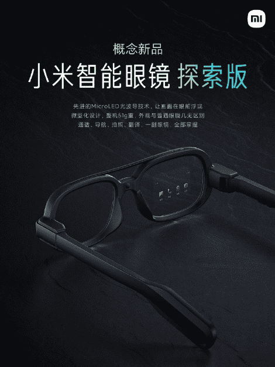

# 小米、华为、B站的元宇宙布局

元宇宙的“走红”始于2021年3月10日，彼时元宇宙概念股Roblox在美国上市，此后元宇宙开始进入人们的视野。Roblox上市后，海内外巨头纷纷开始入场，其中包含在互联网初期就参与研发VR、AR等技术的“老牌”企业，如微软和百度，也包含迅速占领元宇宙概念的后起之秀。本文将对小米、华为、B站的元宇宙布局进行解读。

**小米的元宇宙布局**

小米作为互联网龙头企业，在元宇宙方面除了硬件上的布局之外，也布局了元宇宙的支付技术、元宇宙游戏等。

**一、小米的元宇宙硬件布局**

小米因其高性价比的智能硬件而广为人知。在硬件生态方面，小米拥有手机、电视、路由器以及通过生态链孵化的大量产品，独特生态链模式构建了手机配件、智能硬件及生活消费产品三层产品矩阵，形成了广泛触达用户的硬件体系。

而在元宇宙硬件方面，小米也没有落下。小米着重XR硬件布局。例如，2018年小米和Oculus联合推出了Oculus Go。Oculus Go产品价格仅1499元，是一款高性价比的移动版VR一体机，用于探索VR硬件市场。该产品由Oculus提供技术，小米提供供应链能力。

2021年9月14日，小米在微博上发布概念新品小米智能眼镜探索版。根据小米的介绍，小米智能眼镜探索版采用了先进的Micro LED光波导技术，能让画面在镜片上显示。整个机型重15克。此外，该产品能够实现通话、导航、拍照、翻译等功能。根据小米的介绍，小米智能眼镜探索版为了做到和普通眼镜相似的外观，给显示和堆叠带来了空前挑战。该眼镜有四核心 ARM 处理器、电池、触摸板、Wi-Fi/蓝牙模组等。该产品将使用 Android 操作系统。然而此产品只是一个概念产品，小米还未公布其量产版的信息。

**小米智能眼镜探索版**

**表1 元宇宙虚拟现实硬件总结**

.png)

**来源：01区块链根据公开资料整理**

**二、小米的元宇宙内容层面布局**

许多企业进军元宇宙从游戏开始，小米也是如此。2021年7月，在第二届全球云游戏产业大会上，中国移动咪咕公司联合小米游戏、金山云与蔚领时代等单位发起立方米计划。立方米计划是基于云技术的游戏分发计划，着重依托中国移动系和小米系的云能力和分发渠道能力，为传统游戏厂商提供游戏云化服务，为云原生游戏提供开发运行环境，帮助游戏产业搭建云游戏分发能力，降低发行和分发门槛，并通过创新5G云游戏体验构建新的云游戏商业模式，为广大云游戏用户提供最优质的服务，为合作伙伴创造价值。

在立方米计划里，中国移动咪咕公司以及海马云等中移系的产业合作伙伴发挥5G+“云网边端”一体化优势，提供云算力、云存储、云分发等服务，以及相对应的行业用户、大数据、5G网络等行业发展扶持资源。小米游戏将依托小米生态，在电视、手机及AIoT方面提供用户流量服务，凭借庞大的智能手机与智能电视用户群体为云游戏的分发提供一定的保证。金山云、蔚领时代作为领先的云算力和解决方案提供商也将为合作伙伴提供专业的云游戏解决方案服务。

中国移动咪咕公司总经理刘昕表示，立方米计划启动后，参与各方将一起投入超百亿元推动云游戏产业生态建设和云原生游戏开发，特别对全平台游戏，具有高品质、高画质、高帧率特征的“三高”云游戏，以及基于云能力的创新产品给予更加积极地支持，共同开创云游戏的新纪元。

云游戏是小米布局元宇宙的关键一步。目前市场普遍认为元宇宙的落地将从游戏开始。而小米的云游戏目前已积累了一定的用户量及内容。小米云游戏负责人在2021游戏产业创新趋势论坛上表示，小米将在云游戏、AR/VR 以及元宇宙全面布局。云游戏是小米布局元宇宙必不可少的第一步，同时也已成为小米创新业务中的重点战略方向。

**三、投资当红齐天集团**

小米也通过投资使其生态体系更加的成熟。2021年10月，当红齐天集团宣布完成数亿的B轮融资，由小米战投、建银国际领投，野草创投、老股东联想创投跟投。B轮融资将用于推动“5G+XR”赛道更广泛的场景化应用落地 ， 促进“5G+XR”产品的深度研发，打造线上线下联动的闭环XR生态链路。根据当红齐天集团的介绍，目前该集团已经获得的项目包括上海迪士尼小镇SoReal 5G XR 超体空间、北京首钢“1号高炉”SoReal 5G XR 超体空间等项目。

当红齐天集团（北京当红齐天国际文化科技发展集团有限公司）成立于2015年，是一家致力于创造极致沉浸式体验，集XR内容制作+载具研发+数字运营整体解决方案及产品落地于一体的文化科技公司。当红齐天的业务涉及：“XR+乐园”、“XR+科技秀”、“XR+党建爱国主义教育”、“XR+博物馆”、“XR+应急”、“XR+电竞”、“XR+体育”和“XR+直播”等。当红齐天集团的技术布局围绕：VR交互系统、VR载具 、大空间定位技术、5G云渲染、AI+、先进传感器技术、自动化建模生产方式等最新技术建立VR内容开发技术优势，提供内部及外部合作CP内容开发强力的技术支撑。

根据官网显示，当红齐天集团的股东包含：中航信托、联想创投、芒果基金、深圳韦玥集团、英特尔、小米、建银国际、野草创投、拉卡拉、蓝色光标。

**四、小米积累大量的技术储备**

2021年11月23日，小米回应了其在元宇宙方面的布局。小米表示，小米关注元宇宙周边相关机会，已经进行了不少相关技术储备，在手机、视频、显示等方面都有相关投入，进行过相关准备。

实际上，通过对小米的专利进行检索分析发现，小米在元宇宙领域共有专利129件。小米的专利主要是集中在VR、AR、智能眼镜相关技术上。小米主要布局在VR眼镜、AR眼镜、智能眼镜3款产品上。包括一系列成像算法、控制方法、交互方法、场景应用、硬件结构等方面，拥有比较全面的技术布局。可以说这些专利布局，符合小米在硬件方面的优势。小米依托自家生态系统，着力于硬件以及云计算领域的研究和发展，打造小米独有的元宇宙体系，一起为元宇宙市场的到来奠定了坚实的基础。或许未来在AR/VR眼镜以及元宇宙硬件方面，小米会是一个强劲的玩家。

2021年12月7日，小米获得了虚拟现实环境下的移动支付方法及装置专利授权。

根据专利的描述，小米的虚拟环境下移动支付方法包括向移动终端发送支付请求、接收移动终端发送的支付信息以及向移动终端发送确认支付信息。通过虚拟现实设备与移动终端的信息交互，能够使用户在虚拟现实环境中，购买商品或者进行应用内支付时，无需将移动终端从虚拟现实设备中取出，即可便捷快速的完成支付。

此专利的好处在于能够维持用户的沉浸式虚拟现实体验，为用户的使用带来了极大的方便。该专利技术方案不仅可以应用于虚拟现实设备中，还能够应用于其他所有能够与移动终端进行交互的设备中。

有人会在元宇宙中付费吗？答案是会的。就好比如今人们在互联网上购买各种各样的服务，包括订阅服务、游戏皮肤购买等等。未来元宇宙支付会是一个巨大的市场。小米如今可以说是未雨绸缪，为未来提早布局。

**华为的元宇宙布局**

华为作为通讯技术的领军者，在元宇宙方面的布局也备受关注。

在4月底举办的2022年华为分析师大会上，华为轮值董事长胡厚崑称，元宇宙是非常火的话题， 从全球来看，元宇宙的概念典型处在一个炒作期。华为是一个科技公司， 越是热闹的炒作期越要冷静，要透过喧嚣看到本质，抓住了本质以后，就能更好的去做好准备。

对于元宇宙的本质，胡厚崑认为， 元宇宙的本质是融合，是物理世界和数字世界的融合。

**一、华为推出首钢园元宇宙展示肌肉**

2022年1月11日，华为和北京首钢园的合作项目“首钢园元宇宙”正式上线。用户只需要打开华为AR地图即可体验“首钢园元宇宙”。现实中的首钢园废旧工厂在华为 AR 能力的加持下和虚拟世界融合，呈现出了工业朋克的科幻景象。

**首钢园元宇宙**

用户进入首钢园元宇宙之后，可以欣赏虚拟墨甲机器人乐队演出和炫酷闪烁的虚拟灯光秀，置身“秀池缤纷世界”，在炫彩灯带条环绕的三高炉和漫天星云中体验元宇宙。除此之外，用户还能通过参加 AR 实景团战游戏获得沉浸式游戏体验。华为通过钢铁器械、立体空间、机甲飞船、智能机器、全息广告、炫彩灯光等未来元素打造过去、现在与未来融合的元宇宙综合体，并以多人互动游戏的形式构建一个赛博朋克风格的沉浸式全景体验地和未来科幻城。

在北京市及石景山区政府的大力推动下，首钢园正在着力打造“科幻产业集聚区”。随着 2020、2021 中国科幻大会在园区内成功举办，“中关村科幻产业创新中心”（“元宇宙中心”）在园区内落地，全国首个“科幻产业联合体”盛大发布，加之首钢园深厚的工业文化底蕴、超大的遗存规模和丰富的科幻及元宇宙产业发展空间，首钢园具有打造赛博朋克风格的良好基础，是展示最新最炫的科幻及元宇宙技术的绝佳平台。

从 2021 年 6 月开始，北京河图联合创新科技有限公司与北京首钢建设投资有限公司联手合作，将华为河图平台空间计算、AI 环境理解及红色地标公司 VR 技术、“5G+VR ”文旅平台等有机结合，采用数字空间多维搭建等方式，将首钢园工业遗存与科幻元宇宙概念及创新科技无缝融合。可以说此项目是华为在元宇宙展示自己的肌肉，展示自己将现实与虚拟融合的硬实力。

**二、元宇宙基建卡位5G**

5G是元宇宙建设中一个非常重要的技术，5G技术让人们在元宇宙中互相连结。元宇宙基于VR/AR技术实现互动体验，但VR/AR技术需要大量的数据运算，那么将数据传输至云端计算再反馈至设备就是一个很好的方案。然而如今的技术难点在于实现低延迟的连接，这对通讯技术尤其是5G提出了更高的要求。此前01区块链写了一篇[《元宇宙+ 5G，将走向哪里》]阐述了5G在元宇宙中的重要性以及有哪些厂家布局。

华为本身是做通讯技术起家的公司，5G可以说是华为的看家本领。因此，华为也积极布局了元宇宙的后端基建。华为具备“网络+芯片+终端”的端到端能力。当中端到端能力是指华为的5G产品与技术已经实现了从无线接入、网络基础设施、到终端设备的能力。

在芯片方面，华为发布了多款5G相关的芯片来为5G提供技术支持。例如全球首款5G基站核心芯片华为天罡，包括多频段、多制式在内的极简5G凝结而成；华为的5G终端芯片巴龙5000，是一款集成度较高的5G终端芯片，实现了单芯片多模的能力，能够提供从2G到5G的支持，同时支持NSA与SA架构。

专利方面，华为通过 5G 专利优势，在拥有自主知识产权技术的同时，还降低了未来专利交叉许可的成本。根据欧洲电信标准化协会发布的全球5G标准核心必要专利数量排名（2020），华为获得第一，其1970件的专利数量超出第二名的诺基亚33%。根据咨询公司 Strategy Analytics的数据，华为在端到端 5G 标准的总体贡献超过全球所有企业。该研究公司评估了 13 家领先公司对 3GPP R15 与 R16 版本5G 标准的贡献，最终研究结论表明，华为、爱立信、诺基亚、高通与中国移动是全球 5G 标准的主要贡献者。

此外，许多国家的5G基建都采用了华为的方案，例如韩国、英国、瑞士、意大利、科威特等多个国家都是采用华为的5G方案开展5G基建。因此可以说在元宇宙5G基建方面，华为走在了世界的前沿。

**三、申请商标以及专利为进军元宇宙做准备**

2021年12月15日，企查查的数据显示华为技术有限公司正在申请“元OS”商标，申请号为61186313，国际分类为科学仪器。有消息称，此商标是华为为其进军元宇宙做的准备。

实际上，之前华为就已经申请了“鸿蒙元服务”“鸿蒙元程序”等商标。此外，完美世界游戏公司也表示已与华为HarmonyOS达成战略合作，公司自研的ERA引擎将携手HarmonyOS，在5G时代游戏领域进行更深层次的探索与布局。

除了商标的申请之外，华为也申请了相关的专利，例如华为获得“双模式耳机”专利授权，授权公告号为CN111133364B。根据专利的摘要显示，双模式VR和AR耳机包括头部连接装置、连接装置的主框架和枢轴框架（包括支架、反射屏）。该枢轴框架枢接至主框架上，可使枢轴框架在第一枢轴框架和第二枢轴框架之间移动。

**四、元宇宙硬件的布局**

显示硬件作为元宇宙的入口，华为自然也布局了相关产业。这当中包括了华为推出的华为VRGlass、MateStationX。

2019年9月，华为正式发布华为VRGlass。VRGlass机身厚度仅26.6mm、重量仅为166g，具备3200*1600分辨率、90°视场角，且支持3.5mm耳机和蓝牙耳机。华为VRGlass的售价为2999元人民币。

2021年9月，华为推出了旗下首款旗舰一体机MateStationX。MateStationX标配智慧无线键鼠配件。MateStationX支持开箱自动连接，在键盘上还加入了便捷的智慧按键，按下键盘指纹电源键便可实现一键指纹开机、解锁；一键唤起智慧语音功能，实现会议语音转文字记录，AI字幕翻译外文课等功能。MateStationX的售价为9999元。

2021年11月，华为正式推出华为VR Glass 6DoF游戏套装，售价3999元。VR Glass 6DoF 游戏套装包含此前推出的 VR 眼镜，以及 6DoF 视觉模组、控制手柄、手机散热背夹。VR Glass 6DoF通过有线方式连接智能手机使用，产品采用轻量化设计，结合视觉模组重量仅为 188g。其中视觉模组采用 Type-C 接口与头显相连，免驱使用，可以进行多个自由度感应，还能识别跳起和蹲下，为 VR 头显增加精准的位置定位功能。值得一提的是，在2021世界VR产业博览会上， VR Glass 6DoF荣获大会云峰会VR/AR创新金奖。

虽然华为VR/AR产品鲜为人知，但华为也积极推出相关产品。相信未来华为会推出一个相对成熟的产品打开此领域市场。

**五、软件及操作系统的布局**

鸿蒙（HarmonyOS）是华为自2012年开发的一款可兼容Android应用程序的跨平台分布式操作系统。系统性能包括利用“分布式”技术将各款设备融合成一个“超级终端”，便于操作和共享各设备资源。系统架构支持多内核，包括Linux内核、LiteOS和鸿蒙微内核，可按各种智慧设备选择所需内核，例如在低功耗设备上使用LiteOS内核。2019年8月华为发布首款搭载鸿蒙操作系统的产品“荣耀智慧屏”，之后于2021年6月发布搭载鸿蒙操作系统的智能手机、平板电脑和智能手表。

鸿蒙是万物互联时代的全场景分布式操作系统，鸿蒙也可以成为华为在元宇宙中的操作系统。华为提出“1+8+N”的战略，当中1是指智能手机主入口，8则是4个大屏入口-平板/车机/PC/智慧屏，以及4个非大屏入口-手表/耳机/AI音箱/VRAR，N则是泛IoT硬件构成的华为HiLink生态，通过HuaweiShare实现各类设备互联互通。VR/AR硬件可以通过鸿蒙来连接进入元宇宙中。

除了操作系统之外，华为也开发了VR/AR软件引擎，全方位支持开发者进行内容开发。AREngine是一款用于在Android上构建增强现实应用的引擎，目前已经迭代到AREngine3.0，包含AREngine服务、ARCloud服务与XRKit服务，其中XRKit是基于AREngine提供场景化、组件化的极简AR解决方案，二者均可实现虚拟世界与现实世界的融合，带来全新的交互体验。VREngine同样经过3次迭代至VREngine3.0，目前已经能够实现6DoF交互，支持PCVR无线化，以及第三方交互设备。

内容开发工具方面，华为也推出了Reality Studio，该工具致力于让没有专业开发能力的用户也能够轻松开发内容。Reality Studio的功能包括多方面，交互设计、场景设计、模型编辑、发布管理全体系。该工具还将支持3D格式转换，华为将联合国内开发者共同推动中国自有的3D模型格式——RSDZ格式的建立。华为的目标是将中国3D模型格式推成国际标准。

**六、华为元宇宙底层架构：河图Cyberverse**

Cyberverse=Cyber（网络）+Universe（宇宙）。河图Cyberverse是华为于2018年成立的项目，华为将河图Cyberverse称为数字现实黑科技，希望利用河图Cyberverse构建一个和现实世界无缝融合的不断演化的虚拟世界。

河图Cyberverse是一个基于空间计算算法以及AI识别技术打造的虚实融合的超视觉体验服务，依托终端硬件产品和华为地图数据，基于3D地图及VR/AR的融合，再通过空间计算链接用户、空间与数据，最终给华为移动终端用户带来全新的交互模式与视觉体验。河图Cyberverse的功能已经涵盖包括识物百科、识人辨人、识字翻译、识车安保、3D地图识别；应用场景也包括景区景点、博物馆、智慧园区、机场、高铁站、商业空间等公共场所，为游客提供导览服务等。

截止至2020年5月，**河图Cyberverse有4项核心能力：**

1、3D高精度地图：2020年7月5日，国家自然资源部公布华为已具备甲级地图测绘资质和制作资质。

2、全场景空间计算：使得手机可以解算出自己的厘米级定位，从而实现真实世界与物理世界的无缝融合。

3、环境/物体理解：融合了深度学习技术和地理位臵信息，极大提升了手机准确识别物理环境与物体的能力。

4、虚实世界融合渲染：高精度的HDMAP构建能力可以自动化的提取周围环境的特征信息，自动构建多源多维HDMAP，使得手机准确获取周围世界的3D信息。

目前华为河图Cyberverse已经落地一些初步应用场景，包括华为AR地图开启敦煌“飞天游”、南昌八一起义纪念馆VR智能化讲解体验、AR眼镜呈现万年永宝展等。未来，华为认为河图Cyberverse的应用也将会包括信息展示的面板、可以点击的桌面、可以涂鸦的画板、可以游戏的乐园。

**华为基于河图Cyberverse的敦煌“飞天游”**

.png)

2021年，华为发布了基于河图Cyberverse的AR交互体验软件星光巨塔。星光巨塔提供了多种AR玩法。参与者进入软件就可以看到一个虚实融合的世界，在这里可以收集能量、搜索宝箱、寻找NPC、占领能量塔、团战打BOSS，以取得最终的胜利。

华为也透露了河图Cyberverse未来的主要发展路径。将其整理成下表所示：

**华为河图Cyberverse未来发展路径的八项规划**

.png)

在此之后，华为要把虚拟世界现实化。将虚拟世界在现实空间中真实表达出来，这需要结合高真实感渲染技术。在做好底层架构之后，华为也将加大内容生态投入。包括为开发者提供海量资源，轻松建模的应用工具，鼓励共创共享，并打造可持续的内容市场环境。

**B站的元宇宙布局**

以内容起家的B站，似乎天生适合做元宇宙。

2021年11月17日，B站高层在财报发布后会接受分析师的提问。如今是个元宇宙火热的时代，分析师自然也问到了B站在元宇宙相关的问题。对此，B站的CEO首席执行官陈睿表示， B站是中国最适合去实现元宇宙这个概念的公司之一。

B站第三季度财务报告显示，B站游戏直播及大会员为主的增值服务同比增长约95%，收入19.1亿元，占总营收36.7%，成为B站最大收入来源。广告业务收入11.7亿元，同比增长110%，成为增速最快的业务板块。电商及其他业务收入7.3亿元，同比增长78%。B站的净亏损金额创历史新高，达到26.86亿元，亏损同比扩大144.01%。

元宇宙作为2021年最热门的新风口，似乎也成为了B站的新希望，画下一个大饼，视为未来增长的动力。

《2021 易凯资本元宇宙报告》认为，短期内元宇宙的突破口是游戏、社交与沉浸式内容。与此同时，元宇宙的起点不是平台，而是可以独立成篇、自我迭代、多维立体地吸引用户参与体验甚至参与创作的内容。NFT 和 Defi 是区块链在元宇宙世界中的主要应用，二者可以有效支撑元宇宙的经济系统。而NFT的构成三要素包括：创作者及文化IP、技术支持及平台发行方、社区传播和收藏家。B站作为一家游戏公司，同时拥有大量可自循环的原创内容、分类社区板块及虚拟偶像业务。与元宇宙，B站似乎具有天然的适配度。

**一、B站上线高能链**

2021年12月6日，B站正在测试高能链。高能链是为新应用、文化、游戏以及数字资产构建的数字原生社区。高能链未来还会支持社区治理。目前高能链中已上线区块链浏览器工具，主要是用作链上信息查询工具。高能链旨在打造开放创新，包罗万象的数字原生社区。

高能链的3大应用场景分别为数字藏品（NFT）、数字身份，以及版权。同时，能够为用户提供原创作品上链、NFT藏品展厅、虚拟宠物、偶像互动、数字身份及低调向他人展示自己身份这6个方向的服务。

**高能链的6个方向服务：**

\1. 为原创作品上链，能够证明创作者内容的唯一性和合法性，类似于腾讯ISUX原创馆和腾讯区块链联合打造的版权存证功能。

\2. 打造数字藏品展厅，能够向他人展示自己的数字藏品。类似于阿里的蚂蚁链数字收藏品和腾讯的幻核。

\3. 低调向他人展示自己的身份，目前该服务的具体形式还未知。

\4. 拥有一个虚拟宠物，体验上可能与QQ宠物类似，为用户提供一个独一无二的虚拟猫咪。

\5. 与偶像互动，为用户生成一个虚拟空间，让用户与偶像在特定的虚拟空间中能够产生零距离互动的体验，不排除也会加入虚拟偶像。

\6. 数字身份，通过区块链技术为用户创建数字身份，身份信息等数据永久保存在链上，数据的所有权完全归用户所有。

目前，B站的高能链提出了3个技术方案，目前公开的为私钥保管方案，为了帮助普通用户提升私钥管理的安全水平，高能链采用代替用户集中管理私钥的设计方案。智能合约和可信跨链等两个技术方案还在测试中。

高能链的愿景是提供数字资产上链渠道，欢迎多元化应用加入生态，实现数字资产跨应用流通，为用户提供多样化使用场景和展示舞台。成为组织或个人的“主权身份认证+资产库”。目前高能链中已上线区块链浏览器工具，主要是用作链上信息查询工具。

**二、游戏、主播等内容生态丰富**

B站自2013年起，共投资了近21家游戏公司，覆盖游戏研发公司、制作公司、服务公司、发行公司等全产业链。B站目前也拥有超3.2万虚拟人。2020年，有超过60%的全球知名虚拟主播在B站开播，B站作为中国虚拟主播最丰富的平台，虚拟形象进行内容创作的属性，已然形成。B站的内容创作体系，是元宇宙中NFT的天然落地场景。

元宇宙短期内很可能从游戏、虚拟人等产业开始落地。而B站此前的布局就非常适合元宇宙。创造者、社区传播、收藏家均已具备，而二次元独家IP更是B站业务板块之一。在元宇宙中，B站占据着有利的地位。

B站显然也认识到了自己的优势，陈睿在电话会议中表示，元宇宙这个概念，包含了一些产品的要素，如虚拟现实、一个紧密的社交体系、游戏内的一个自循环的生态系统等。这些要素本身都不新，且已经有一些公司实现了，如Meta、腾讯，其实B站也实现了这些要素当中的一部分。

B站认为，如果真有一个元宇宙的世界，一定是需要非常多的内容，这样才能让用户流连忘返，因此需要一个自循环的内容生态。目前B站已经有这样的一个生态，且形成了2.7亿人的社区，所以B站确实是在中国比较适合做元宇宙的公司之一。陈睿在电话会议上表示，在元宇宙概念中最重要的是有自循环的内容生态供给，这不是一个公司能做完的，毕竟要新建一个元宇宙世界，必须有很多创作者，并且能在其中赚钱。这就是B站生态一直以来秉承的理念。比如虚拟主播就是这样的案例，up主通过动作捕捉，变成另一个形象，受到很多人的喜爱。

**三、测试虚拟人物相关功能**

2021年12月2日，B站开始了测试虚拟人物养成功能（看板娘测试项目），被视为继续进军元宇宙的一步。看板娘测试是B站近期的一项大计划。用户可以将B站看板娘放置在个人主页中，支持换装、查看天气等自定义项目。

用户能够根据自己的喜好在B站的两位看板娘（22娘和33娘）之间进行切换，不同的看板娘有不同的性格，会以不同的语气和用户进行交流。

在付费上，和QQ秀类似，这一虚拟人物养成功能的主要付费点集中在了看板娘服装的购买上，用户需要使用B币（B站的付费货币，与人民币1:1兑换）为看板娘购买服装，进行个性化装扮。

网友将此测试称为“bilibili版电子鸡、QQ秀”。显然B站是想先观察自身用户的使用、积极程度，待时机成熟之后，再将元宇宙概念相关的产品具体落地到B站自身生态及应用中。

**四、B站推出数字收藏品**

2022年1月5日，B站官方的认证号，哔哩哔哩数字藏品发布一条动态，宣布旗下首款数字收藏品头像《鸽德》正式开放报名领取，限量2333个。该系列头像不售卖，用户需要报名，领取的条件是B站用户等级达到6级，且2021全年每日使用哔哩哔哩的用户，而且需要确保年满14周岁，并需要完成实名认证。此领取条件显然是针对年轻人用户。

**数字收藏品头像《鸽德》**

本次发行数字收藏品，B站对该系列数字藏品的定义是数字收藏品头像，介绍中未出现任何“NFT”字样。根据B站的简介，该系列具有收藏价值，可以用于研究、观赏以及用作社交媒体的头像。

此外，《鸽德》有两个新功能，衍生品制作与线上二次创作。在简介中，用户在持有本数字收藏品头像期间，有权基于本藏品制作、销售并宣传实体周边。因此，用户能够具有一定的商业开发权利，有别于其他平台所推出的数字收藏品。该系列数字藏品能够转赠，但不鼓励任何形式的数字收藏品头像炒作行为。
