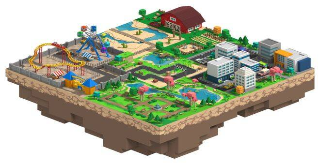
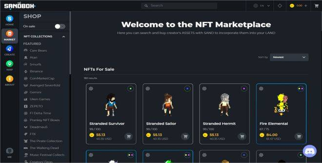
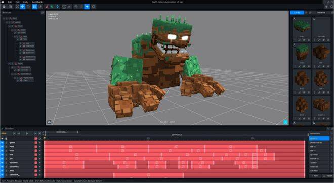

# 分享一款元宇宙游戏平台——The sandbox

**元宇宙**

**The sandbox**

The Sandbox沙盒游戏是一个基于区块链技术开发的虚拟游戏生态系统，以虚拟世界为特色，玩家可以在其中建立、拥有和赚取利益，它属于Play to earn（边玩边赚）的模式。与传统的游戏不一样，使用The Sandbox提供的免费软件，例如 VoxEdit 和 Game Maker，玩家、艺术家和游戏设计师可以为自己创建资产和应用，例如游戏、立体模型和艺术画廊，并与他人分享，从而获得利益。

**The Sandbox平台上的当前产品包括：**

1.VoxEdit：创建元素资产的软件，然后可以成为不可替代的代币（NFT）并导入到市场。

2.maket：在 VoxEdit 中创建的用于交易游戏内资产的去中心化市场。

3.Game Maker：一个可视化脚本工具箱，允许任何人免费构建 3D 游戏。

在The sandbox中，玩家可以通过完成任务来赚取费用，并在游戏内购买NFT资产NFT资产中就包含了虚拟土地。拥有地块就拥有了The sandbox游戏中虚拟土地资产的所有权。所有者可以对土地进行自行设计和运营，也可以通过市场转卖给其他人，赚取差价用于交易。艺术家可以将设计变成NFT转化为游戏中的资产进行售卖。因此TheSandbox被称为游戏的同时不如称之为「平台」。

The Sandbox之中，除了艺术家可以在平台上进行NFT艺术作品的售卖，最受关注的必然是**土地**这个元素。在Sandbox中，世界地图是一张“横向408格子，纵向408格子，共166464”的「体素地块地图」。在网站中你可以通过查询看到地图中正在出售的地块以及已经被购买的地块。玩家可在地块上对于自己购置来的游戏元素和NFT作品进行展示和规划。而无论是 Sandbox官方售卖或是游戏创作者的交易都必须在 OpenSea这个平台上完成。(NFT的售卖也是)。

**NFT艺术创造者基金**

Sandbox 的创作者基金是一项旨在通过奖励和激励艺术家为The Sandbox平台创建 3D 资产来支持艺术家的计划。创作者根据每个资产获得奖金，该奖励的范围从每个独特资产 2 美元到 60 美元不等。除此之外，艺术家还可以在The Sandbox的综合市场上出售他们的资产。

