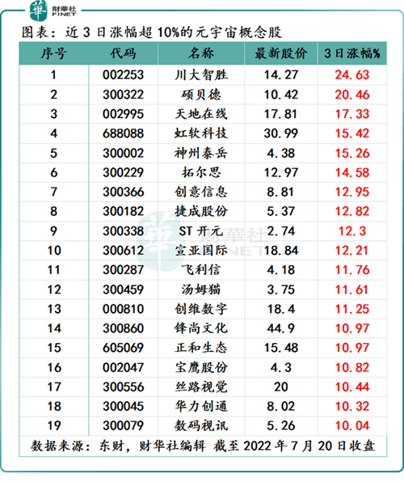

# 元宇宙行情复燃，超九成云宇宙概念股跑赢大市，这些个股已涨疯

论最近三个交易日A股市场哪个概念股板块反弹力度最大，关注度最高，那元宇宙概念股板块肯定榜上有名。

根据东财行情数据显示，截至2022年7月18日（周一）至7月20日（周三）收盘，元宇宙概念板块累计涨跌幅+7.16%，而同期A股沪、深、创三大股指累计涨跌幅分别仅为+2.37%、+1.31%、+0.17%。

个股方面，近三个交易日股价累计涨幅超10%的元宇宙概念股多达19家。其中，涨幅超20%的元宇宙概念股有川大智胜（002253.SZ）及硕贝德（300322.SZ）；

近三个交易日累计涨幅介乎于10%-20%之间的元宇宙概念股分别是天地在线（002995.SZ）、虹软科技（688088.SH）、神州泰岳（300002.SZ）、拓尔思（300229.SZ）、宣亚国际（300612.SZ）、创意信息（300366.SZ）、捷成股份（300182.SZ）、汤姆猫（300459.SZ）、飞利信（300287.SZ）、创维数字（000810.SZ）、ST开元（300388.SZ）、锋尚文化（300860.SZ）、宝鹰股份（002047.SZ）、正和生态（605069.SH）、丝路视觉（300556.SZ）、数码视讯（300079.SZ）、华力创通（300045.SZ）。

值得注意的是，目前A股市场元宇宙概念股板块共有114家，近三日股价累计涨幅跑赢沪深创三大股指涨幅的企业多达105家（占比达92.15%）。这足以反映出当前元宇宙概念股火热的投资情绪。

**元宇宙概念板块爆发之因**

至于当前元宇宙概念股板块及相关概念股关注度如此之高的原因，或许与以下几个方面有关。

首先，本周全球股市回暖迹象明显，A股沪深创三大股指，漂亮国股市“道纳标”三大股指，港股恒指、恒生科技、国指三大指数，都录得不同程度的上涨，多头情绪明显提升。注：“道纳标”指的是，道琼斯指数、纳斯达克指数和标普500指数。

其次，云宇宙概念股中，不少成分股拥有诸多热度概念及题材光环的加持，市场投机、游资等资金或多或少会向这些概念股倾斜。

例如，涨幅最高的元宇宙概念股川大智胜，是15个概念及题材的成分股。其中，不乏近日热门题材及概念板块华为概念、人工智能和车联网。这些板块成分股中，都有川大智胜的身影。

除此之外，硕贝德、天地在线、神州泰岳等涨幅居前的元宇宙概念股，都是多个概念及题材傍身。

最后，元宇宙产业利好消息面利好不断，或是直接驱动元宇宙概念股板块大涨最根本的原因之一。

具体而言，随着房地产行业进入更加稳健及健康发展阶段，以及“十四五”数字经济发展规划的指引，元宇宙成为不少地方政府布局数据化经济重要抓手之一，写入到政府工作报告中。

今年以来，全国各地聚焦元宇宙产业发展及应用的步伐明显提速，上海、北京、广州等在内的多个省市出台了产业发展规划或召开座谈会。

例如，近日上海率先落地了首个地方政府最完整元宇宙发展方案，吸引力不少资本、券商及投行的关注。

7月8日，上海市政府发布了《上海市培育“元宇宙”新赛道行动方案(2022—2025年)》。

这个方案明确提出，2025年元宇宙相关产业规模目标实现3,500亿元，上海将持续推动“元宇宙”产业园建设，培育10+头部企业、100+“专精特新”元宇宙企业，并打造50+垂直场景应用，推出100+标杆产品与服务。

7月19日，上海市文化和旅游局局长方世忠还表示，上海正积极抢抓和布局元宇宙新赛道，联合相关企业、平台和研究机构，深化元宇宙在文旅产业层、应用层的系统研究，加快编制上海市培育文旅元宇宙新赛道的三年行动方案，明确发展目标、重点任务和保障措施，构建一批文旅元宇宙的“上海场景”，制定若干文旅元宇宙的“上海标准”，激发文旅新活力，提升文旅新体验。

同日，特斯拉CEO埃隆·马斯克在社交媒体上回答狗狗币联合创始人比利·马库斯的问题时提到，他已经将自己的大脑上传到云端，并已经与自己的虚拟版本交谈过。

而这虚拟版本，被看作未来元宇宙的雏形之一。

据悉，元宇宙时代，终端硬件形态将向VR/AR、脑机接口等新兴设备演进，“信息-眼-脑”的传输方式被简化为“信息-脑”两个环节。脑机接口将成为继VR、AR之后下一代元宇宙入口。

产业投资方面，近日，第三方平台发布《中国元宇宙投融资数据报告》中显示，2022年上半年元宇宙融资数量达到了41起，融资金额54.6亿元，融资额几乎是过去十年融资总和。

从融资额来看，虽然规模不算大，但其增速是非常的惊人的，这或许能说明当前元宇宙产业正涌入大量的资本，资本关注度正加速提升。

诚然，当前元宇宙概念板块投资情绪再次被点燃，与元宇宙产业诸多利好消息频现、大市回暖、题材概念炒作热度渐起等因素叠加共振有关。

但是，需要投资者注意的是，与当前发展较为成熟的产业相比，元宇宙产业尚处于发展初期，现阶段市场没有标准化，对其定义仍是较为松散且难以分类，相关概念股对元宇宙业务的厘定更是不清晰。

某种层面上讲，元宇宙产业仍处于炒作周期中。对此，元宇宙概念虽火，但投资者切莫盲目跟风或追涨杀跌，应理性看待！
