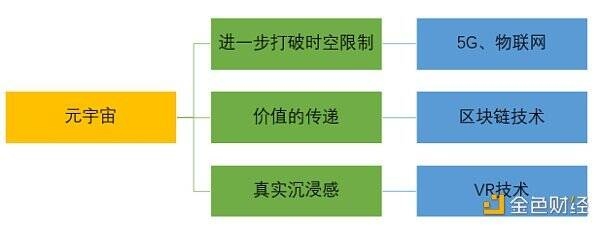

# 元宇宙与区块链和AR等热门技术的关系是什么？

# 元宇宙与区块链和AR等热门技术的关系是什么？

今年以来，有关VR、AR、区块链、NFT、社交媒体、5G等大热的技术和创业名词均与元宇宙相连接，元宇宙所定义的范围究竟是什么？与这些大热的技术之间的关系是什么？

元宇宙一词由科幻作家Neal Stephenson于1992年在其著作《雪崩》中首次提出，在小说的描述中，Metaverse是一个脱胎于现实世界，又与现实世界平行、相互影响，并且始终在线的虚拟世界。电影《头号玩家》即可视为元宇宙的一个典型代表，元宇宙有自己的经济、社会系统，人们可以在这个虚拟世界中可以换一个身份做更多自己在现实世界中无法实现的事。

火币研究院 William分析，元宇宙的内涵及关键技术主要包括以下三个大类：

（1）进一步打破时空限制：

元宇宙的建设要求人们可以在任何地方、任何时间更方便地访问互联网。因此，未来人们与互联网交互的方式将不局限于移动手机和电脑，各种穿戴设备、汽车、家居等都将接入网络中，并且延时程度低，传输能力更强。5G和物联网将是实现该部分的关键。

（2）真实沉浸感：

目前网络主要通过二维图形技术向用户传递信息内容，但在元宇宙中，现实物理世界与数字虚拟世界间的界限将被逐步打破，计算机将模拟虚拟环境从而给人以环境沉浸感，实现虚拟与现实的相互结合，类似电影《头号玩家》中这样的元宇宙世界将会逐步形成，这依赖于VR技术的进步。

（3）价值的传递：

Web 3.0的本质是“价值的连接”。前面当前的互联网只能实现信息的传递，尚不能实现价值的流转。根据新制度经济学的产权理论，一个高效率价值网络的实现关键在于网络上“信息数据产权的确定性和专有性”（产权的界定）和“信息数据产权的可转让性和可操作性”（自由交易）。其中产权的界定要求做到身份的认证与价值数据的确权，自由交易要求实现身份隐私保护与价值数据的授权传递。因此，区块链技术将是元宇宙的核心技术之一。不过从大的发展方向上看，元宇宙不会仅仅依赖区块链技术就可实现。

目前，包括Facebook、韩国手游巨头网石游戏等都宣布布局元宇宙，因为目前的移动互联网红利已近消失，市场由增量扩张转为存量竞争，各大巨头都要寻找下一个战略赛道，而元宇宙很可能是其中之一。风险投资的主要作用就是在一项技术尚处萌芽状态或早期阶段就介入其中，以促进成长模式的转变或提升增长速度。元宇宙自今年夏季以来的大热，很大部分因素是资本追逐的结果；但风险投资具有高风险高收益的特征。距离元宇宙的爆发还有很长的距离。

火币研究院 William指出，目前元宇宙的各大技术发展尚不成熟，市场推广成本较高，尚未达到大规模民用的阶段，比如VR眼镜笨重、物联网基础设备较少、区块链性能低下等的问题，因此元宇宙真正落地任重而道远。
