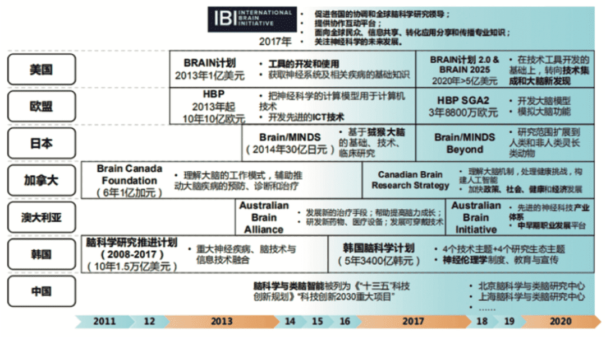

# 题材之王马斯克，一己之力带动元宇宙，元宇宙何去何从？

最近，特斯拉CEO 埃隆·马斯克又来搞事了！

**第一个消息：他表示，他已经将自己的大脑上传到云端，并已经与自己的虚拟版本交谈过。**

马斯克旗下神经科技公司Neuralink正在开发脑机接口。该设备将允许计算机将人的思想转化为行动，让他们仅仅通过思考就能执行诸如打字和按按钮等操作。据悉，Neuralink未来五年的计划是让人类不必使用语言，直接通过大脑进行交流。

也许在不远的未来，人类就将像动漫描述的一样，有机会前往游戏世界中开启自己的第二人生。

**第二个消息：马斯克证实，特斯拉将Steam游戏平台整合到其汽车上，相关的Demo演示可能会比预期的更早。**

早在今年开年，马斯克就表示，特斯拉目前正在努力将Steam平台上的游戏库引入其车辆。特斯拉的目标是，使大量Steam游戏能够直接在其车辆上运行，而不需要开发者进行移植或修改。

特拉斯开发视频游戏，更主要的是为了将来的无人驾驶阶段做准备，车联网成熟以后，大数据、人工智能、5G等技术集合在一起，在无人驾驶过程中，乘客就可以在路上玩游戏。

此外，汽车内部的互联网生态系统一旦成熟，可以向驾驶人和乘客提供音乐、视频、媒体娱乐等服务，这方面也有着巨大的价值。随着5G、云计算、大数据、人工智能等技术与游戏产业的结合越发紧密，游戏行业场景变得更加多元化、智能化。

这两个消息一出来，直接催化了市场上**元宇宙板块**的表现。

那么马斯克所谓的脑机接口业务到底是什么？跟元宇宙有什么关联？如何分析这里面的投资逻辑呢？这就是今天和大家讨论的话题。

脑机接口，也称“大脑端口”或“脑机融合感知”，是在人或动物脑（或者脑细胞的培养物）与外部设备间建立的直接连接通路。

该技术能够在人（或其他动物）脑与外部环境之间建立沟通以达到控制设备的目的，进而起到监测、替代、改善/恢复、增强、补充的作用。脑机接口属于接触式类别，是身联网未来的重要发展方向之一。

未来脑机接口有望解决大部分神经退行性疾病，包括老年痴呆、失明、瘫痪、抑郁、失眠、极度疼痛、中风、脑部损害等一系列问题。

.png)

1924 年，德国精神病学家 Hans Berger 发现了神经电的活动并记录成了脑电图（electroencephalogram, EEG）。

1970 年代，美国国防高级研究计划局（DARPA）开始发力探索大脑潜力。1973 年，美国加州大学洛杉矶分校教授 Jacques Vidal 首次提出了脑机接口概念（Brain-Computer Interface, BCI）。

直至进入二十一世纪，脑机接口开始受到学术界关注。近十年来，脑机接口真正成为学术研究的热点领域，并逐步走向商业化。

随着现代科技和医疗技术的发展，人类预期寿命不断提高，目前是 80-90 岁，在本世纪后半叶甚至有望突破 100 岁。未来 50 年，30% - 60% 的人群有望活到超过 90 岁。

然而，当下现实情况是，绝大多数人群在 50-70 岁开始出现脑功能下降带来的问题，比如记忆力下降、痴呆、抑郁、癫痫、脑肿瘤、脑萎缩等等。如果这些与大脑相关的问题得不到根本性的改善，一个人群普遍寿命延长的社会将会面临着文化、伦理和经济等层面的巨大挑战。

**这是人类平均寿命快速增长与大脑工作寿命有限之间的矛盾。**

另一方面，近 50 年的信息技术革命给人类社会带来了指数级增长的信息增量，然而人类学的相关证据表明，过去 2000 年来人类的个体大脑并未发生显著的生物学进化。

这意味着人类文明知识的爆炸式发展远远超过生物大脑的进化速度，二者之间也存在显著矛盾。

人类本体和生物大脑的两大矛盾将长期伴随我们存在。**脑科学与脑机接口技术的发展或许将帮助我们发现解决这两大矛盾的关键问题，从而获得变革性的解决方案。**

***\*\**脑机接口和元宇宙关系：下一代互联网入口？**

说到元宇宙，相信大家都不陌生，总体上看，**元宇宙作为一个具备永续性、开放性、自治性和沉浸感等特征的高度发达的通证经济形态，符合现代经济的发展趋势。**

另有学者指出，从“场景时代”到“元宇宙”，“人的连接”的迭代、重组与升维为媒介进化提供了新的尺度、新的内容和新的范式，并将以“人的延伸”为纽带，推动元宇宙通往未来的“心世界”。

**那么人如何进入到这个世界就至关重要。**

比如大脑有信息要传递给手，首先要通过运动神经把信息传递给手，然后通过手来移动鼠标或敲击键盘，从而把信息传递给计算机，计算机的信息首先要被我们的眼睛看到、耳朵听到；

然后通过眼睛或耳朵内的感受器转换成电信号，再通过视神经或听神经传递给大脑，而**有了脑机接口，我们就不用这么麻烦，我们可以直接实现大脑和计算机之间的信息交换。**

通过把电机植入大脑推移来采集脑电信号，其优点是信号质量高，缺点是安全非进入式脑机接口；通过脑电波头盔等设备在大脑外部采集脑电信号，其优点是安全，缺点是信号质量不高。

.png)

但如果进入是脑机接口，通过将电机放置在颅骨之内、脑膜之外的区域来采集脑电信号，其安全性或信号的质量都处于中等区别。

由于非进入式，使脑机接口安全性比较强，因此用户的接受程度比较高，应用前景比较大，那么脑机接口技术对我们有什么样的用处？可以说，脑机接口技术对人类扶持的提升将起到非常重要的作用。

短期来看，脑机接口将显著提升脑年人和残疾人的生活质量，还可以提升人类的认知能力，在医疗健康、管理和教育等方面都将发挥极其重要的作用；

长期来看，脑机接口使人类和设备、人类和人类的沟通方式发生了翻天覆地的变化，为我们找到了一条保存一致的路径，使意识在数字世界永生成为了可能。

**脑机接口与元宇宙的关系就是世界与门的关系。**

目前通往元宇宙的接口主要是虚拟现实眼镜，也就是VR头显，但是VR头显最大的不足就是需要佩戴在头上非常不方便，而脑机接口技术将弥补这一重大缺陷，使得人们线上和线下的互动更为顺畅和沉浸。
