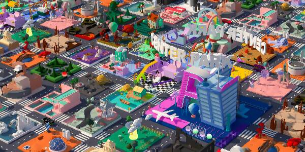
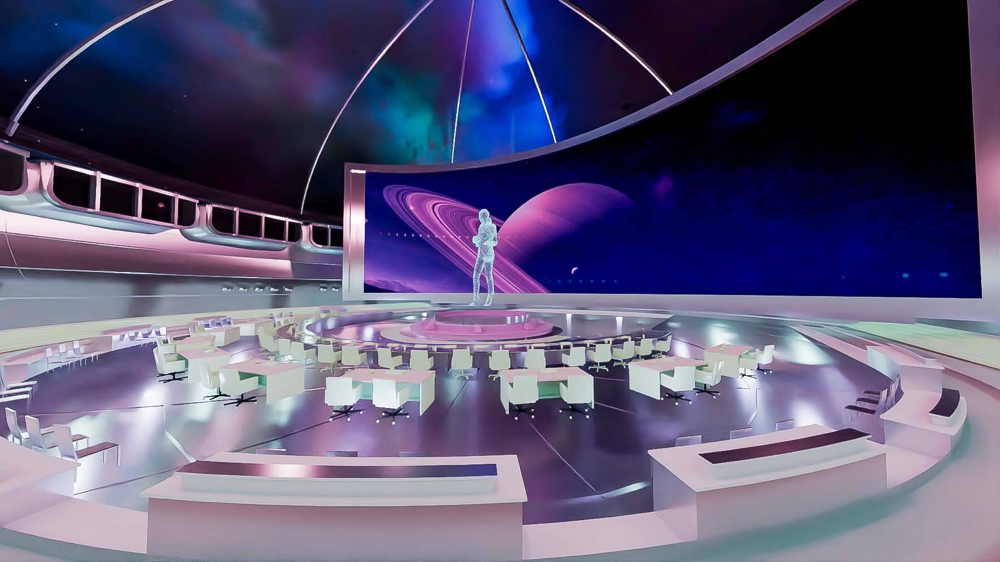
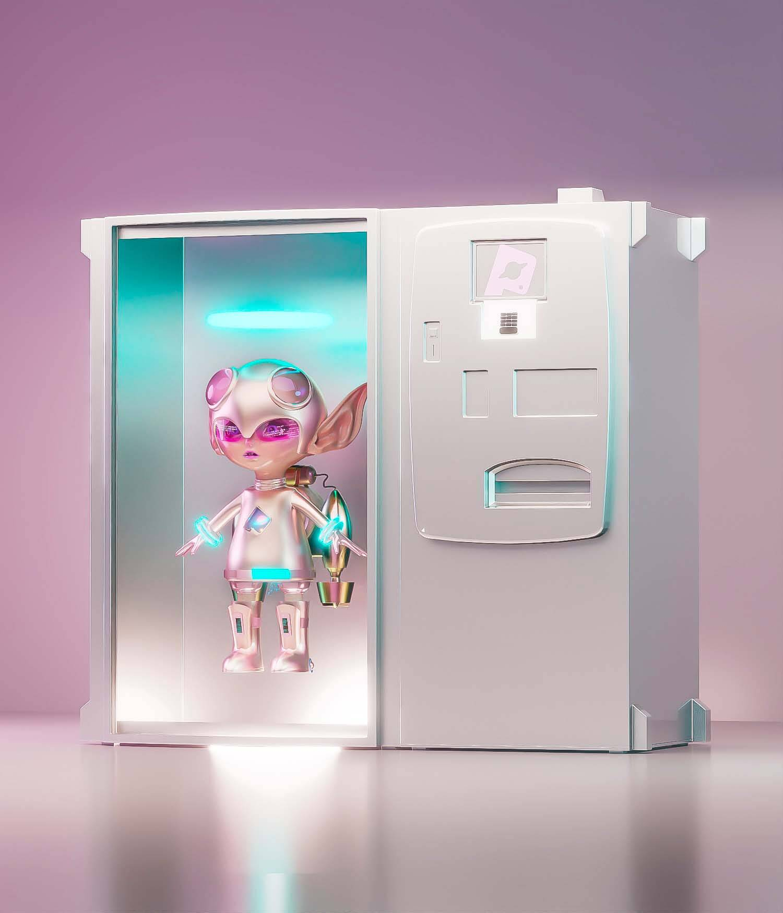

# 宙也科技--定义元宇宙未来下的新模式

2021年,元宇宙的概念席卷了整个互联网行业,如今元宇宙的数字经济已然成为“十四五”发展的主旋律,在不久前印发的《浙江省高质量推进数字经济发展2022年工作要点》中更是明确提出了要深刻把握数字经济发展趋势规律。

宙也科技是一家致力于搭建元宇宙虚拟社区的科技服务公司,专注于突破现实世界与元宇宙数字虚拟空间的边界感,以铸造商业数字藏品为基础,从事元宇宙社交平台搭建以及维护服务。以技术为驱动力,获得进入元宇宙领域的通行门票。

(中心社区)

**深耕智慧技术,推动艺术数字化**

宙也科技CEO谢贤东一直致力于实现元宇宙虚拟社区与数字艺术流转的科技导向型公司,专注于探索现实世界与虚拟世界的边界感和可能性,构建一个全新的元宇宙商业模式。宙也科技与区块链平台合作,生成私域地址,不断尝试未来元宇宙世界在web3.0中的可能性。宙也科技不断挖掘元宇宙的各种创新玩法,并将概念内容具象化,打通可感知的元宇宙通道。

**Center Park中心公园应用“智慧社区,虚实共存”**

宙也科技旗下互联网虚拟社交平台Center Park,在即将到来的web3.0时代,利用U3D等技术为用户提供专属地块,丰富的场景体系与模型库供用户挑选,让每一位用户都拥有3D虚拟形象,以及构建梦幻的私人虚拟空间,共同搭建未来科技感元宇宙社交公园。宙也科技通过路径实现元宇宙入口链接,利用数字孪生技术以及AR实景交互实现,用户可在Center Park元宇宙工作、购物、休闲娱乐、企业培训等,串联异次元门,共同打造丰富多彩的沉浸式泛娱乐虚拟生活社区。

(中心公园会议室应用效果图)

**宙也科技创新商业元宇宙技术“元”模式**

基于线上元宇宙商业模式,宙也科技推出国内首台线下NFR自助贩卖机,打破虚拟与现实的维度壁垒,推动价值链和产业链的升级、转型,创新品牌文化传播方式。用户可在线下商业街区投放的NFR自助贩卖机上,体验宙也科技带来的创新、便捷的购物体验!

在未来一年内,宙也科技将在浙江各大商业综合体投放500台NFR自助贩卖机。在未来三年内,宙也科技将在全国各大城市投放超过1万台自助贩卖机,赋能现实世界多个行业领域。

(NFR自助贩卖机效果图)

“中心”为商业赋能,“公园”提供社交娱乐。宙也科技将在未来进一步拥抱数字改革,在技术发展的风潮下,推动数字技术赋能实体经济,打造商业发展新引擎,创新休闲娱乐新方向。

在未来,宙也科技将继续紧随时代浪潮,明确发展目标,砥砺未来之路;创新玩法模式,赋能实体经济,实现共创、共治、共享的虚拟数字家园。
