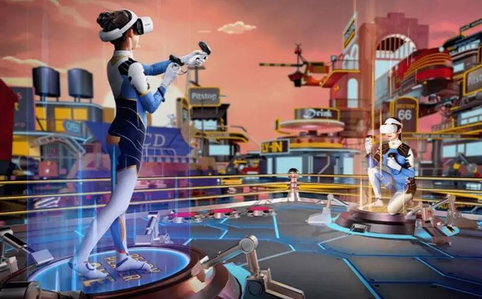

# 元宇宙应用场景之健身

实现全民健身，回归体育的本质，真正让新技术、新模式运用到了人们体育生活的方方面面，用科技的力量提升全民健康水平。在当前形势下，释放工作压力，追求生活品质、休闲健康成为大家健身的动力。2021年8月全民健身计划2021至2025年正式出台，并明确至2025年经常参加体育锻炼人数比例将达到38.5%。带动全国体育产业总规模达到5万亿人，随后在奥运会、全运会等体育盛会的影响下，一场全民参与健身的热潮正在兴起。

从产品应用来看，元宇宙包括沉浸式体验、低延迟和拟整改虚拟化分身开放式创造强社交属性、稳定化系统等特征，这也与国家推动体育产业高质量发展，优化产业结构，推进体育产业数字化转型，鼓励体育企业数字赋能，推动数据赋能全产业链协同转型的全民健身思路不谋而合。与此同时，智能健身镜，VR健身等作为一个全新品类的产品，为用户提供更多场景选择，科技赋能，随时居家健身。

在全民健身中，不仅要有元宇宙健身入口，还要有健身课程、健身教练和人工智能交互等，只有创新的交互模式，搭配品类丰富、定期更新的专业课程库，以家庭用户为单位，提供高质量的软硬一体的健身服务，解决用户在快节奏生活中对健身的丰富性、高效性和趣味性的需求。沉浸式健身体验，在线教练可以通过体感设备和检测指标，指导你私人化定制健身目标，打造虚拟身份，结合健身优势，实现打怪升级、与平台用户PK互动等体验，让健身爱好者在元宇宙的世界中遨游。在大众健身领域，已经有新创企业通过VR、健身镜等设备以及在线健身应用等路径，开始元宇宙健身的征程。
