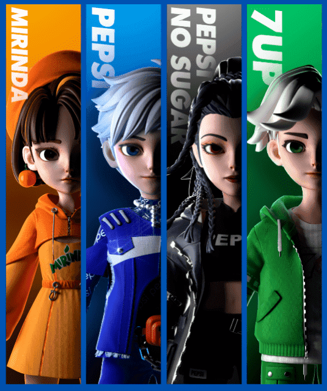
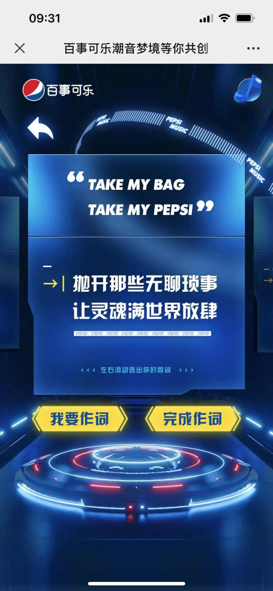

# 百事元宇宙，实现了我的“创世”梦？

如果说**「百事盖念店」**是夏日限定版年度潮流热点盛事，那么今年的回归显然比以往更热血——

因为这一次，我们迎来的不再只是一座线下潮玩体验店，而是一个更具未来感、想象力和创造力的虚实交互空间。

***\*就在前不久\*******\*，百事官宣百事盖念店全面焕新升级，\*******\*正式进入百事元宇宙时代\*******\*。\****

首推4位百事家族虚拟偶像、打造国内首秀元宇宙Live House、推出NFT、开启虚拟世界未来第三空间......足见，百事元宇宙有备而来！

***\*如果拥有主导权，
你想创造一个怎样的世界？
\*******\*
如果想象没有边界，
热爱将会引领去往怎样的前线？
\*******\*
如果生命不以\*******\*物理时空\*******\*为限，
我们又会拥有多少种
截然不同的“人生”体验？\*******\*
......\****

在这场 ***\*#用热爱创未来#\**** 的元宇宙营销里，百事正以前所未有的创新对话集结“创世伙伴”，共同“揭盖”一个集想象力、创造力、生命力于一体的“未来新世界”。

**0****1**

**六大动作，开启元宇宙颠覆性试炼**

 

元宇宙概念，最早出自美国科幻作家尼尔·斯蒂芬森的《雪崩》。

在小说里，所有现实世界的人都有一个“网络化身”，通过这个分身人们可以自由进出一个与现实世界平行的虚拟空间，彼此交互。这一设定也成为了当下品牌布局元宇宙的基本框架。

了解了这一点，我们再来看看百事元宇宙是如何诞生的：

***\**\*➤
\*\**\*首推品****牌虚拟偶像，演绎百事个性形象** 

**
**

在创造新世界之前，先要“创造”全新的自己。以旗下极具代表性的四大品牌——百事可乐、百事可乐无糖、美年达、7喜为设计原型，百事首次推出 4 位百事家族虚拟偶像，并组成了一个虚拟偶像天团***\*TEAM PEPSI\*******\*。

他们是百事品牌形象和热爱基因的具象化显现，却也各自有着鲜明的性格标签——

明朗率性的**PEPSI**，拥有从气泡中升腾而起的“酷爽”气质；

飒酷十足的**PEPSI NO SUGAR**，尽显劲爽无畏的“超敢”精神；

阳光活力的**MIRINDA**，保留着“鲜活”态度；神采飞扬的 **7UP**，全身洋溢满满的清爽能量，将“有趣”充分演绎。

这一横空出世的虚拟偶像天团象征着未来生命力，也是将和Z世代一起开启未来的“创世伙伴”。

**打造国内首秀元宇宙Live House，沉浸式体验超现实视听盛宴
**
为了更生动地传递未来体验，此次焕新，百事选择了用品牌文化深耕的潮流音乐链接现实与虚拟，联手虚拟音乐嘉年华 TMELAND，独家举办了**国内首秀元宇宙Live House「百事可乐潮音梦境」**。

放在元宇宙的 Live House 打破了传统舞台所受的物理空间限制，在两位明星嘉宾的带领下，我们可以肆意穿梭于荒漠、绿洲、海底、星球宇宙、赛博都市等变幻场景，身临其境地参与一场从“入梦”到“出梦”的奇妙探险之旅。

甚至我们还能借助数字分身，切换演唱会的观赏视角与参与模式：

【纯享模式】可以占据最佳机位观看演唱会；【互动模式】可以自由行走来操控演唱会视角，或者屏蔽他人，享受和偶像的独处时光。

现场还有定制红包雨，从天而降百事可乐无糖，玩家可以随机抽取限量虚拟装备、绿钻周卡和QQ音乐实体周边等礼物。

同时，通过点击互动按钮，虚拟的“我们”还能随时随地跟着节奏摇摆。所谓音乐盛宴，不就应该这般无拘无束地放肆玩！

这一打破虚实界限的沉浸式音乐互动体验，很快吸引了大量“云蹦迪”爱好者围观，**当晚****开场不到二十分钟，在线人数就已接近200万，创下了TMELAND互动数首次突破百万的历史记录**。

**发布百事首支元宇宙主题曲，强化用户共创体验感**

在这一元宇宙舞台上，TEAM PEPSI还公开演唱了**百事首支元宇宙主题曲《Pepsi Cypher》**。

值得注意的是，早前百事曾向全网发起“共创召集令”，邀请所有音乐发烧友一起填词，共同为百事元宇宙发声。许多网友的自创歌词还在Live House弹幕墙上得到了随机展现

.jpg)

这一全程参与的共创体验，既增强了年轻人对于百事元宇宙助力音乐热爱的认同感，也让更多年轻创造力被看见、被激活，为百事元宇宙未来驱动持续蓄力。

**上新百事NFT数字藏品，深化百事元宇宙感知
**
集结先锋艺术团队，百事还和95后知名数字艺术家SHANE FU 合作，推出了4款限量 NFT 数字艺术藏品。

其灵感来自百事可乐与舌尖接触时的奇妙反应，借助超现实主义裸眼 3D 展示大片，融合了抽象城市、无垠星云、超现实自然等丰富元素，生动还原了可乐接触味蕾那一瞬间气泡炸裂升腾时的即兴状态，以及百事希望和当代年轻人一起探索宇宙奥秘的澎湃激情与独特的热爱基因。

**创建首款虚拟百事盖念店，开启社交“未来第三空间”**

就在接下来的 8 月，百事还将携手腾讯超级 QQ 秀，创建首款虚拟百事盖念店线上体验空间。

用户可以进入到充满缤纷夏日元素的“潮酷商店”和“夏日沙滩风”两大创意主题空间中，与百事家族虚拟偶像进行智能交互、购买各类百事饮品以及兑换心仪的未来潮品，身临其境地感受未来社交消费体验；也能在清爽的夏日氛围之下触发虚拟烂漫烟花雨，乐享超现实的氛围空间。

**上线更多人气虚拟角色，解锁“N种人生”体验**

除了当下设定的歌手角色，未来，百事家族虚拟偶像天团还将化身音乐DJ、滑板高手、跑酷达人等多种高人气虚拟角色，带领我们感受“N种人生”并行的奇妙体验。

**六大动作重拳出击，不仅快速搭建起百事元宇宙雏形，也将年轻消费者对这个集想象力、创造力和生命力于一体的“未来新世界”期待值拉至顶点。**

而这背后，则反映了百事品牌作为流行文化引领者，对于时代趋势的敏锐洞察。

**0** **2**

**洞察流行，以突破创新强化营销张力**

自2021年元宇宙概念兴起，这一关键词在火速成为全球热点话题的同时，也成为了品牌布局的重要赛道之一。

然而迄今为止，这一产业仍然处于萌芽期，元宇宙营销应用也尚处于摸索阶段。品牌惟有不断创新、大胆突破，为这一先锋概念注入更多、更丰富的内涵，才能推动元宇宙时代快速发展，并最终从抽象走向具象可感。
***\*
而百事的先行之处就在于，它以超敢\*******\*开拓\*******\*的姿态，为年轻用户打开了一个可玩性更强、想象边际更辽远、更能张扬个性表达的全新社交场域。
\****
**那为什么元宇宙文化深受Z世代的憧憬与拥护？**

此前动森、ROBLOX等游戏的爆火，其实就已反映出：虚拟世界突破物理局限的设定、超越现实的互动感应、以及高度自由的创作环境等，都能极大限度地满足年轻人时刻迸发的创造力与想象力。

而在对当代潮流文化更迭与年轻意识形态变迁的密切关注中，百事早已敏锐洞察到：
***\*
当Z世代站在元宇宙这一立体多面的新场域时，他们期待能够享有更多主导权，共同参与创建“未来”的过程。
\****
因而在建立百事元宇宙时，品牌非常注重共创引导与个性尊崇：

创立品牌自己的数字化身，百事虚拟偶像并非一枝独秀而是组团出道，共创热爱文化的同时，也保留了各自的人设个性，可以说他们既是为百事代言，也在为自己代言。

举办元宇宙livehouse以音乐为沟通主题，百事用共创汇聚青年创想的热爱阵地，让更多创作激情在热爱共鸣里大胆释放，而随机上墙的原创歌词曝光、数字形象的换装自定义，都为用户开辟了自我展示的舞台。

通过这些多元化的方式，百事让更多年轻用户感受到：

品牌在元宇宙中里是以“创世伙伴”的身份相伴左右，而不是高高在上的主导者。由此拉近了跟用户的距离，同时也有利于建立起互相尊重、彼此认同的亲密关系。

**03**

**以“热爱”为核心，驱动年轻创造力**

不得不说，对于年轻热爱的推崇与喝彩，一直根植于百事品牌基因，而百事盖念店的出现，更加速了多元热爱的升腾与裂变。

**今年已经是百事盖念店火热上新的第六年。
**
作为专为年轻人搭建的当代潮流文化聚落，“百事盖念店”自2017年出现开始，就一直是百事与时代保持同频的前沿阵地。

.jpg)

从H5到快闪店，从联名跨界到元宇宙试炼，越来越多年轻人与百事一起，在此延伸创造边界，用硬核科技和新锐设计为传统注入生机、让经典焕发活力，也让热爱初心与开拓创新的新青年精神在此奔腾不息。

因而把品牌元宇宙试炼的开端，放在有着近6年热爱经验的百事盖念店，也是百事元宇宙营销策略上值得一提的亮点。

同时还有一个细节值得注意：

今年百事盖念店的突破升级，是以百事家族中的“超敢担当”——**百事可乐无糖作为引爆者**，而这一产品的诞生，本身就是百事品牌敢于突破、大胆创新、无限热爱精神的最佳象征。

.png)

回看此次百事元宇宙的一系列玩法，我们不难发现，**品牌始终是将“热爱”作为驱动创造的核心，把激发年轻创造力作为开创未来的引擎**。

对于百事来讲，始终胸怀热爱、始终保持“少年感”，是品牌常青的秘诀。

它从不屑于去做潮流追赶者，而致力于让自己成为潮流本身；也从不畏惧走无人走过的路，将拓展想象边界视为自身价值的体现，这使得百事总能为行业营销思路带来新的借鉴。

就像此次颠覆性的元宇宙试炼，百事以“热爱”为驱动，不断跨越“新”与“旧”的边界。

从虚拟偶像到虚拟演唱会，从NFT到未来第三空间蓝图，在不断延伸的创造边界中，***\*百事\*******\*一面\*******\*向年轻人\*******\*输出\*******\*潮流、时尚、创造、多元\*******\*热爱\*******\*的品牌文化\*******\*，\*******\*一面\*******\*与\*******\*其共创开辟新的\*******\*成长\*******\*路径，在元宇宙这一全新的对话语境里，百事正向这\*******\*一代\*******\*年轻\*******\*人\*******\*发起\*******\*「\*******\*用热爱创未来\*******\*」\*******\*的“创世”邀请。\****
