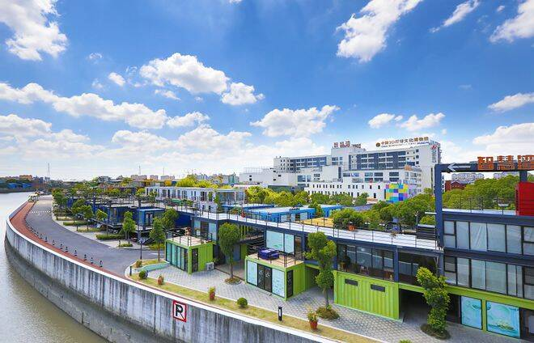
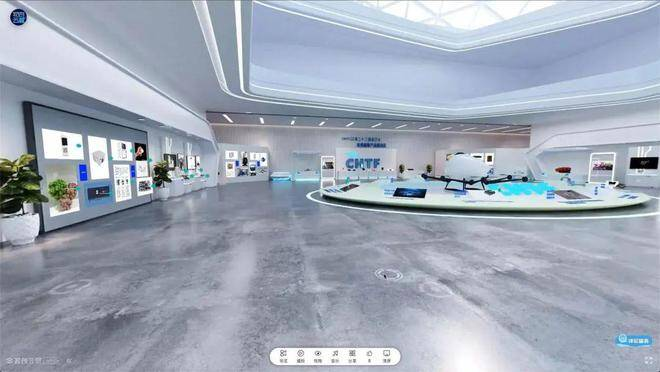
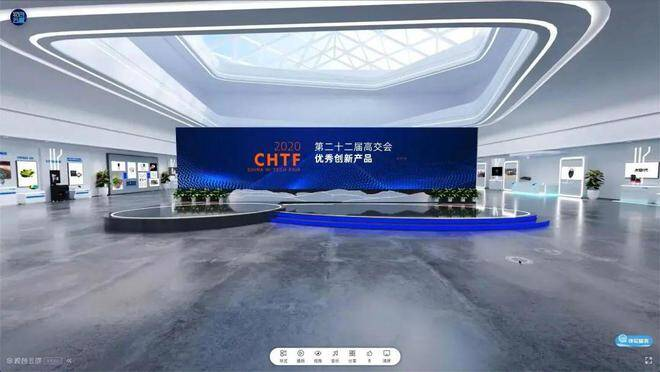
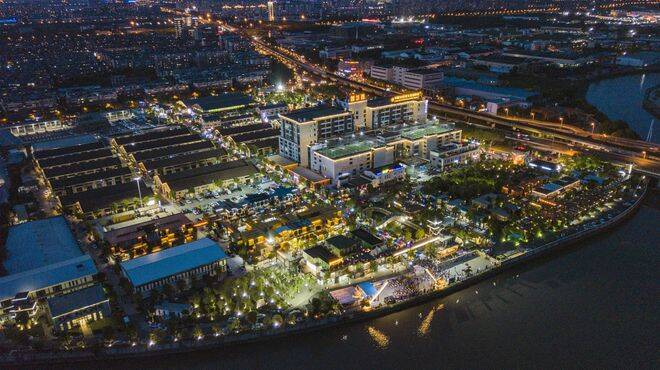
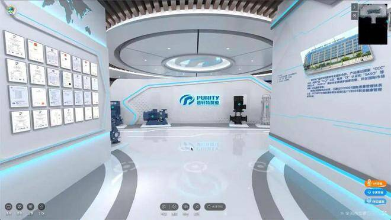
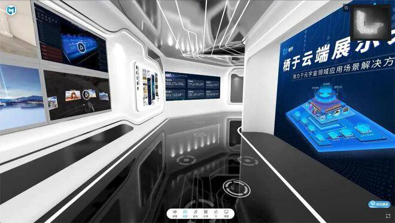

# “元宇宙”赋能企业发展！宝山这个硬科技中心致力于打造标志性创新产业平台

# “元宇宙”赋能企业发展！宝山这个硬科技中心致力于打造标志性创新产业平台

去年年底入驻智慧湾的上海宝山硬科技中心，是全国区域城镇首个以“硬科技中心”为主题的“融-销-产”科技创新产业平台。它的入驻也为宝山打造科创中心主阵地注入了新的活力。

上海宝山硬科技中心围绕硬科技的代表性领域：光电芯片、人工智能、航空航天、生物技术、5G信息技术、新材料、新能源、智能制造等，以“科技企业落户、科技成果转化、产融关系强化和创新载体优化”为目标，建设“一个地标、两个平台、三大服务体系、四个功能区”的生态体系，致力于打造一个科技创新产业平台。

那么“一个地标、两个平台、三大服务体系、四个功能区”的生态体系是如何建构的？又有什么特别之处呢？上海宝山硬科技中心负责人介绍道：“依托于智慧湾产业园区，两个平台主要是以投资服务、路演为主，等于是把全国的很多的科技类的企业通过线上和线下，安排到我们这来进行路演，了解我们宝山的一些产业政策。三个服务体系指的是通过赋能给企业销售，我们做了一个元宇宙的平台，现在已经在一些工业领域赋能，还有包括投融资。因为自己打造了一个互联网的投融资平台，那么通过一些精准的标签，我们会围绕一些新生代的产业，给企业提供一些服务。此外，还有特别是关于一些科技类的企业，它们在一定的阶段内需要落地和落户，那我们等于是协助它们在当地进行一些政策的咨询，包括帮它们去做一些关于载体的筛选和优化。”

说到为什么选择落户宝山智慧湾，上海宝山硬科技中心负责人表示：“在上海市南北转型大背景下，宝山正全力打造科创中心主阵地。宝山区顾村镇产业基础雄厚、产业特征明显；同时，地方政府也给予了一定的扶持政策，主要包括办公场所、路演场所、物业补助、税收补助、项目落户奖励、人才公寓等方面，因此，我们最终就选择了宝山。”

值得一提的是，在疫情期间，中心发挥线上平台优势，把投融资路演在云端通过虚拟场景来实现投融资对接，同时，上线了上海区域最早的元宇宙应用场景运营平台。让工业企业、零售业、硬科技企业可以通过线上平台，在云端展示自己的产品和技术。

