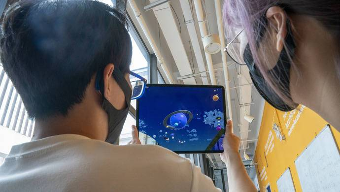

# 上海布局“元宇宙”新赛道，发力点在哪里？政协委员：这项技术是核心 

# 上海布局“元宇宙”新赛道，发力点在哪里？政协委员：这项技术是核心 

很少有概念像“元宇宙”一样，从诞生之日起就讨论不断，甚至很难找到一个公认的定义，但这并不妨碍相关技术、产业的蓬勃发展。最近，上海发布了培育“元宇宙”新赛道行动方案，提出到2025年“元宇宙”相关产业规模达到3500亿元，带动全市软件和信息服务业规模超过15000亿元、电子信息制造业规模突破5500亿元。

在多位深耕数字领域的政协委员看来，这一行动方案系统全面、措施明确，吹响了上海元宇宙发展的集结号。在元宇宙成为年度热词的当下，该如何理解这一概念？上海发展元宇宙的优势和着力点是什么？又有哪些需要注意的问题和风险？最近，多位政协委员参与相关调研后提出意见建议。

**新赛道是科创能力竞争**

元宇宙有多热？最近，美国《时代》周刊发布最新一期封面文章《元宇宙将重塑我们的生活，让我们确保元宇宙变得更好》。文章指出，在2022年的前六个月，“元宇宙（metaverse）”这个词已经在美国证券交易委员会的监管文件中出现了1100多次，而在2021年仅有260次。

这种热度从企业战略中也可见一斑。国际上，脸书、谷歌、微软、英伟达等互联网科技大公司已纷纷投巨资布局元宇宙。在国内，除上海外，北京、武汉、深圳、重庆、杭州等多地已制定元宇宙相关规划或政策，一批元宇宙研发机构、创新企业、产业园区应运而生。

简而言之，元宇宙是基于PC互联网、移动互联网之后的虚实交互互联网，将成为虚拟世界和现实世界相交互的重要平台，被认为有望在部分领域引发颠覆式的创新和爆发性的增长。

“去年以来，随着VR/AR、数字孪生、5G、人工智能等技术逐渐成熟，疫情之后用户和市场需求不断提升，沉浸化‘娱乐+社交’应用层出不穷，推动元宇宙达到了临界点。”市政协委员、中国电信研究院副院长李安民告诉记者，元宇宙代表了下一代全息互联网的发展方向，是未来数字资产的重要生产地，更是未来人类的数字生活和工作的虚实融合空间，预计在未来两三年仅虚拟现实的市场规模将达到6000亿美元以上。

“上海发展元宇宙，有其自身优势。”李安民指出，算力是元宇宙最重要的基础设施，相关技术能够优化元宇宙虚拟世界的稳定性，大大提高虚拟现实体验。在这方面，正处于加快数字化转型过程中的上海具备优势，作为率先建成“双千兆”宽带的城市，上海在信息化基础设施建设方面长期处于国内国际的领先地位。

“元宇宙代表的新赛道，背后竞争的主要是城市的科技创新能力。”市政协常委游闽键说，在这方面，上海在国内有着得天独厚的优势。他给记者提供了一组数据：目前，上海集聚了全国约50%的5G人才、40%的芯片人才及30%的AI人才，元宇宙相关产业生态繁荣，产业链布局相对完善，基础较好。

此外，上海元宇宙与其他产业的融合，也已具备非常丰富的应用场景。记者注意到，上海中国商飞已开始提供“工业互联网+元宇宙”场景，中山医院、瑞金医院则提供了“医疗+元宇宙”场景，虹口区打造了全国首个“元宇宙创意园区办公”场景，大创智数字公园的基础建设计划于今年年底竣工完成，建成后将成为全国首个数字公园。

“总体来看，尽管当前元宇宙仍处于初始阶段，但其未来前景不可估量。”李安民说，元宇宙的发展之路，就是一条我们在探索发展元宇宙、元宇宙也在探索发展我们的路，这需要产业链各方一起努力，勇往直前。

**加快数字基础设施建设**

发展元宇宙，核心技术是重要着力点。去年12月发布的《上海市电子信息产业发展“十四五”规划》，明确要求加强元宇宙底层核心技术基础能力的前瞻研发。在委员们看来，上海布局元宇宙新赛道，加快数字基础设施建设是关键，智能算力技术则是其中的核心。

“算力支撑着元宇宙虚拟内容的创作与体验，更加真实的建模与交互需要更强的算力作为前提。”李安民解释说，元宇宙是一个承载活动的虚拟世界，以算力为支撑的AI技术能够辅助用户创作，生成更加丰富真实的内容，构成元宇宙的图像内容、区块链网络、人工智能技术都离不开算力的支撑。

“上海要在现有科技创新的基础上花大气力，大胆拓展人工智能、脑机接口、通感一体、全息网络、情感AI等新技术的研发，打造元宇宙时代的算力产业。”李安民建议，研究机构与企业应积极参与，对新型智能化综合性数字信息基础设施，以及相应的数字化需求及趋势进行深入研究，同时，政府部门应进一步明确相关发展规划，建设好云网融合的算力底座。

记者注意到，此次行动方案已明确提出，要超前布局未来网络，加快推进“双千兆”网络建设，培育5G+、6G、卫星互联网、Wi-Fi 7、IPv6等未来网络生态，同时，加大计算能力支撑力度，推动云边一体布局、算力自由调配、云端实时渲染的新型云计算和边缘计算平台发展，培育基于容器化、开发运维一体化等技术的云原生应用。

不断提高的算力需求，将带动集成电路相关行业以及新一代通讯技术行业的发展。但在游闽键看来，现有的硬件基础仍不能满足将来高速膨胀的元宇宙应用需求。此外，元宇宙终端设备对应的产品涵盖了智能手机、VR/AR 设备以及其他深化感知交互设备，这也对硬件设备提出了更高的要求，现有产品并不能完全满足对元宇宙功能的预想。

对此，他建议重点围绕与沉浸感相关的接入硬件行业进行重点布局，初创企业与科研院所进行联合技术攻关，发挥科研院校研究能力的优势，与实际产业需求相匹配，快速提升上海元宇宙设备行业的硬实力。加快 VR/AR 等新型硬件终端设备的研发，出台扶持政策，支持工业化量产与市场化应用，从而改变硬件入口产业较弱的现状。

硬件的强弱与产业布局不无关系。委员们在走访上海元宇宙相关企业时发现，目前相关产业布局仍较为分散，呈现“有点、无线、缺面”的状况，亟待完善统一的管理和服务机制，建议依托领军企业的头部优势推动产业上下游有机结合，形成紧密衔接的产业链和服务链。

此次行动方案已明确提出，要培育10家以上具有国际竞争力的创新型头部企业和“链主企业”，打造100家以上掌握核心技术、高能级高成长的“专精特新”企业。在委员们看来，这将对进一步打通元宇宙产业链，形成特色新兴产业集群产生正面效应。

**加强监管防范系统风险**

在各种元宇宙相关企业、产品如雨后春笋般冒出来的同时，委员们也注意到其中潜藏的风险。如，一些不法分子借机蹭热点，以“元宇宙投资项目”“元宇宙链游”等名目吸收资金，涉嫌非法集资、诈骗等违法犯罪活动。

在深耕数字领域多年的在沪全国政协委员谈剑锋看来，从顶层设计到战略规划，我国具备发展数字经济的底气，但与此同时，也要防止个别人钻政策红利空子、割投资者“韭菜”。他直言，要谨防资本利用国家发展规划和热点概念，让国民误解国家产业政策，误导地方产业规划的落实，产生新型数字经济监管风险，出现新的虚拟经济泡沫。

在调研中，谈剑锋发现，目前，以区块链技术为基础的卡通人像、电子油画等NFT虚拟艺术品已在“元宇宙”里大行其道，监管却较难落实，可能形成新的洗钱通道。他建议，对以元宇宙概念运营网络社区、网络游戏、网络交易的企业，相关部门应依据国家《网络安全法》《数据安全法》《个人信息保护法》等法律规范要求进行监管，同时要关注并跟踪研究元宇宙概念中产生的新模式、新机制，根据需要提前研究制定监管法律和规范，如制定备案登记制度、运营交易模式监管制度，提前防范系统风险。

“此次元宇宙行动方案发布后，更须防范NFT市场过度投机和恶意炒作。”游闽键指出，主管部门应从严审核企业资质，避免同质化发展造成行业乱象，同时，要在消费流通环节加大监督执法力度，针对NFT平台涉嫌非法吸收公众存款、集资诈骗、非法经营、洗钱等违法犯罪行为，做到早发现，早取缔。

元宇宙的发展也对数据安全提出了新的挑战。在市政协最近召开的相关专题协商会上，市政协常委、经济和金融委员会主任，市金融工作党委书记严旭直言，目前，我们对元宇宙的理解更多的是从技术角度出发，还未到建立法律法规和标准协议的阶段。元宇宙所涉及的虚拟物品所有权、信息安全、反垄断和未成年保护等问题尚未明确，建议加快推动立法研究，健全市场规则，支持有条件的企业和机构研究制定各专业标准，加快建立行业标准体系，推动行业规范发展。

“元宇宙产业界要脚踏实地，遵循‘虚实映射、虚实交互、虚实融合’的技术和产业演进规律，推动逐步实现数字经济的迭代升级。”在委员们看来，上海拥有元宇宙发展的肥沃土壤，在技术和应用场景方面有比较优势。既要给元宇宙数字经济的创新发展提供容错机制，也要对违法违规行为重点监管，以技术创新与制度创新相结合，打造上海元宇宙数字经济新名片。
