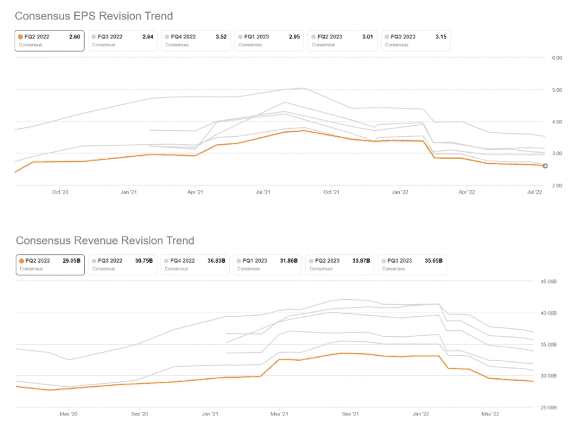
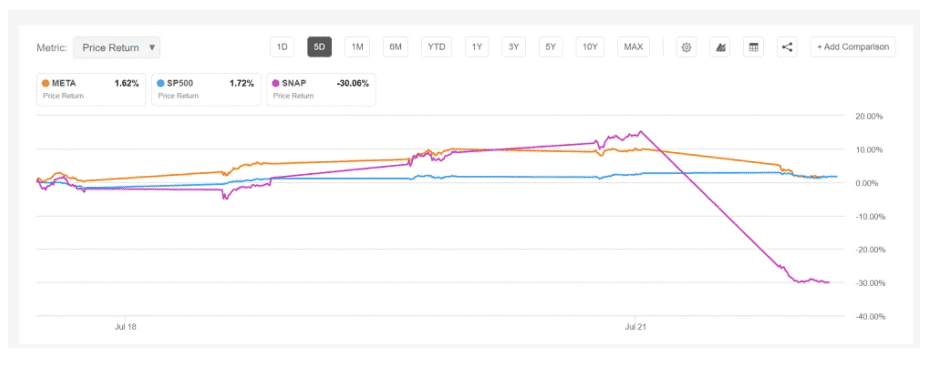
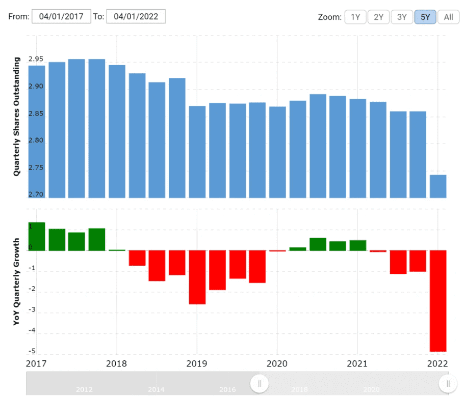

# 元宇宙概念股Meta本周发布Q2财报 投资者需注意这四个关键因素

对于Meta来说以目前低于200美元/股的价格，可以说是十多年来最好的投资机会。毫无争议，现在Meta的股价绝对被严重低估了，考虑到围绕Meta广告业务的负面情绪和暂时无法盈利的元宇宙构想，本周即将发布的Q2财报对于Meta将是一个关键事件，以此证明市场的反应已经过度。

众所周知，Meta Platforms计划在7月27日发布Q2收益报告，有四个关键因素可以让该公司获得意想不到的增长。(1)Meta的营收，包括MAU和营收，(2)Meta的研发投入水平，(3)Meta的股票回购计划加速/增加，(4)Meta与TikTok的竞争。

**Meta Platforms的收入预览**

据彭博终端报道，截至7月20日，已有31位分析师提交了他们对Meta即将到来的2022年第二季度业绩的预测。总销售额预计在276.8亿美元和300亿美元之间,平均预期是290.5亿美元。值得注意的是，如果我们以平均值为基准，销售额预计将同比下降约0.09个百分点。每股收益分别为2.0美元和2.97美元，平均为2.6美元。

这里要强调的是，分析师已经多次下调了2022年第二季度的营收和每股收益预期。作为参考，在2021年9月，分析师认为Meta可能产生约330亿美元的销售额和约3.8美元的每股收益。现在，对营收和每股收益的预期分别降低了10%和25%以上。实际上，降低预期是看涨的动力，因为市场正在消化大量负面消息，并为财报的意外超预期打开了大量上升的空间。

值得注意的是，Meta Platform本身指导在2022年第二季度的销售额在280亿美元至300亿美元之间。鉴于美元汇率上涨的不利因素、税收支出较上年增加以及广告需求略微疲软，该公司也预期也比较谨慎。

**需要关注的关键指标**

鉴于负面情绪的上升，我相信Meta有足够的空间让市场惊喜。具体来说，需要主要关注4个关键因素:(1)Meta的营收，包括MAU和营收，(2)Meta的研发投入水平，(3)Meta的股份回购计划加速/增加，(4)Meta与Reels的合作进展。

**(1) Meta的营收**

Meta的收入和收益预期非常悲观，正如前一节所强调的，共识估计已经稳步下降。Snap最近公布了负面的收益（令人惊讶的是下行），股价在该消息中下跌了约40%。由于投资者正在交叉解读对数字广告领域的影响，Meta在同一天下跌了约7%。

经济衰退对所有数字广告公司的影响并不相同。我认为对于广告业来说，在经济不景气的情况下，更多的新兴渠道（如Snap）的预算将被削减，而成熟的解决方案（如Meta的平台）的预算将被增加。Meta的广告回报是行业中最高的，目前只有Alphabet能够与之相媲美。考虑到不确定的宏观环境，效率变得越来越重要，所以说Meta的广告收入将更有弹性。值得注意的是，美国银行最近将Meta评为最不景气的股票。

**(2) Meta的研发投入水平**

Meta高昂的研发投资遭到了投资者的强烈抵制，因为投资者担心，公司在Metaverse的幻想中会消耗太多的成本。值得注意的是，2021年，Meta的研发投资占营收的比例超过了20%。现在，考虑到成本削减和效率的重要性，相信Meta将通过将研发费用降低到更合适的水平来取悦投资者。猜测可能会减少3 - 5个百分点，这将为公司带来约40亿美元的额外现金流。这样的公告肯定会让投资者感到高兴，并恢复对管理层决策的信心。如果到第二季度Meta还没有减少研发支出，公司可能会在财报电话会议上制定这样的研发节约计划。

**(3) Meta的股份回购方案**

Meta在2022年第一季度回购了价值93.9亿美元的A类普通股。这相当于该公司市值的1.7%左右，对股东来说是相当可观的价值分配。截至2022年第一季度，Meta的资产负债表上仍有超过430亿美元的现金和现金等价物，相信该公司将利用股价下跌的机会，回购更多的股票。截至2022年3月31日，Meta有294.1亿美元可用和授权回购。即便该公司不增加这个项目，也没有坏处，但如果Meta增加了回购，对于刺激股价来说就有巨大的好处。回购是一种进入盈利阶段的免费隐含看涨期权。投资者也应密切关注管理层的业绩报告，以防出现任何可能的交叉解读。

**(4) Meta与TikTok的竞争**

近几个月来，Meta大力加快了与TikTok竞争的新举措。例如，Meta最近改变了它的内容发现算法和策略，以更像TikTok的工作方式，例如，提供内容发现与社交图网络。此外，该公司还推动了Reels在Instagram上的广泛采用和使用，即长达30秒的多片段视频。最后，Meta还推出了吸引和留住内容创作者的举措。所有这些努力最终都是为了通过提高Meta的参与度和对年轻一代的吸引力来与TikTok竞争。也就是说，投资者必须更多的了解Meta在所有这些举措上的进展，以及这些进展最终将如何转化为股东价值。

**财报存在的风险**

在财报方面，有两大风险可能会导致我的论点被推翻：首先，Snap的业绩不佳并不是个例，而是整个数字广告领域的一个缩影。其次，尽管Meta的表现超出了预期，但市场仍对该公司2022年下半年的表现感到担忧。在这种情况下，投资者可能会寻求继续抛售Meta股票。所以Meta对于下半年的指导将是财报的一大关键。但反过来也有可能:即使Meta业绩不佳，投资者还是会在股价疲软和悲观情绪时买入该公司的股票，也就是我们常说的利空出尽丧事喜办。

**最后该如何操作Meta股票**

Snap的营收预期仅比市场普遍预期低2%左右。然而这一消息一出，该股市值当日就下跌了40%，而且是在5月份下调过预期股价已经大跌了43%的情况下，可以说，市场对于数字广告行业非常谨慎和紧张，市场现在太过悲观了。这种消极的情绪持续蔓延，只要释放出一点点利好（例如奈飞），Meta的股价很容易上涨。
