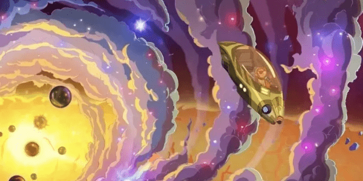

# 元宇宙与数字藏品的关系

**元宇宙是一个大的范围界定，数字藏品是元宇宙中的一种形式。**

NFT让元宇宙中的各种数字物品的价值归属、产权确认、虚拟身份的认证都成为可能，所以，NFT将 是未来元宇宙经济活动的基本枢纽，还有人将NFT比喻为开启元宇宙世界的门票。

数字藏品也可以说就是有收藏价值的虚拟产品。每个数字藏品都有唯一的区块链编号，任何一件艺术品或商品通过数字手段加密后，便拥有了一张独一无二的“数字证书”，这份凭证将被永久储存在链上，不可篡改，不可复制。每个数字藏品都有唯一的区块链编号，它让我们在数字时代，真正拥有“专属”于自己的内容。

这项依托于区块链技术，生存于虚拟世界的发明，正在改变着人们对收藏的认知。NFT作为元宇宙的必要组件之一，与元宇宙相辅相成，成为了衔接现实世界与虚拟世界的桥梁。NFT通过所有权的标记使虚拟世界中的物品在现实世界拥有一定价值，并加速物品的数字资产化，成为了构建元宇宙的有力技术支撑。
