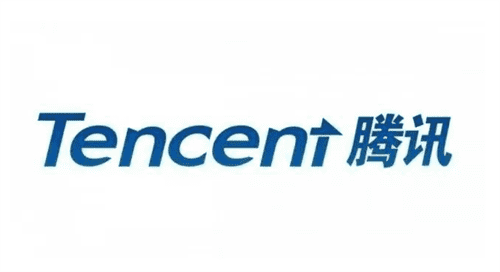
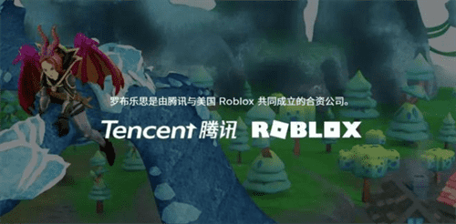
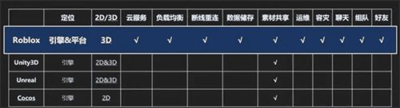
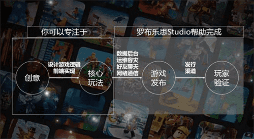
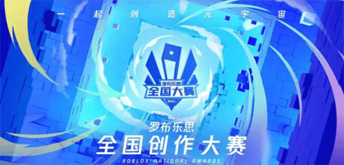
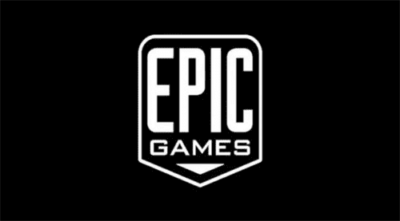

# 腾讯元宇宙概念股罗布乐思 腾讯元宇宙布局蓝图

腾讯目前的产业布局已相当全面，从底层技术例如游戏开发引擎UE、云服务、大数据中心，到中层的各类型内容产品和成熟的社交网络互通生态，再到上层组织管理对PCG部门的战略调整，可以说腾讯已率先具备了布局元宇宙的优越条件。

2019年2月，Roblox与腾讯共同出资成立了一家合营公司“罗布”，并计划上线中国版的Roblox平台“罗布乐思”。去年3月，腾讯投资元宇宙概念股罗布乐思（Roblox），腾讯代理发行的《罗布乐思》是集体验、开发于一体的多人在线3D创意社区。平台通过提供强大的编辑工具和素材，让用户能够尽情创作内容，并在虚拟社区中与伙伴一同体验交流、共同成长。

值得一提的是，在《罗布乐思》游戏内，乐趣不仅来源于玩游戏，还来源于自己创造游戏。平台内许多游戏的开发都与公司无关，而是由平台用户自主开发而成，这也是当下元宇宙类游戏的一大特点。

除此之外，腾讯游戏、罗布乐思公司为推动腾讯版元宇宙“超级数字场景”创作还举办了「罗布乐思」全国创作大赛 2021（RNA-Roblox National Awards 2021）；

本次大赛以“一起创造元宇宙”为主题，旨在探讨互联网进入全真互联网时代，每个有创造力的个体如何释放巨大的能量，共同探索“超级数字成长场景”的新生态。

马化腾在2020年提出“全真互联网”概念，同年2月，腾讯投资、淡马锡等资本参与了被业界称为“元宇宙第一股”的Roblox的1.5亿美元G轮融资。而更早之前，腾讯以40%的持股，成为了Epic Games的股东，这是一家3D内容及AR/VR内容开发引擎Unreal Engine的开发商。

从目前的情况来看，已经拥有游戏和社交两大王牌的腾讯，自然不想错过元宇宙这一全新领域，但其依然是以投资的方式去试探其发展潜力，与当年先投资拳头公司，而后再对其进行收购的举动如出一辙。

另外，腾讯也已申请注册近百条元宇宙相关商标，如“逆战元宇宙”、“腾讯音乐元宇宙”、“和平精英元宇宙”、“绿洲启元宇宙”、“王者元宇宙”、“天美元宇宙”等，可以看出其在元宇宙版图布局的野心勃勃。
