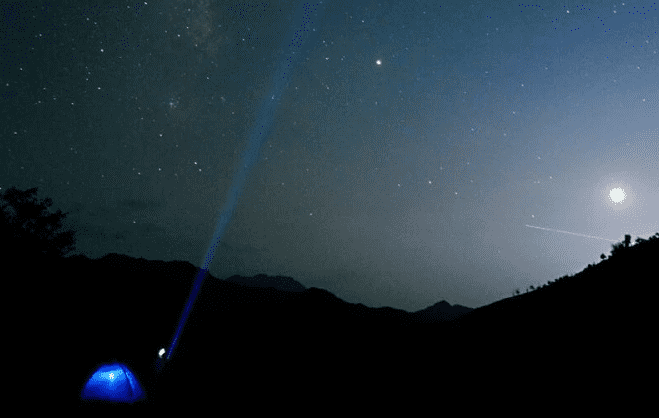
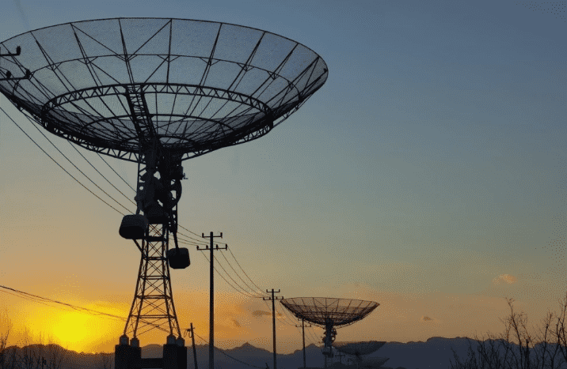

# 问天系列数字藏品发行，连接宇宙与元宇宙

7月24日14点22分，在海南文昌航天发射场101工位，长征五号B遥三运载火箭，成功将问天实验舱发射升空。并与天和核心舱对接。作为目前全球自身长度和直径最大的超级单体舱段，“问天”实验舱的成功发射不仅意味着中国已拥有全球目前单体性能最为强大的太空舱舱段，也意味着天宫空间站将拥有巨大搭载和科研能力。

文昌一直都承载着中国航天梦想，文昌国际航天城是中国官方支持的“唯一商业发射场”，更是中国商业航天的摇篮。中央国务院印发的《海南自由贸易港建设总体方案》中也提出“依托文昌国际航天城、三亚深海科技城，布局建设重大科技基础设施和平台，培育深海深空产业”。在区块链等新一代信息技术出现之际，文昌国际航天城管理局与数字藏品平台开展合作。

在“问天”实验舱发射之际，7月18日-26日“万众一心，助力问天”活动期间，一共发布了4款问天系列数字藏品，分别为“我的问天号”“问天梦圆”“铜鼓问天”“逐梦问天”，以此纪念“问天”航天发射这一震撼瞬间。

此次“问天”系列数字藏品的发售，为未来区块链技术在航天领域的应用奠定基础，有利于推动我国航天事业跨越发展。航天领域发行数字藏品，能够连接宇宙与元宇宙，依托基纳链等联盟链，为每一个数字藏品生成唯一数字凭证，具有唯一性、不可篡改的特点。
