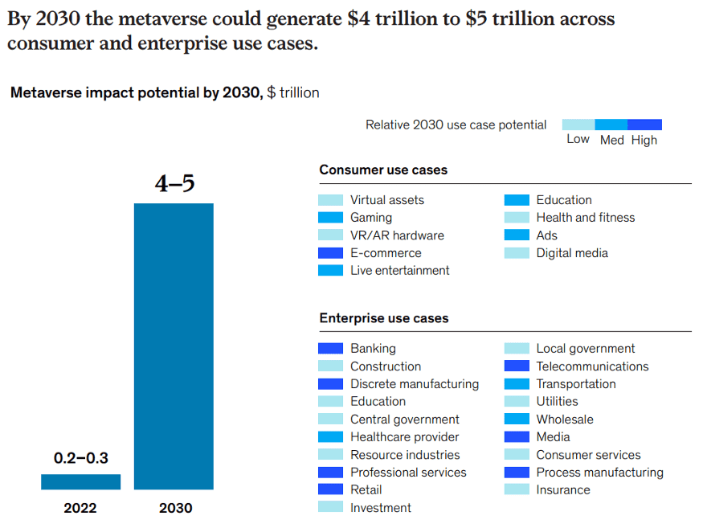

# 到2030年，元宇宙电子商务价值可达到2.6T美元

# **到 2030 年，元宇宙电子商务价值可达到 2.6T 美元**

> 麦肯锡最近发布了一份新报告，探讨了当今消费者和企业如何使用元宇宙以及未来可能会是什么样子。根据该报告，到 2030 年，元宇宙的价值将达到 5 万亿美元。元宇宙的潜在影响因行业而异，估计具体对电子商务的影响为 2 至 2.6 万亿美元。让我们看一下报告的主要见解。

​                                 资料来源：“元宇宙中的价值创造。虚拟世界的真实业务”，麦肯锡公司

消费者和品牌已经参与到元宇宙中。对 3,400 多名消费者和商业领袖的调查发现，对元宇宙的潜力感到非常兴奋。几乎 60% 的消费者热衷于将日常活动转移到虚拟世界。在虚拟世界购物是消费者最兴奋的 5 大活动之一。调查还显示，95% 的高管预计元宇宙将在五到十年内对其行业产生积极影响，61% 的高管预计它将适度改变行业运营方式。

元宇宙将对零售业产生重大影响。消费和零售、媒体和电信以及医疗保健是最有可能受到元宇宙影响的行业。该报告预计，在虚拟世界经济影响的所有潜在驱动因素中，电子商务将是最大的。它预测，到 2030 年，电子商务在虚拟世界中的价值将稳定在 2 到 2.6 万亿美元之间。根据麦肯锡的说法，虚拟世界可以为服装、时尚和奢侈品行业提供销售数字时尚和奢侈品的机会，以及创造虚拟世界中的体验支持身临其境的品牌参与。

最重要的是，该报告指出，关于时尚元界发布的大部分狂热都集中在 NFT 上。然而，麦肯锡的专家认为，时尚品牌的长期机会是利用 NFT 吸引消费者，以实现更实用的目的，例如忠诚度代币或数字双胞胎。NFT 可用于触发忠诚度福利，例如提前获得新的 NFT 赠品和实物产品，本质上是作为会员计划。反过来，NFT 数字双胞胎可以托管有关物理或数字产品的历史、真实性和所有权的信息，这对试图与假冒作斗争的奢侈品零售商特别有利。

在 Cappasity，我们也相信元宇宙有可能彻底改变人们的购物方式。今年夏天，我们将推出一个解决方案，允许品牌创建基于 NFT 的忠诚度计划并为其产品增加额外价值。Cappasity NFT包含一个附加材料部分，即使在品牌客户获得 NFT 后也可以添加这些材料。因此，零售商将能够使用 Cappasity NFT 作为新的客户沟通渠道，通过高级会员资格、忠诚度奖金、新产品发布的优先访问权以及其他奖励来奖励品牌粉丝。

更重要的是，作为一家为沉浸式购物体验提供创新解决方案的公司，我们目前正在开发首个电子商务虚拟世界，这将使品牌能够开设虚拟展厅并以全新的方式展示他们的商品——在沉浸式体验中格式。在 Metaverse 中，在线购物者还可以试穿想要的商品，看看它们是否合身。
