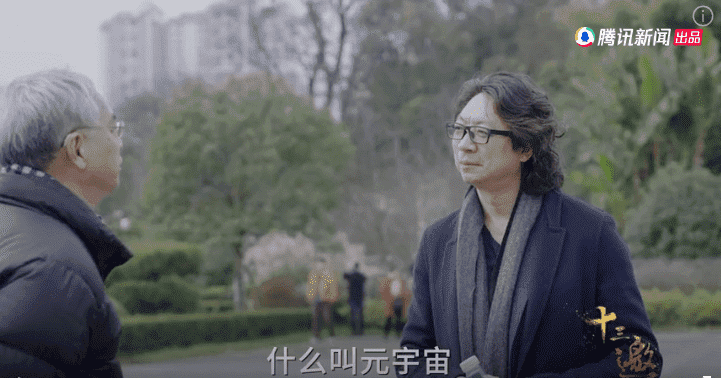
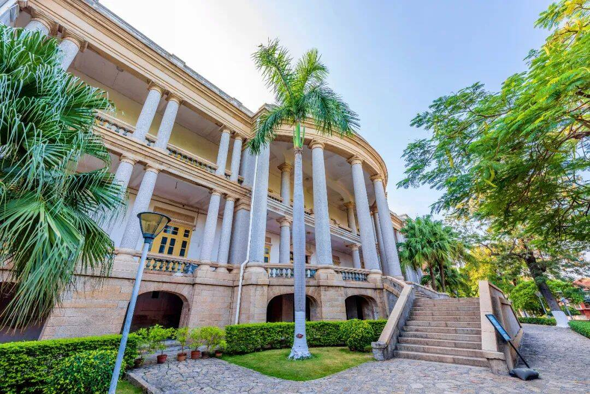

# 谁在孵化元宇宙第一岛？

“我现在最想知道什么是元宇宙，你能不能给我个解释？”

这是历史学家葛兆光在《十三邀》中向许知远提出的问题，只可惜他没能得到想要的答案。

不止葛兆光，商业世界那些离元宇宙最近的人们同样没有找到答案。就连把元宇宙写上《时代》封面的马修·鲍尔也坦言，无法看透元宇宙对全球经济的意义。但他认为，元宇宙绝不是“把几十亿资金投入某款游戏”这么简单，而是会让教育、基础设施等传统行业发生改变。

的确，元宇宙很有潜力成为移动互联网的“下一站”，理论上应该覆盖到更多产业，而不是“少数人的狂欢”。但问题在于，该如何调动起全社会对元宇宙的参与积极性，让产业资本、创投团队和消费者共同加入元宇宙的掘金之旅？

元宇宙之路虽然存在诸多变数，但国内却不乏先行者：7月22日，中国移动咪咕公司在第五届数字中国建设峰会上和厦门市政府正式签约，将与福建移动通力合作，以数智化赋能厦门市“高素质、高颜值、现代化、国际化”城市建设目标，共同打造厦门“元宇宙生态样板城市”和数字化发展新体系。该项目的第一站，就是将大名鼎鼎的鼓浪屿进行“元宇宙化”。

- **鼓浪屿的科技跳板，中华文化的放大镜**

对于旅游爱好者而言，鼓浪屿是能被写进“一生必去清单”的地方。但去过鼓浪屿的人，往往对这里“又爱又恨”。

就拿码头坐船这件事来说，旺季出游如果没有提前在网上订票，可能要在现场花费大量时间排队。而多数人对鼓浪屿的预期是“当天往返”，以至于在游览过程中会非常仓促。不仅如此，鼓浪屿除了环岛观光车外只能步行，炎炎夏日很难徒步把景点逛个遍。尤其是一些著名景点，“人挤人”几乎不可避免。

与此同时，鼓浪屿的爆火也衍生出一些文化问题：近几年来，抖音等短视频平台为鼓浪屿源源不断输送着客源。但年轻人对鼓浪屿的认知也局限于网红土耳其冰淇淋、文艺咖啡厅等网红打卡点，殊不知鼓浪屿的真正魅力在于其作为世界文化遗产的人文价值，全球历史、建筑风格在此产生的奇妙融合。

**所****以摆在鼓浪屿面前的问题是，该如何平衡“网红化”带来的流量价值，和原生文化的内涵价值？**

在此背景下，“鼓浪屿元宇宙”项目应运而生。

“鼓浪屿元宇宙”是中国移动咪咕联合福建移动，依托5G+算力网络，以云渲染融合创新引擎为驱动，基于鼓浪屿真实场景和当地历史文化，实现沉浸式MR虚实场景互动的元宇宙开放世界。旨在通过对鼓浪屿文化的守护、传承、展示，实现对中华优秀文化的创造性转化、创新性发展，讲好鼓浪屿和闽南文化好故事。该项目创新引入系统化全场景商业赋能，充分满足年轻人的社交消费需求。

.jpg)

“鼓浪屿元宇宙”的设想一旦成真，将让鼓浪屿的旅游痛点迎刃而解。

**一方面，这种虚实结合的方式可以改善鼓浪屿在旅游旺季的供求失衡问题。**很早以前，迪士尼、环球影城就在App中通过交互地图等方式来减少高人气娱乐项目排队时间过长等问题。

未来，中国移动咪咕的“鼓浪屿元宇宙”也许能解决更多复杂性问题：**比如，为时间仓促的游览者提供备选方案，把有限的时间贡献给最想去的景点，其它内容则通过“鼓浪屿元宇宙”来体验。再比如，把“鼓浪屿元宇宙”作为前哨，结合云游览的观感优化真实游览的路线。包括景区内的爆款文创产品，也可以在元宇宙中进行售卖，免去用户排队之苦。**

这相当于为鼓浪屿有限的文旅资源创造了一个蓄水池和后花园，既让鼓浪屿的商业价值和美誉度得到提升，又让消费者拥有了更加难忘的鼓浪屿记忆。

**另一方面，鼓浪屿的文化价值也能得到传承与发扬。**对于旅游爱好者而言，旅游和行走的意义更多在于去了解当地的文化”。对于鼓浪屿这样的世界文化遗产，更要承担起寓教于乐的责任。

“鼓浪屿元宇宙”就能发挥类似作用：用户在线下忙于拍照、品尝美食之余，可以通过“鼓浪屿元宇宙”来获取文化、知识方面的内容，间接成为中华文明的传承者。可以预见，这项“新基建”的引入将让鼓浪屿成长为向全球输出中华优秀文化的一艘航母。相信这才是厦门市政府和中国移动咪咕打造文旅元宇宙示范空间的初衷。

- **中****国移动咪咕元宇宙首个“文旅元宇宙样本间”，意欲何为？**

去年底，中国移动正式发布了元宇宙MIGU演进路线图。该路线图认为，元宇宙是产业数字化和数字产业化的融合趋势下的科技产物。

.jpg)

为了加速元宇宙的落地，咪咕公司依托于中国移动一点接入、即取即用的“算力服务”，陆续推出具有游戏互动特点的全新引擎Gamified interaction engine、元宇宙“分身”数智达人，还在高清视频、VR、AR、视频彩铃、智能座舱等业务场景中加入了元宇宙元素。2022北京冬奥会期间，咪咕的“5G冰雪元宇宙”更是成为全网热搜收割机。

**在****这些宝贵经验的加持下，咪咕元宇宙首个“文旅元宇宙样本间”——“鼓浪屿元宇宙”正式官宣。相较于过往项目，“鼓浪屿元宇宙”显然更具复杂性，还将经受鼓浪屿每年数千万游客的“考验”，其开发难度可见一斑。**

但是对于中国移动咪咕来说，成为“鼓浪屿元宇宙”的“主创”具有必然性。

**于文化旅游产业而言，**目前正处于复苏阶段，急需新的科技、文化抓手来打好“助攻”。《“十四五”数字经济发展规划》也明确提到，要通过数字化促进公共服务更加普惠均，促进社会服务和数字平台深度融合，探索多领域跨界合作，推动文旅融合等多领域、跨行业深度合作。中国移动咪咕作为作为新媒体国家队主力军、沉浸式媒体先锋队，理应拿出舍我其谁的担当推动文旅数字化的进程。

鼓浪屿多样的建筑风格、音乐文化和自身独有的亚热带海岛风情，非常适合以元宇宙为载体呈现给外界。一旦“鼓浪屿元宇宙”带来新的经济价值，必然会吸引大型景区主动跟进。届时，中国移动咪咕可以通过元宇宙技术和内容储备为整个文旅行业带去新变量。

**于中国移动咪咕自身而言，**鼓浪屿元宇宙是一个理想的文旅元宇宙样板间，更是佐证MIGU演进路线图前瞻性的关键一环。鼓浪屿素有“一步一景”之美誉，在“元宇宙化”的过程中非常考验企业的技术整合能力。不仅如此，“鼓浪屿元宇宙”还需要通过商业模式创新为景区创收。

中国移动咪咕此前在技术和商业化方面的丰富储备派上了用场。

**技术方面，依托T.621+5G+XR及时能力，咪咕将创新赋能数字孪生引擎、内容创作引擎、虚实交互引擎、云渲染融合引擎在鼓浪屿元宇宙的建设中发挥作用。这些新技术不仅能作用于“鼓浪屿元宇宙”，更可以为咪咕现有产品带来质变，在“下一代互联网”取得先发优势。商业化方面，咪咕曾经在体育、云演艺方面打造出5G云包房、云呐喊、场景电商、子弹时间等优秀产品，还在衍生品创作方面有所积累。这些创新成果都可以在“鼓浪屿元宇宙”当中得到延续。**

该项目落地后，将坐实中国移动强大的全产业链能力和元宇宙领域的领导地位，让中国移动“5G赋能千行百业”之路走得更加精彩。

于元宇宙市场参与者而言，鼓浪屿元宇宙能够帮助产业资本、创投团队打开视野，从游戏、社交的局限性中走出，去思考“元宇宙+”的全新可能性，带动传统行业更积极的参与到数字化转型当中。

在这个过程中，也会激活更多的元宇宙用户，让他们见证“元宇宙炒房、炒币”之外的动人图景。徐霞客曾用一生的时间，游历了16个省、市、自治区。现如今，愈发成熟的基础设施让年轻人可以用区区几年时间“当一次徐霞客”。而咪咕文旅元宇宙带来的时空交汇感，更能让人们无限接近徐霞客当年的所见所想。

这便是中国移动咪咕元宇宙的态度和立场：不做脱离实际的乌托邦，而是打造一个让“所有人”都能参与、受益的操作系统。

 

- **写****在最后：元宇宙新经济，拨开云雾睹青天**

从全球范围来看，布局元宇宙的企业为数不少，但元宇宙所产生的经济性多半还是通过“虚拟物品销售”来实现。但元宇宙的意义不该只是加强版的“QQ秀”和“开心农场”。于是，中国移动咪咕元宇宙创造了一个新的分支：在其推动下，“鼓浪屿元宇宙”将在景区、厦门，乃至全国起到标杆作用，助力地方旅游文化出圈，在经济复苏过程中发挥重要意义。

众所周知，吃喝玩乐领域的服务商可以通过美团等“新基建”扩大辐射范围，电商从业者亦可以通过多平台开店的方式来提升品牌力。然而，有很多为“数字鸿沟”所困的传统行业，没有这样“一键数字化”的渠道和工具。这些行业的个体往往是“非标准化”的，数字化难度相对较大、数据迁移周期较长。

就好比文旅业，每个景区都独一无二，其文化内涵也是“千景千面”。三年前，一场大火让巴黎圣母院面目全非。外界原本寄希望于《刺客信条》项目组的巴黎圣母院模型。不曾想，该游戏组当初因为版权等问题，在圣母院关键结构上进行了“二创”，故而无法为修复提供参考。

**可见，****要想保护好这些不可复制且拥有巨大文化价值的事物，就要未雨绸缪的将其进行数字孪生。而中国移动文旅元宇宙在此基础上，找到了社会价值和商业价值的平衡。既能为景区、建筑创造孪生场景做好文化注脚，又能让这些元宇宙项目独立创收。让景区、博物馆像运营App、小程序一样，运营一个独立的元宇宙。**

这相当于把元宇宙从游戏和社交行业的延长线中抽离，带入到一个更务实的坐标系里。在全新的坐标系中，元宇宙这项“新基建”可以在现有文化消费场景中进行复制，让文旅行业实现有内涵、高质量的发展。

有人说，宇宙存在的意义是让人们去关注未知世界的神秘。那么中国移动元宇宙的意义，大概就是让人们更深刻地意识到已知世界的美好吧。
