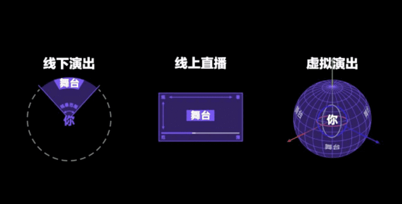

# 元宇宙演唱会值得听吗？

**首席观点：**随着科技的发展，元宇宙已成为音乐人的新阵地，国内外多位著名歌手试图通过视觉体验、交互体验、游戏化体验等玩法，为音乐与演唱会赋能。

音乐，作为最古老的人类艺术，经历了人类精神产品从“现场演奏”到“流媒体分发”两个巨大的飞跃，从未缺席人类精神世界的任何一次升维和跃迁，包括元宇宙时代。

2019年，电音音乐人“棉花糖”Marshmello在游戏《堡垒之夜》里举办了一场虚拟演唱会，吸引了超千万玩家参与，开启了元宇宙演唱会的大门。

.jpg)

图 | Marshmello在《堡垒之夜》的演唱会

自2020年，由于疫情的影响，许多线下的音乐会、音乐节、演唱会纷纷取消或无限延期。与此同时，大量线上音乐演出不断出现，加速了音乐产业走向虚拟化，“虚实相生，连接一切”的音乐元宇宙也逐渐形成。

根据2022年3月美国Morning Consult的一项调查，在虚拟活动中，成年人对虚拟音乐会最感兴趣，排在“观看现场体育赛事”和“在虚拟现实世界购物”之前。

---

***\**\*元宇宙——音乐人的新阵地\*\**\***

2020年4月， 美国饶舌歌手Travis Scott用其虚拟形象在游戏《堡垒之夜》里举办了一场直播演唱会，创下 1,200万名玩家同时在线观看的纪录，收获上亿次的观看，Travis Scott本人更是捞金 2,000万美元。相较而言，从2018年到2019年，他每场真人演出的收入约为100万美元。

.jpg)

图 | 美国饶舌歌手Travis Scott

图 | Travis Scott用其虚拟形象

在《堡垒之夜》开演唱会

至此之后，各式各样的虚拟演出开始“大爆发”。2021年11月， 加拿大歌手贾斯汀.比伯与虚拟音乐会公司Wave VR合作，向全球歌迷献上了一场30分钟的元宇宙演唱会，通过科技的力量，给观众带来了一场集游戏、实时动作捕捉和现场音乐表演为一体的身临其境的互动体验。

图 | 贾斯汀.比伯的元宇宙演唱会

元宇宙演唱会也吸引了国内大厂和明星的联动合作。

一逢他开演唱会必有大事发生的汪峰，时隔五年再次举办演唱会，这次是与字节跳动旗下VR产品Pico以元宇宙演唱会的形式和歌迷们见面。7月2日，《Pico汪峰@VR奇幻音乐漂流记》通过实景打造与VR呈现。

Pico 使用了 8K 3D VR 直播技术，打造了一个 " 无边界 " 互动场 +" 悬浮式 " 实景舞台。用户可实现5大机位随心切换，最近时距离汪峰本人只有一米。

.png)

.jpg)

图 | 《Pico汪峰@VR奇幻音乐漂流记》

音符、旋律、夜空和皓月。当这些如梦似幻的元素结合到一起，并在观众的面前飘过时，音乐也被赋予了新的诠释。

---

**集众多玩法于一身的元宇宙演唱会****‍**

**一、丰富的视觉体验**

虚拟演出的优势体现在趣味度、互动性和仪式感三个方面，有着很大的挖掘空间和可玩性。

当我们亲身去到现场观看线下演出时，相当于选择一个固定机位从头看到尾；用手机观看线上直播，虽然多了机位的切换，但并不能自主选择角度，感官也受限于屏幕这个小方块之中。

用VR设备观看虚拟演出时，虚拟空间与现实空间的界限变得模糊，观众对屏幕空间的感知层次也变得丰富，达到了线下演出和线上直播无法体验到的互动感。

当用户通过游戏身份以第一视角观看虚拟演出时，可以与舞台、明星进行互动；并在多场景之间时空穿梭，为演出行业带来了全新的沉浸式体验。

**二、极致交互体验**

贾斯汀.比伯的元宇宙演唱会，以虚拟人的形象和虚拟场景呈现在观众面前，观众也以虚拟形象围绕在歌手身旁，他们不仅可以与表演实时互动，还可以选择发送粒子光斑、花朵等3D动画特效。

**三、游戏化演唱会**

“游戏化”是“元宇宙演唱会”的一大趋势，国外主流的“元宇宙演唱会”主要在游戏平台里举办，而“游戏化”也让观众/玩家参与其中，为虚拟演唱会制造了更好的沉浸感。

Pentakill是《英雄联盟》游戏人物组成的虚拟乐队，2021年9月，Pentakill发行新专辑，全球顶级游戏开发商拳头游戏和WAVE合作，为Pentakill办了一场虚拟演唱会。这场演唱会相当酷炫，Pentakill不但可以在演唱的同时施展魔法，还设计了一个搅局的大BOSS以及群魔相争的故事。在“故事”发展的过程中，观众可以像玩游戏一样，助力乐队打败敌人。

.jpg)

图 | Pentakill虚拟演唱会

**四、数字化舞美**

虚拟演唱会利用XR、VR等技术从人的感官出发来模拟现实场景，打造虚拟的沉浸式空间，增强画面空间中的细节与层次感，达到了以往线下演唱会无法体验的交互感。

在Travis Scott在Astronomical虚拟演唱会中以技术打造的山川、河流、房屋建筑不仅色彩、光影层次丰富，真实感极强，还利用实时渲染技术实现“移步换景”。

.jpg)

图 | Astronomical虚拟演唱会

Astronomical虚拟演唱会借助VR设备双声道技术和高清影像，将具象化的“诗与远方”带到了观众面前。

.jpg)

图 | Astronomical虚拟演唱会

**五、NFT新型周边**

在国内，胡彦斌于2021年8月15日在QQ音乐平台，将其《和尚》纪念黑胶以数字藏品的形式限量发售，开创了国内主流音乐平台发行数字藏品的先河。

据悉，近8万名歌迷参与抽签预约，一经发售便迅速抢空。

.jpg)

**=完=**
