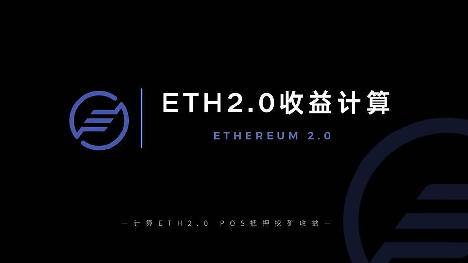

# ETH 2.0收益计算,你懂吗？

# ETH 2.0收益计算,你懂吗？

> 区块链技术彻底改变了全球市场，扰乱了金融、贸易、农业和医疗保健。比特币是区块链技术的第一个广泛应用，以太坊拥有第二大市值，是最大的通用区块链。

除了万人瞩目的比特币减半事件，以太坊向2.0过渡也是加密行业的大事件。以太坊2.0是新一代的以太坊，在区块链的架构上采用了全新的思路。其目标是提高以太坊的可扩展性、安全性和可编程性。

ETH 2.0 到底是什么？包含哪些升级？目前进展如何？

ETH 是否值得持续投资？

## 关于这个计算器

ETH 2 计算器使用 ConsenSys Codefi 的ETH2 电子表格提供的框架。以太坊 2.0 计算器的社区讨论，其变量和假设可以在 Telegram 频道@eth2calculator 上找到。

此页面上的计算器旨在简化在即将推出的以太坊 2 存款合约中进行质押时衡量预期回报的前端复杂性。用户可以选择“高级设置”来修改一些影响验证者预期投资回报的变量。

## 计算器变量

**Stake (ETH)**
这是在以太坊 2.0 存款合约中质押（投资）的 ETH 数量。根据Phase 0 规范，每个质押节点（验证者）只能质押 32 个 ETH。那些希望质押超过 32 个 ETH 的人可以运行多个验证器。为了简单起见，出于此计算器的目的，可以在计算中使用任何数量的 ETH。对于那些没有最低 32 ETH 要求的人，正在开发第三方服务，以便在质押数量方面提供更大的灵活性。

**ETH 价格**
的价格用于粗略衡量以法定货币计算的投资回报。此变量默认为当前价格，但可以在高级设置下手动设置。

**质押的 ETH总额**
的 ETH 总额（占流通供应的百分比）在计算验证者质押所赚取的年度利息方面发挥着重要作用。百分比越高，产量越低。直到网络达到创世点（524,288 ETH 质押）才会发放奖励。

**平均网络在线**
中所有验证者的平均正常运行时间。该协议的构建方式是至少 2/3的验证者将始终在线。

## 计算器假设

**ETH 价格**
计算器假定 ETH 价格不变。在验证者的整个生命周期中，ETH 的实际价格可能会有很大差异，任何以法币计价的回报也会如此。

**ETH 质押**
总量 ETH 质押总量（占流通供应量的百分比）每 5 分钟从主网存款合约中提取一次。在最初的几个月或更长时间内，该值可能会在达到某种稳定的平衡之前经历显着的波动。

**运营成本**
这个 Ethereum 2 赌注计算器不考虑与运行验证器相关的任何运营成本。也就是说，运行额外验证者的边际成本很低。要考虑的运营成本包括虚拟专用服务器 (VPS) 的托管，或者 - 对于家庭设置 - 购买 Raspberry Pi 等硬件和相关电力的费用。与工作证明中的以太坊矿工相比，在权益证明中运行以太坊验证器的运营成本微不足道。

## 关键术语

- **验证器**——运行 ETH 2 客户端的节点，用于验证交易并获得奖励。
- **Stake** – 系统中质押的 ETH 数量（每个验证者 32 ETH）。
- **ETH 2** – 以太坊的多阶段网络升级。
- **阶段 0** – ETH 2 升级的第一阶段，也引入了质押机制。
- **存款合约**——ETH 1 上接受验证者存款的智能合约。
- **循环供应**——流通中的 ETH 总量，有时也称为开采的总硬币。

