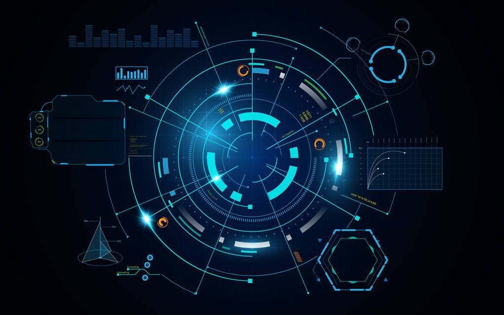
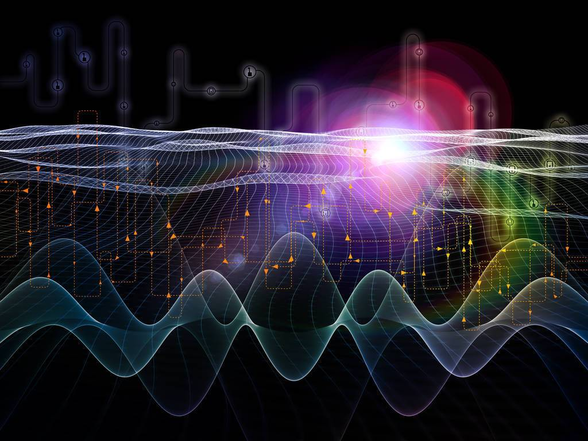

# 元宇宙升温，苹果、Meta交锋在即！！！

## 元宇宙升温，苹果、Meta交锋在即！！！

自2021年下半年起，元宇宙的概念持续升温。元宇宙被认为拥有良好的发展前景，因此一众科技企业宣布进军元宇宙，这其中就包括宣布”ALLin元宇宙”的Meta。

在近日的一次采访中，MetaCEO认为Meta与苹果正在元宇宙建设方面展开”深层次的竞争”，而这一次竞争的领域是VR和AR。

日前，Meta委托国际经济咨询公司AnalysisGroup编写了一份元宇宙白皮书，该报告以移动设备的发展为依据，预测了元宇宙技术对全球的影响。

报告提到，已经有行业分析师对元宇宙的潜在价值及市场规模进行预估，其预测在未来几年内元宇宙市场将在8000亿美元-20000亿美元。而当元宇宙被广泛采用后，元宇宙市场将会在3万亿美元-30万亿美元之间，最乐观的估计可超过80万亿美元。

值得一提的是Meta是首个宣称“allin元宇宙”的企业。Meta的前身是坐拥月活跃用户30亿的社交网络Facebook，但社交工具更新换代的速度十分迅速。Meta很难保持长期稳定的业务增长。因此，尽可能早地寻找下一个增长点并提前布局成为纾解Meta困境的良策。

将Facebook改名、收购Oculus并对其进行一系列升级改造……Meta在推动硬件发展并打造元宇宙社交平台方面不遗余力，此前，Meta趁热打铁，推出了VR社交平台，用户可以在平台上创建虚拟形象，并与其他用户交互。

苹果布局元宇宙，一方面能创造更多新的潜在设备(VR/AR)吸引更多用户加入生态；另一方面可以创造新的元宇宙使用场景和消费场景，提高用户的内容、软件和应用消费投入。

尽管目前苹果的AR产品还没有公开发布。知名苹果爆料人郭明錤在其社交平台上放出了关于苹果AR头显的相关爆料信息，苹果头显采用了轻量级设计、两个4Kmicro-OLED显示器、15个摄像头、两个主处理器据说是连接、眼球跟踪、物体跟踪和手势控制等功能初代产品。

郭明錤认为，正如苹果在智能手机端的苹果将成为头显领域的行业领导者，拥有“显著的竞争优势”，而且不需要加入元宇宙标准论坛。从Meta和苹果的元宇宙布局来看，Meta更偏向安卓阵营，而苹果却延续着iOS环境的封闭。很难说开放发展还是封闭发展能给元宇宙的发展带来新的发展机遇，正如在智能手机时代，安卓阵营的百花齐放和苹果的封闭第一取得了一定的成果。

从苹果的定位来看，即将推出的AR产品应当是一款高端产品。郭明琪认为，一旦苹果头显发布，竞争对手将竞相模仿，“引领头显硬件行业进入下一个快速增长阶段”。

苹果的理念是将软硬件等所有服务和功能紧密整合，建立更好的用户体验，而Meta则更相信多元化、大规模的生态，在这个生态中不同的公司可以发挥出自己的专长。值得注意的是，苹果从未加入科纳斯组织牵头的AR/VR、元宇宙开放联盟，并没有加入Meta、Epic、微软、谷歌等大厂的开放标准制定议程。

当然，目前还不能确定元宇宙适合更开放，还是更封闭的生态。苹果、Meta的这场交锋结果也难以预料，不过可以确定的是，伴随着二者竞争的加剧，元宇宙相关的AR、VR产品的开发速度将会加快。
