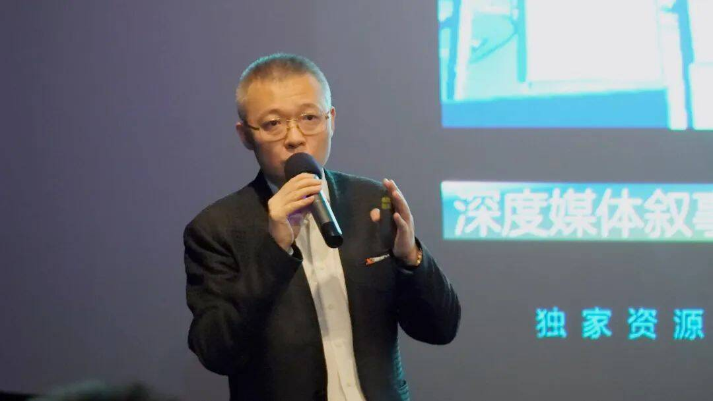
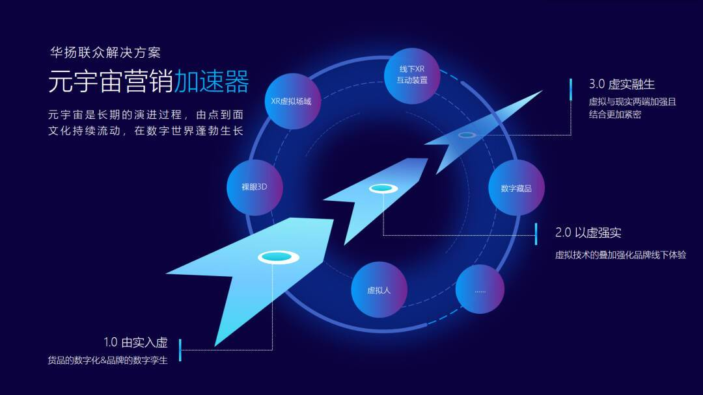
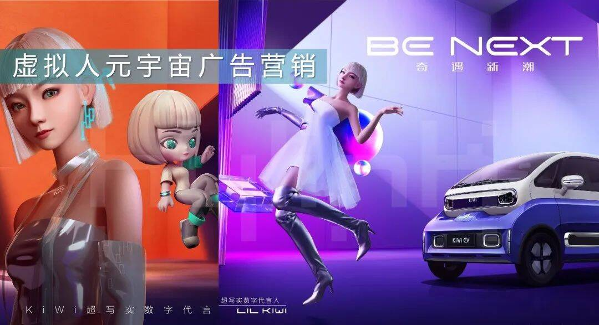
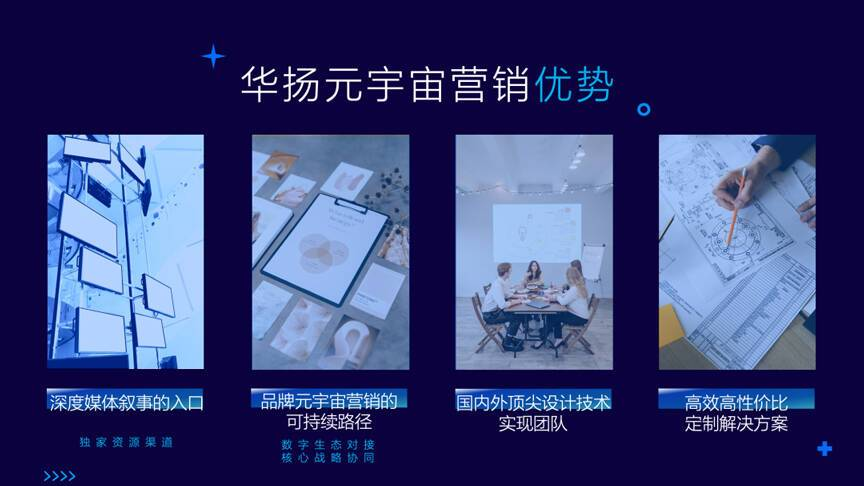
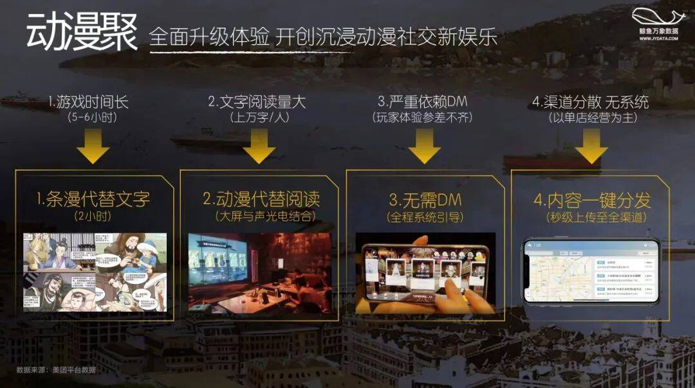
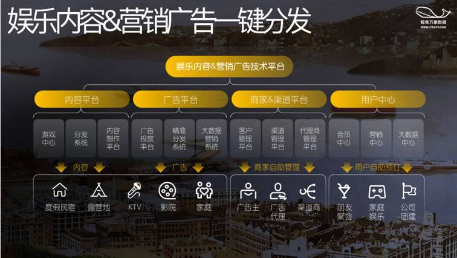

# 华扬联众携手鲸鱼数据，举办元宇宙营销内容技术发布会

# 华扬联众携手鲸鱼数据，举办元宇宙营销内容技术发布会

7月28日，华扬联众与鲸鱼数据在北京召开“元宇宙营销内容技术发布会”，华扬联众董事长苏同、鲸鱼动漫聚CEO张根铭到场，分享在万物皆入口、数字世界与现实世界的边界逐渐消失的当下，如何为品牌打造一站式、高品质的元宇宙营销解决方案。

华扬联众董事长苏同为发布会致开场辞，并阐述了面向Web3.0和元宇宙时代，作为中国数字营销行业领军企业的全新思考——他认为在通向下一个互联网时代的演进过程中，虚拟技术与实体产业不应是单向导入、相互侵噬、或是虚实脱离，而应当是相伴共生，共融互惠的。尤其是在当下，后疫情的时空背景下，如何用全新的信息技术更好地扶持和赋能于实体产业，是华扬联众坚持探索的重要课题。

Web3.0将在万物连接的时空中，融入「人」的感官体验，而人与互联网的空间升维，会将人类的信息获取和创造，以前所未有的生动体验在虚拟与现实之间构筑连接，届时，任何个体都可以围绕感官体验进行叙事创造。

实体经济和虚拟经济迎来高度的融合，数字世界与现实世界的分界逐渐消失，万物皆是虚拟世界的入口，皆在虚拟现实中共生。因此在全新互联网时代的背景下，各行各业都将迎来叙事表达和用户的新关系构筑，商业模式将先技术一步迎来进化。就像在大文娱产业，剧本杀已成为重要的叙事创造的基石与虚拟世界的入口。华扬联众与鲸鱼团队一起构筑了OMO虚实融生的剧本杀元宇宙场域，用户将在其中，与虚拟人与品牌一同沉浸共生，感受到前所未有的场景、技术、IP、内容层面的全面革新体验。

华扬联众作为以驱动增长为核心、整合全域及全链路数字化经营能力的信息科技集团，拥有得天独厚的媒介资源与技术优势；伴随着Web3.0时代的新需求与新机遇，华扬联众率先进行数字虚拟技术的开发和孵化，国内外顶尖技术实现团队持续在数字科技、虚拟形象、元宇宙等方向，为客户品牌创新营销场景、拓展传播渠道，定制高效、高性价比的营销解决方案，已经帮助众多客户实现数字资产价值的增长。

鲸鱼动漫聚CEO张根铭与现场来宾分享了动漫社交新娱乐的未来展望。在Z世代用户的娱乐新需求下，沉浸式娱乐新的市场机遇应运而生，与元宇宙的数字化、科技化、沉浸化特质不谋而合。

鲸鱼团队开创的全新线下娱乐形式“动漫聚”，以动漫视听一体化的新内容、营销广告一键分发的新技术，重新发现线下场景活力的新渠道为根基；打造沉浸式、个性化品牌营销，赋能品牌迈出在元宇宙时代的新营销第一步。

元宇宙时代，即将诞生的大量数字内容亟待广阔的分发渠道与应用场景，实现由产品向市场、由品牌向用户的高效触达。鲸鱼「动漫聚」打破传统空间属性，融合线上+线下互动娱乐体验，以新内容、新技术、新渠道引领元宇宙时代娱乐社交的场景应用，创造品牌营销新可能。

未来，华扬联众还将继续携手鲸鱼数据，全面提升虚拟空间品质、完善数字人技术与实际应用、拓展线上线下链接手段、探索沉浸式营销互动方式，从而获取全新的叙事渠道与方式，帮助品牌客户加速数字资产积累，打造现实与虚拟价值兼具的营销解决方案。
