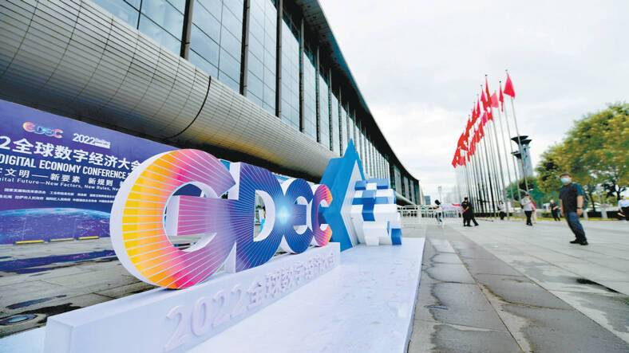
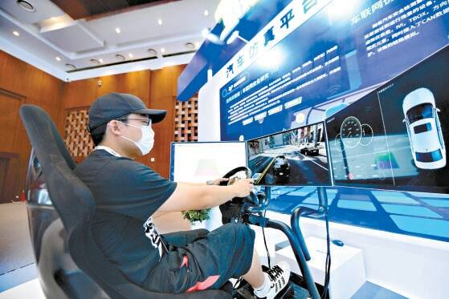
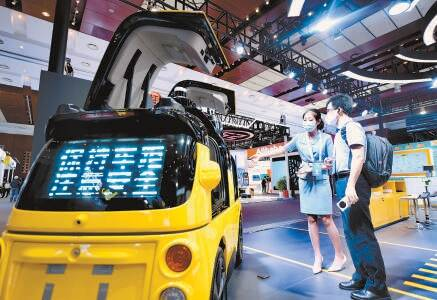

# 走近元宇宙 秒变数字人 记者探营全球数字经济大会

# 走近元宇宙 秒变数字人 记者探营全球数字经济大会

国家会议中心外，2022全球数字经济大会的标识十分醒目，吸引参会者拍照留影。

OLED全息虚拟人仿真程度令人惊叹。

参展企业正在进行汽车仿真平台漏洞攻防演示。

元宇宙体验馆内，工作人员展示基于元宇宙技术打造的数字体育全民运动装备。

美团无人售卖车吸引眼球。

在数字人民币体验区，数字货币可以直接购买商品。

表情丰富细腻的虚拟数字人、能做神经外科手术的机器人“大夫”、根据自己脑波数据形成的可视化影像、能用5G远程操控的赛车……29日，2022全球数字经济大会将正式开幕。28日上午，记者提前探营，感受超前的元宇宙应用，体验一场科幻奇妙的元宇宙之旅。

刚一走进展区，科技气息扑面而来，数字人民币、智能无人车、手术机器人……从展台间就能体会到数字化深度融入生活的方方面面。

一架大黄蜂似的无人机刚一亮相就引来大家围观。“无人机送到接驳点，再由快递小哥放入接驳柜中，更加方便快捷。”美团展区工作人员介绍，“大黄蜂”配送无人机飞行高度最高可达120米，速度为10米每秒，续航可以达到20分钟。“大黄蜂”一旁，还搭配了一个智能出餐柜，可以实现无接触取餐。

脚步往前，华科精准医疗科技有限公司的展区，展出视频中，一位机器人“大夫”正在给患者做脑部手术。柜子一样的“身体”、机械臂“胳膊”外加一个显示屏“眼睛”就构成了这位能做神经外科手术的机器人“大夫”。据介绍，这款机器人“大夫”将目前业内手术机器人病人注册时间大幅缩短到3分钟以内，并且病人无需固定标记物扫描术前CT，不光提高手术效率还能减轻患者痛苦。

以“开元之境”为主题的元宇宙体验馆，也是此次展会的亮点。动感的音乐、具有科技感的灯光，走进元宇宙体验馆仿佛进入未来世界。“哇！太逼真了！”在场馆右手侧传来阵阵惊呼，循声望去，一位观众身穿传感器设备，正在“国承1号”一体式VR体验舱里探索元宇宙，从一旁的屏幕上看到她正走在绿道上，一旁都是荒废的仓库。“你往前走就好，跑步机会自动跟随你。”工作人员说道。原来脚下的跑步机也有“玄机”，跟随用户的步伐被动启动。

在北京河图展区，一只九色鹿在展区里跳跃奔跑，飞天仙女在上方舞动，兵马俑在一旁“站岗”，“各地博物馆的文物齐聚元宇宙展区，我们还能给文物复原颜色让它们更具生机。”工作人员介绍道，北京中轴线、敦煌以及首都博物馆馆藏文物等历史文化瑰宝以虚实融合的方式在展厅进行生动的重现。

“元宇宙世界的你是什么样？”在北京海百川科技有限公司展台里，观众可以一秒进入元宇宙。“看！她在跟着我动，手指动作都一样！”一名体验者体验后惊呼道。

据悉，此次展会分为精品主题展和元宇宙体验馆两大主题，展会总面积共计7000平方米，超50多家企业参展。
