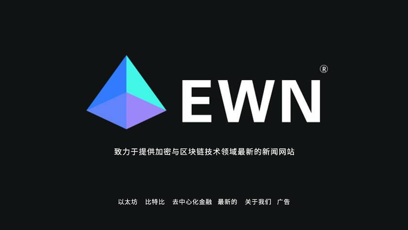

# 谁是以太坊世界新闻（EWN）？

# 谁是以太坊世界新闻（EWN）？

**谁是以太坊世界新闻（EWN）？**

EWN 全称 Ethereum World News，致力于提供加密与区块链技术领域最新的新闻网站。就像以太坊激发了区块链技术领域的进化与革命一样，EWN 灵感源于以太坊路线图上的每一个重要事件。

Ethereum World News是一家以美国和英国为中心的组织，成立于2017 年 6 月，是一家以提供比特币、加密货币和区块链行业相关、最新和有影响力的新闻报道为基础的媒体机构。

我们的内容创作者、作家和记者团队认为，要使区块链技术的革命永存，重要的是通过新闻和其他内容花絮实现信息访问的民主化。

以太坊世界新闻团队由精通写作、技术和加密货币世界的行业专业人士组成，以及它在改变从医疗保健和金融到治理和供应链管理等行业的潜力。

如果您将我们的团队简化，他们就像您一样 - 一个热爱加密的狂热消费者，对学习以及内容的消费和创造充满热情。

我们希望通过涵盖所有主题——从比特币和区块链基础知识到以太坊、XRP、山寨币和其他对新兴行业重要的项目，成为值得信赖、有趣和令人耳目一新的行业内容的来源。以太坊世界新闻团队旨在遵守高标准的新闻和编辑标准，为读者提供最好的内容。

 我们被Detailed.com 评为50 个最佳加密货币博客之一

