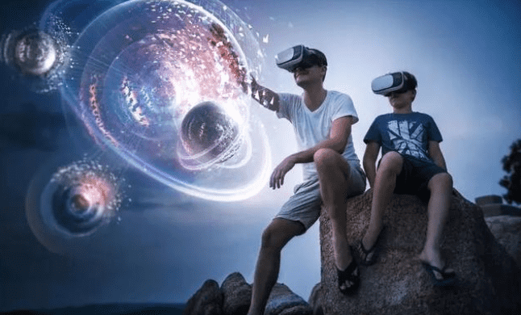

# 元宇宙有哪些现象级的案例？

元宇宙是不是还只是个概念？只有专家嘴里的元宇宙和朋友圈里的元宇宙，而没有大众可以体验的元宇宙？其实不是的，今天就给大家讲一讲已经出现了哪些现象级的案例。

Horizon可以看作是小扎在元宇宙中迈出的第一步。HorizonWorkrooms是该平台中专门面向办公场景的应用，用户可以通过这项服务在VR环境中举行会议。它可以支持单个房间最多16个用户在VR中一起使用，总共可以支持50个人同时在线。

另外，它还有一些桌面识别、键盘识别、虚拟化身、混合现实等功能。Decentraland是一个3D的虚拟世界，也是第一个完全去中心化的虚拟世界，大家可以在这里构建自己的虚拟世界，畅玩游戏，探索NFT艺术馆，参加现场音乐会，也可以进行其他社交活动。

除此之外，Decentraland还是一个由用户真正控制的虚拟世界，用户能够完全控制自己创建的内容和应用，所有自己创建的虚拟土地以及土地上的建筑物都由所有者永远持有。安装MetaMask扩展程序之后，用户还可以使用加密货币和NFT功能买卖房产，创建艺术馆，出售虚拟艺术品，还有一个就是目前非常火的Roblox的The Sandbox，它也是一个虚拟世界，它给大家提供了一个想象、创造以及和朋友同乐的空间。

Roblox的内容来自于开发者，目前全球已经有超过200万开发者，他们使用Roblox是平面设计工具，Roblox创建各自的沉浸式多人游戏体验，只要是你能够想象到的任何体验都可以通过该平台创建，玩家可以使用平台的代币SAND在以太坊区块链中再次重建、拥有和货币化游戏体验。该游戏没有中央权威管理，颠覆了现有的游戏制造商，创造者能够在没有任何中央管控的情况下进行制作、游戏、分享、收集、交易，享有版权，让其作品以NFT的形式呈现，以SAND代币作为奖励回报。崛起的企业家们，元宇宙的商机已经出现，你有什么想法？想要了解更多可以关注一下。
