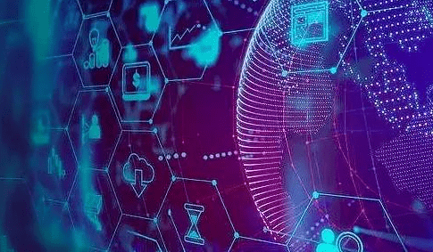

# 元宇宙一定是去中心化的，去中心化有什么“魔力”？

区块链有很多特性，今天我们就聊聊去中心化。所谓的去中心化，是指在区块链上不存在中心化节点，由于采用了分布式记账和存储技术，任意节点的权利和义务都是均等的，数据由整个系统中所有的节点共同维护和保障。

在区块链上开发的应用，自然也就叫去中心化的应用，简称Dapp，听起来啊，是不是很难理解？我再用一个小故事给大家解释一下，举个例子，如果我把钱借给你，你第二天就不认账啦，那我找谁说去？于是啊，我把村长老王找来，老王他有一个账本，里边记录了村子里的每一笔账，这个就叫中心化。那如果说我把钱借给你的时候，我又让村子里所有的人都知道，他们每一个人都有一个账本，每一笔账目，都记录在每一个人的账本上，这样谁都别想抵赖，这个就叫去中心化。

一时激起千层浪，世界人民开始举一反三，由此及彼，哪里有中心，哪里就有去中心化。于是，互助保险出现了，从此以后我们不要把保费交给传统的保险公司了，大家可以交到一个智能合约账户里，理赔的时候由智能合约自动赔付，这样做是不是运营成本很低，赔付率很高呢？

资产登记的方式也可以优化了，无论是房产交易、二手车或者金融资产，理论上都可以不通过某个权威机构办理了，大家都去区块链上交易和登记资产转移手续，这样既方便快捷又安全可信，很多场景其实都可以去中心化。

企业家朋友们，你们的公司和业务也要去中心化，去中心化可以降低企业对老板的依赖，可以促进员工之间的有效协作。推而广之，去中心化可以降低对产业链核心企业的依赖，可以促进产业链协作，未来的方向已经开始发生变化，你感知到吗？大家想要了解更多内容，可以关注元宇宙商业资讯。
