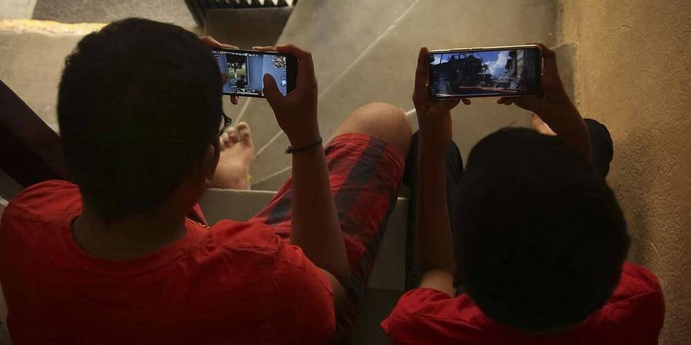

# 元宇宙这么神？这款游戏可以边玩边赚

元宇宙（metaverse）话题，从去年延烧至今年未歇，资策会MIC指出，元宇宙具有资本新故事、技术新场景、市场新想像等「三新」题材，且已有多元应用陆续产生，预估至2030年，全球市场规模将突破6,500亿美元。其中「区块链结合游戏」的应用模式，将会是游戏产业未来新趋势，边玩边赚（Play-to-Earn）的游戏经济模式，也将颠覆全球游戏产业。

MIC资深产业分析师柳育林指出，元宇宙可以分为三大架构，最底层是基础建设，包括各种晶片、云端建设等，第二层则是关键能力与装置，如空间运算、去中心化的网路以及人机互动装置等，最上层则是应用生态，如内容创作、应用整合平台、应用市集等。

而游戏、影音娱乐是元宇宙里面重要的应用之一，包括表演、赛事、娱乐活动等都可以在虚拟世界中透过VR装置呈现，另外透过区块链网路，艺术品、收藏品则可以转换为NFT交易。

以区块链游戏来说，主打让玩家「边玩边赚」的游戏化金融（GameFi）概念于2021年快速兴起，目前区块链的加密节点已经遍布在世界各地，而且GameFi也已从东南亚地区的小众游戏，升级为跨区域的网路游戏。

不过，通常GameFi游戏的游戏性设计较单一，如果游戏内的代币经济模型（tokenomics）未设计好，例如代币增发太快，但却没有「出水口」，很容易造成游戏内高速通膨之后又高速通缩的情况，后续进来的玩家感到获利减少甚至赔钱的时候，玩家也将快速流失。

游戏业者认为，接下来边玩边赚（Play-to-Earn）的模式将渐趋热门，不过若游戏团队想要进入GameFi，应先思考几大关键点，例如，区块链游戏市场迭代快速，团队需要先拟定对策因应。此外，除专业游戏研发人才，还需具备懂区块链技术的工程师及数据分析师。

业者也指出，区块链的使用者相当注重社群沟通，因此团队也尽量完善游戏内生态与社群经营。而区块链游戏项目通常是全球营运，因此拥有好的平台以及基础架构，才能让游戏稳定运作。

业者认为，企业不管是做区块链还是GameFi，其节点（node）之间的连结，或跟其他供应链、交易所产生的交易互动，都会与全球的服务互动，整体数位资产的安全性、服务的可靠性也更加关键，因此，基础架构、网路连结、资安等规划都变得至关重要。

元宇宙、Web3热潮延烧，台湾游戏厂商从去年较为观望的态度，到今年开始几乎每家都开始投入相关商机。包括宇峻奥汀、智冠、大宇资讯、橘子集团、传奇网路都积极投入，争取在高度竞争激烈的市场中，找到新的商机。

宇峻奥汀近期针对旗下PC多人网路游戏《神州Online》，推出纪念NFT，也携手娱乐IP投资商智宝国际和区块链技术专家博斯资讯安全，共同成立郎将股份有限公司，并针对NFT、GameFi推出MOJOY平台，以及公益、游戏、生活、艺术类NFT专案，期望抢攻Web3商机。

宇峻董事长刘信说，有些GameFi项目的游戏度不高、代币经济体模型（tokenomics）又没有打造好，这样将很难成功。他表示，宇峻还是会专注在产品的本质以及游戏性，而MOJOY将会先聚焦NFT，未来才会逐步往GameFi与区块链游戏迈进。

游戏研发厂商唯晶科技董事长詹承翰则表示，目前不少国际游戏大厂，都已成立部门研究区块链游戏，而区块链技术将为游戏带来全新的乐趣，「例如在元宇宙内买房子，未来还可以拿去交易，游戏就算停服，NFT虚拟宝物也不会消失，这些新的模式，将让玩游戏变得更真实。」

智冠旗下游戏新干线，则在近期推出区块链平台「GFi赋能平台」，该平台与MaiCoin集团旗下Qubic NFT技术整合服务、Lootex、CRZY.io等专业团队携手合作，抢攻Web3游戏的商机。

游戏新干线也同时发行两款具备多种玩法的20周年纪念NFT。游戏新干线总经理张益民解释，区块链的应用有很多种，建立在GFi赋能平台上的NFT更倾向于融合游戏体验、社群服务层面。

除了宇峻、智冠以外，橘子也推出Baas区块链一站式整合服务，透过乐点的技术以及在数位游戏产业累积的经验，提供所有欲投入NFT应用的企业用户、游戏业者、数位艺术创作者、内容IP发行与版权商一站式整合服务，抢攻元宇宙商机。
