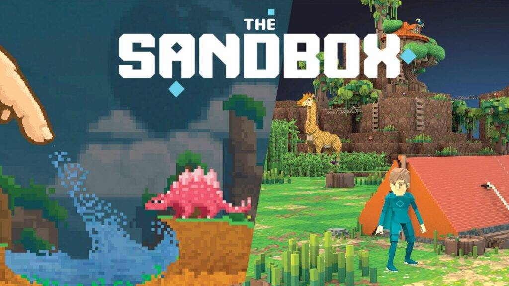
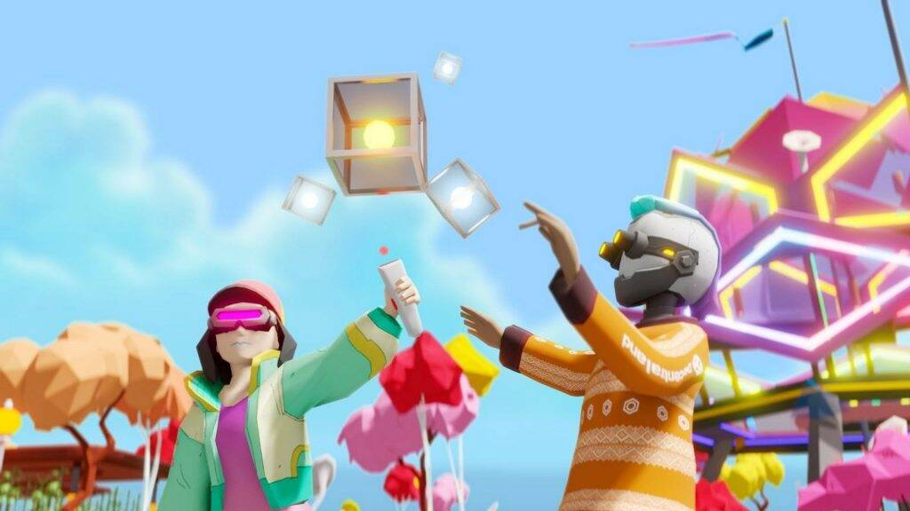
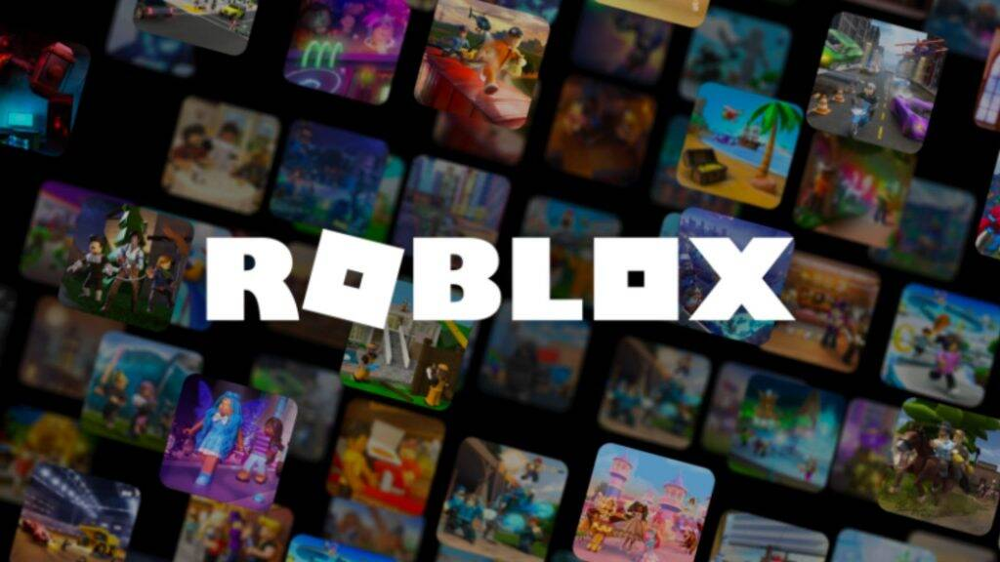
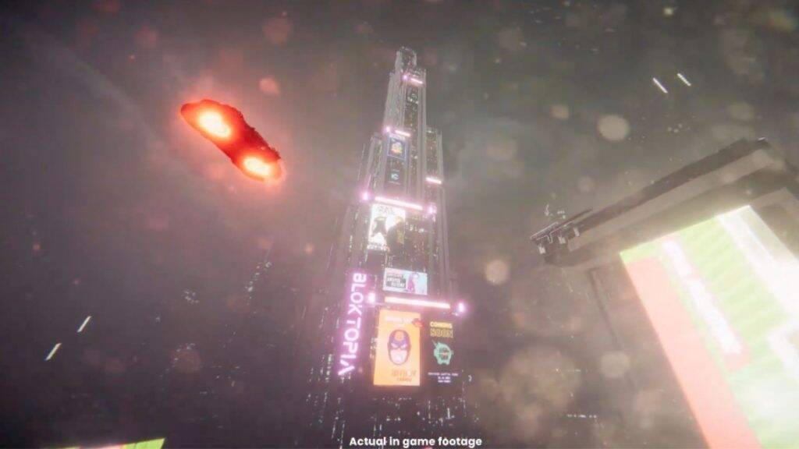
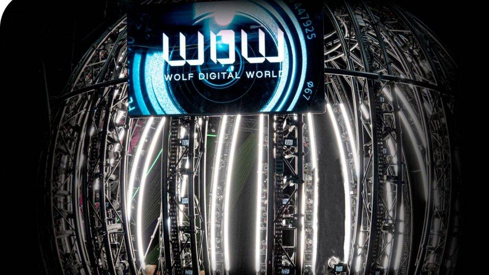

# 元宇宙时代降临！5个Metaverse平台你不知道就落伍了

Metaverse是一个聚焦于社交连结的3D虚拟世界，虽然听起来好像是触不可及之地，但事实上我们身边已经有5个令人叹为观止的Metaverse平台出现，让大家可以一探元宇宙，现在为大家一一介绍!

## [1. The Sandbox]

The Sandbox是著名以区块链组成的始祖游戏平台。随着科技的进步，它已进化成了拥有自家加密货币「SAND」的元宇宙平台。

作为全球最早的元宇宙平台之一，它一直与科技、金融、房地产、游戏和娱乐等多元化行业的表表者合作，其中更包括为香港电影产业制作虚拟城市影像。

The Sandbox所建立的虚拟世界平台栩栩如生、引人入胜，用户可在平台中构建像素化角色、游戏或虚拟产品。而且， 它还有很好的稳定性和安全性。

## 2. Decentraland

Decentraland是元宇宙世界中的先行者，它着眼于建立虚拟目的地，让身处在世界各地不同的人士可以一同进行会议、游戏或虚拟产品交易。而该平台也有自己的加密货币：MANA，可用作购买虚拟土地同NFTs（Non‑fungible Token，非同质化代币）。

NFTs买卖是现今世界的大势所向，而Decentraland也把握了这个潮流，与著名的澳大利亚网球公开赛合作，发布了一系列NFT 头像作销售。而最为著名的是，NBA 冠军斯蒂芬库里和赞助商Under Armour 也于2021 年宣布与Decentraland 建立虚拟世界合作伙伴关系，可见Decentraland的成功。

## 3. Roblox

Roblox的独特性在于去中心化，即是网站内超过2000万款游戏都是由用户主导和研发，同时亦供完全免费下载，给予极大的自由度。为了维持日常的运作，Roblox也会在游戏中贩卖人物皮肤、游戏币、武器；或会跟国际大品牌：Gucci、Nike等加入到虚拟世界中为其作推广，以赚取营利。

这自由度大的平台使到不同的创意和科技想法不受限地交流，擦出不同的新火花。用户更在社交游戏中创立了”special voice chat”这个功能来提升交流质素，使Roblox这个平台不断进步。

## 4. Bloktopia

Bloktopia是极少数拥有已面向公众推出的元宇宙平台的沉浸式技术供应商之一。Rebloks是Bloktopia世界中的虚拟货币，可用作购买虚拟地图上的建筑物。而Rebloks也是现今最实惠、值得投资的虚拟货币。

而Bloktopia亦跟据中本聪（Satoshi Nakamoto）所写的「比特币白皮书」（A Peer-to-Peer Electronic Cash System），在虚拟世界中设计了一座21 层的摩天大楼，向有着巨大成功的比特币致敬。

## 5. Metahero

虽然Metahero的发展不及以上介绍的平台发成熟，但它有着相当强大4K像素3D扫描技术，能把现实中的人、事和物十分像真的带入虚拟世界中。

这个技术名为：虚拟重建（Virtual Reconstruction），在Metahero 的“Metascanning”室中，用200部Sony A7RIVA 摄像机从各个角度为物体或人拍摄高清照片，以重现逼真的3D 模型再把它们带到虚拟世界中。

此技术容许用户把现实中的资产带到虚拟世界中，并将它们投放于不同的用途，如教育、娱乐、商业用途中。

随着把现实资产带到虚拟世界风气愈发盛行，Metahera的壮大已成了必然之事！

## 属于香港的元宇宙

香港贸发局亦因NFTs卖买盛行，就「元宇宙」和「加密货币」这个课题举办了研讨会，重点探讨元宇宙的出现如何令传统供应链超越现实世界的界限，以及中小企如何运用元宇宙进行营销推广。

而2022年，香港也有由FEED HK 主办的革新年宵活动「MART IN HONG KONG」，游戏制作网络红人Kingsan 景三合作，设计具香港特色场景，打造全港首个让大家以虚拟身份（Avatar），一尝在虚拟世界行年宵的滋味。

## 元宇宙已成了时代大趋势

「元宇宙」和「加密货币」已成了这个世界的大趋势，趁着元宇宙仍在发展之际，我们应该开始了解及投入到相关的资讯中，早着先机，那就不会落后于人。
