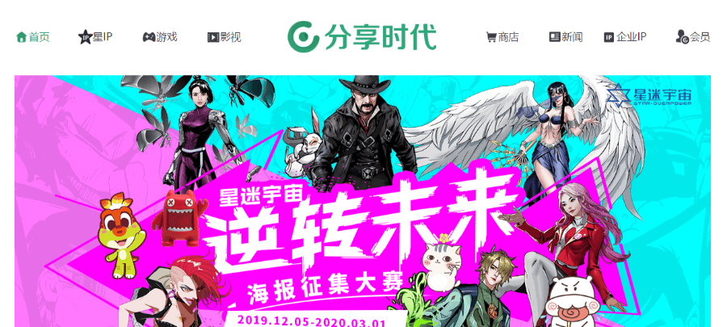
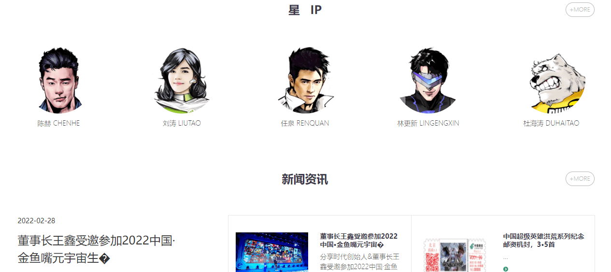
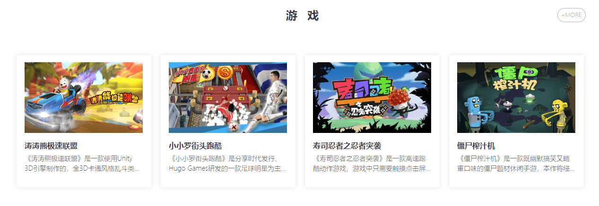

# 元宇宙不再是概念，新兴虚拟社交平台孕育而生

眼下，元宇宙概念仍然处在风口浪尖上，有人认为这代表了人类社会科技领域的发展未来，有人认为这不过是一场资本泡沫，争论颇多。

但不可否认的是，无论元宇宙时代的完全到来离我们还有多远，它已经在切切实实地影响着我们普通人的生活。

如果说VR/AR设备还有使用门槛，那么现在几乎人手一台的智能手机就是元宇宙渗透进日常生活的入口，在虚拟世界中社交也是社恐人群的福利，对于生活也越来越来便捷。

虚拟社交也已逐渐成为未来的一种崭新社交形式。在这个风口一些比较好的虚拟社交平台也孕育而生。

**虚拟社交网站推荐——分享时代**

北京分享时代科技股份有限公司（简称：分享时代）是一家以明星知识产权运营为核心的娱乐文化公司、创建国内明星知识产权运营平台，公司以明星IP为基点进行多方位发展，纵深驰骋游戏、影视、动漫、阅读、音乐、体育、教育、AI、品牌以及新媒体、新零售、新科技等各个领域。

（分享时代网站主页面）

合伙人包括任泉、刘涛、陈赫、杜海涛、刘璇等多位娱乐体育明星。未来， 分享时代将通过资本助力，以IP运营为核心，深入聚合产品和资源，整合产业价值链，成为国际知名文化品牌。愿景是成为创造并分享快乐的娱乐文化公司。

分享时代秉承“用心分享”的团队使命，立足“明星IP赋能”发展战略，通过多年积累的数字内容运营优势，打造全球IP发行体系。

（明星ip）

充分将优质“内容”与“产品”完美结合，提出“内容 社群 产品“大战略构想，以内容流量为入口，粉丝运营为重点，产品变现为结果，并联合百位文体明星、虚拟偶像和历史人物，构建 “星迷宇宙”品牌的超级英雄故事，并将其打造成家喻户晓的经典内容。

主营业务涵盖明星知识产权运营、企业品牌人格化解决方案、互联网内容运营等。

分享时代发行了《每日故宫》《割绳子》《找你妹》《坠落侠》《C罗街头跑酷》等百款家喻户晓的手游产品，出版人气小说《野士岭》，星迷宇宙系列漫画，打造 “涛涛熊”“陈赤赤”等百位明星 IP，并为百余家企业提供品牌人格化服务。

（分享时代网站游戏）

公司是国内明星知识产权储备类型非常丰富的IP运营商。更多元宇宙相关资讯可持续关注“斗极元宇宙导航”。
