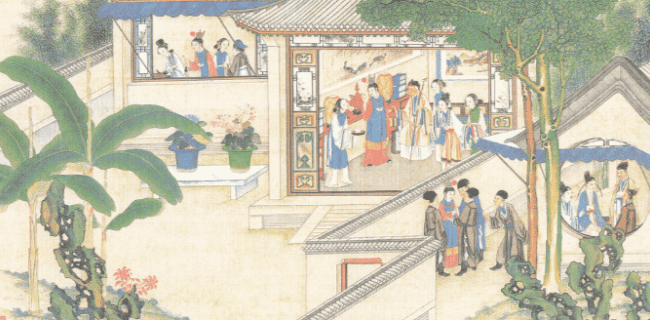

# 打开《红楼梦》“元宇宙”

　　7月31日，上海音乐出版社联手画家、中央民族大学美术学院教授付爱民推出集诗、画、乐于一身的《金陵十二钗》系列数字藏品，打开《红楼梦》的“元宇宙”。

　　此次发行的《金陵十二钗》系列数字藏品，基于上海音乐出版社2015年出版的大型4开本《“红楼梦”之金陵十二钗（正册）工笔人物描摹范本》。付爱民根据雍正时期的《十二美人图》，研究多部红学专著，参考石印小说《石头记》的卷首插图，历时数年创作了12幅工笔人物诗画作品，通过对细节的推敲和对古代人物服饰的考证，展现了原著中金陵十二钗各自的才貌性情。

　　本系列数字藏品由“收获App”选品，是收获App发行的“无界”系列数字藏品之一。因藏品的收藏价值与艺术内涵高，因此在集结众多艺术家人群的Amall.ART平台发布。

　　《金陵十二钗》系列数字藏品将书中的12幅工笔人物图分别制作成12款独立红楼美人画像，以数字技术展示静态人物画像，伴随经典旋律款款而来。集齐《金陵十二钗（诗·画）》白描版系列12款不同藏品，可以生成1份《诗·画·乐》兑换凭证。持有该凭证可获得《金陵十二钗（诗·画·乐）》彩色有声版系列藏品，并有机会获得平台随机抽签的1套绝版典藏图书《“红楼梦”之金陵十二钗（正册）工笔人物描摹范本》，随书还附赠由王立平创作的1987版同名电视剧主题曲CD一张，收录了《红楼梦》13首主题曲、插曲。

　　上海音乐出版社、上海文艺音像电子出版社社长、总编辑费维耀表示，首次探索发行的《金陵十二钗》系列数字藏品，得到作者付爱民的大力支持，作品以图文+诗乐的数字形式，让藏家在古典诗词、工笔画作、主题音乐营造的视听盛宴中品味经典。为讲好中国故事，传播优秀文化，两社将持续挖掘艺术资源宝库，以数字化、信息化技术为“推进器”，制作发行多款独具特色的艺术类藏品，为中华优秀文化赋予时代、海派、数字特色，让民族音乐传播突破时间、地域、技术壁垒，让大众更好地品味传统文化的魅力。
