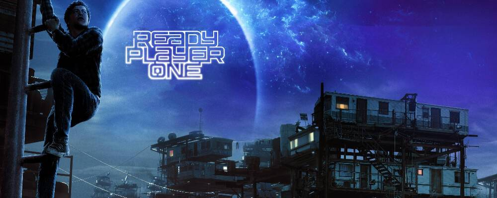

# 元宇宙真的是电影的未来吗？

元宇宙与电影有着天然的联系：一方面，人类对抽象“元宇宙”概念最初的具象感知都来自于科幻电影。另一方面，电影是艺术和科技相结合的产物，每次科技变革都推动电影创新发展。今年的第十二届北京国际电影节举办首届元宇宙电影论坛，本文为北京大学中文系教授戴锦华在论坛上的演讲，受版面所限，文字有所删减。

**元宇宙意味着什么？**

对于元宇宙的所有讨论，我始终保持着关注。我的关注出发于我作为一个电影人，关注元宇宙这样一个概念得以产生的现实动力，得以产生的资本动力，得以作为一个技术应用的范畴，作为一个股市上的概念股，作为Facebook给自己的最新命名，它究竟意味着什么？它对于人类生活意味着什么？它在这轮新技术革命当中意味着什么？它是一个新的概念吗？它是一个新的实践吗？它是一个新的场域吗？还是它是一个噱头？

元宇宙真的是一个电影的未来吗？是一个电影的纵深吗？是一个电影的可能性吗？那么，它并不玄虚，意味着我们必须回答，当数码取代胶片成为了电影基本介质的时候，电影、电影艺术是否意味着将伴随胶片而死亡。如果它不会伴随胶片而死亡，如果数码转型仅仅是电影所经历的一系列技术进步，技术革命的又一浪，又一次冲击的话，那我们要回答的是：在数码转型之后的电影，我们获得了什么新的可能？我们为了这个新的可能，为了这个新的空间，为了这个新的纵深，我们失去了什么？

在这个获得与失去的观察、思考和理解之上，我们说电影艺术的未来在什么程度上被新的技术所打开？在什么意义上被新的技术所改变，甚至封闭？

对我来说，大概元宇宙是在这样的双重层面上与我相关。刚才被引入这个话题的时候，我们使用了“未来已来”，一个关于未来展望的双重命题。大家都知道元宇宙这个概念是从1992年美国科幻小说《雪崩》中来的，而这个想象未来的科幻书写，是科幻书写当中一个非常重要的脉络，也是一种科幻书写的惯例，只不过这一次，它把这样的一个科幻未来想象的惯例命名为“元宇宙”。

**回溯，科幻小说中最初的元宇宙**

我们回到《雪崩》这部小说当中的话，会发现它具有科幻写作当中几个基本的特质，或者说几个基本的类型规定，就是赛博朋克与“敌托邦”——反面乌托邦，它是一个幽暗的未来，它是一个当现实已经陷于全面的困境，崩解耗竭，消耗殆尽的一种状态。（在这样的状态到来时）虚拟世界，虚拟空间成为一种逃避的可能，成为一个延展生存的可能，成为一个社会尝试重组的可能。这大概是科幻小说曾经给我们提供的元宇宙的基本特征。

于是就带出了三种未来：一个是科幻小说所书写的、所想象的未来；一个是“未来已来”的未来，当我们说“未来已来”的时候，我们是指一系列的技术发明、技术进步，使得科幻小说所构想、所想象的世界可能真实到达，或者说已经真实地到达我们的现实空间当中；第三个层次的未来是我们站在这个被新科技革命所改变的现实当中，再度去展望未来的时候。

**电影将选择站在元宇宙的什么位置？**

对于我来说，问题在于我们的未来，我们使用的未来概念，我们在这个特定的概念之下的未来想象以及我们今天在论坛上希望打开的，最后将具体到电影的生产，电影的制作，电影想象世界的构成，电影艺术的这种成就以及中国电影观众，乃至我们所想象的世界，电影观众将如何与我们的电影相遇的另外一个未来展望的层次的时候，我想说，重要的问题在于，我们究竟选择，我们究竟接受哪一种建构未来想象、支撑未来想象、行构未来想象的逻辑和依据？

持科幻小说的幽暗未来想象的逻辑，其中有非常宝贵的面向，那就是现代主义反思，那就是现代主义批判，那就是对于现代文明的承诺给我们无限进步、无限发展的文明逻辑的提示和预警。

这个承诺事实上已经进入20世纪的历史，让我们看到，它未必能够抵达。而具体到元宇宙之未来和电影之未来，具体到元宇宙那样的一个文明预警的形态，和我们置身在，我们应用元宇宙，兴高采烈地去拥抱元宇宙，在人文社会科学的各个学科当中，以不同的层面试图去拓清去定义元宇宙这样的一个乐观的、带有嘉年华节庆性质的不同的情感基调、不同的价值逻辑之下，电影将选择站在哪里？

所以我再一次强调，对我来说，元宇宙不是新技术的代名词，元宇宙不是虚拟技术的代名词，元宇宙不是电影制作当中的新技术应用——虚拟技术应用的代名词。元宇宙与此相关，但元宇宙同时意味着它是元宇宙，它是一个和我们的现实世界相平行的、与我们的现实世界相关联的、构成于我们现实世界相区隔的一个整体的世界构想。

它可能会成为一种游戏世界的建构形态，可能会成为一种科幻电影的展示形态，可能会成为经由科幻电影的形态让我们反身我们的现实，让我们思考我们的现实，让我们去尝试创造或者改变我们的现实，让我们的现实能够更长久地、可持续地延续下去。

**如何去处理电影中的元宇宙世界**

**和电影中的现实世界**

具体到元宇宙与电影的时候，我觉得非常重要的是，电影，我们说的主要是故事片，当我们说到叙事的时候，说到经由电影的视听时空的语言结构去建构一个想象世界的时候，我想元宇宙与电影最直接相关的，就是我们如何去处理电影中的元宇宙世界和电影中的现实世界。

借用一下《头号玩家》那句对白，说绿洲的游戏世界再神奇再美好，我们唯有在现实中才能吃上一口热饭。当然已经有太多的电影告诉我们，我们不用返回现实吃一口热饭，那就是《黑客帝国》，那才是完全的完整的元宇宙，而完全的完整的元宇宙，在科技想象，在科幻想象，在现代哲学当中有另外一个名字叫缸中之脑。

那是一个现代主义的梦魇式的未来情境，我们弃置了我们的身体，整体地接受身体的被占有、被奴役，我们不过是一个科技制造的，借助我们神经的反应系统。这也就是科幻小说提供的那个最重要的恶梦般的质询，假如我生存的现实并不存在，假如我所有的对于现实的体验仅仅来自于一种被他人，被比我们强大得多的力量所掌控的一种感知的制造，完全是一个幻觉性的存在。

所以，如果我们不是在《黑客帝国》的元宇宙，完整的彻底的元宇宙的意义上去讨论电影中的元宇宙的话，讨论我们未来建构的元宇宙的话，那我们必须要处理的仍然是我们从何处出发，我们为什么要出发，我们为什么要抵达一个元宇宙所创造的平行世界，这个平行世界究竟提供给我们什么？

回到《黑客帝国》，《黑客帝国》仍然在处理真实世界，所谓真实的荒漠，文明彻底地自我毁灭，人类彻底地毁灭了现代文明、地球文明，甚至在很大程度上毁灭了人类自身生存的可能性的空间之后，大家注意到，这几乎是今天我们会作为元宇宙电影例证大部分影片当中的共同前提：它是某一种大灾难之后，它是某一种后末日之后，它是在现实空间已经成为废墟，现实空间已经陷入了绝境的情况下的一种逃逸之路。

但是事实上，关于电影中的元宇宙，关于元宇宙与社会学，与人文科学相关的可能性之一是：也许虚拟技术可以让我们的实践关于现代社会构想，实现我们关于理想的人生，理想的社会，理想的人际关系。一种不同的社会组织形态，一种不同的文明形态，一种不同的生存形态的实验空间。换句话说，元宇宙再度打开了乌托邦实践的可能性，元宇宙再一次召唤着我们对乌托邦冲动的释放。

所以在“敌托邦”，反面乌托邦的另外一面，元宇宙打开了一种乌托邦实践的可能性。

**当元宇宙与电影结合**

在哲学的、社会学的层面上，我们要回答的是，这个可能性究竟有多么大，这种实践的意义究竟有多么深切或者多么真切，或者多么具有现实价值。而在电影的意义上说，当影片与现实相对的元宇宙是一种社会理想实践可能性的时候，我们要问：作为电影人，我们真的仍具有这样的想象能力吗？我们仍然具有在今天世界巨大的、牢不可破的、残酷的逻辑之外，去构想别样可能性的愿望和能力吗？

对我来说，元宇宙与电影并非正相关的概念，但却是一个非常有趣的、可以去打开的空间。它也许对于我们今天的中国电影业，对于我们中国电影可能的纵深，对于我们中国电影设想我们将在未来的世界电影乃至整个世界文化当中扮演的角色是有着正相关性的。而且它是一种可能，它是一种再度打开想象力，而这个想象力的打开，获益的将不仅仅是电影，不仅仅是元宇宙的概念，而且是中国已经介入的、中国尝试引领的、走向未来的进程。

可能有一点空洞，但是，我还是想用这句话来结束我的讨论：今天也许我们正在一个奇特的与未来相关联的时代，一边是未来不再在远方，未来在我们近旁；一边是现代生活方式让我们透支、预支了我们的未来，以至于我们不再拥有未来……但是正是在这种意义上，元宇宙代表的技术实践，元宇宙提供的想象空间，元宇宙与电影结合所开创的创造力也许可以成为我们再度赢得未来之战的武器。 

