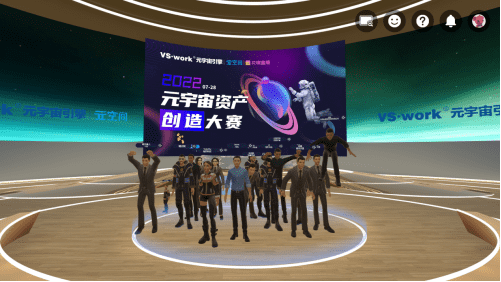

# 花椒直播丨元宇宙资产创造大赛发出“宇宙”邀请函

2022年，元宇宙进入万物并秀、生机勃发的时代。更多行业、更多人群投身到这个欣欣向荣、无比浩瀚的虚拟数字空间，在虚实共生中，畅享和玩味元宇宙打开的一切神奇“脑洞”，珍视和收藏区块链上独一无二的数字资产。

在7月13日刚刚发布的《上海市数字经济发展“十四五”规划》中，针对元宇宙、区块链等领域以及NFT（数字藏品）给出的正面支持，让许多此前处于观望态度的企业或投资者乐于和敢于参与到这个全新的赛道，开发、创造、流通、变现……元宇宙资产的全产业链从未如此广受关注。

“欢迎各位元宇宙空间的客人，这里是VS·work主办、花房集团协办的《元宇宙资产创造大赛》的现场……”2022年7月28日，由VS·work元宇宙引擎举办，元空间承办，花房集团等协办的元宇宙资产创造大赛火热开启，一场在元宇宙虚拟空间举行、所有参与嘉宾均以虚拟形象登场的启动会通过花椒直播等官方直播合作平台向全球发布。

**花房元宇宙avatar ：呼唤更多“上古玄儿”**

2022年6月，花房集团旗下花椒直播首个虚拟主播“上古玄儿”在10万+网友的围观中横空出世，这位呆萌可爱、耿直有趣的外星MM站在虚拟世界的入口，将许多人第一次带入蕴藏无限想象力的元宇宙。这就是avatar形象的魅力所在！

本次元宇宙资产创造大赛面向全球的VR企业开发者、个人开发者、艺术工作者、高校及机构参赛，征集avatar虚拟作品及优秀虚拟建筑场景等作品。

其中avatar虚拟形象为IP原创2D作品3D虚拟形象化，公众将从所有参赛作品中评选寻找最受欢迎的虚拟形象，挖掘出最适合元宇宙化的IP，期望打造一经上市即售空的元宇宙应用型NFT。

虚拟偶像类，呼唤与“上古玄儿”一样造型风格各异、可应用于多个不同场景的人气avatar偶像，最好在元宇宙世界具有成为虚拟小花旦的潜力。

在元宇宙世界，可以尽情构建属于自己的梦想之地。本次元宇宙资产创造大赛期待收到独具想象力的虚拟室内外建筑场景，应用于场景、建筑、道具、人物等的特效设计，匪夷所思的虚拟物品、道具，甚至是可爱的虚拟宠物，都可以大胆加入到参赛作品中。每一个开发者可同时提交多部作品参赛，组织者将保持开放性的态度，任开发者无限创作。

**花椒直播打开上链通道：从原创设计到数字藏品的“一步之遥”**

在被业界称为“元宇宙元年”的2021年，花椒数字艺术展示平台——“花椒粒”上线并首发数字艺术藏品；2022年春节，花椒携手腾讯云「至信链」上链多款数字艺术礼物……在花椒全力构建的元宇宙当中，数字资产一直占据极其重要的战略地位。

发现爆款数字藏品、寻找优秀的NFT造物者，从来都不容易。本次大赛承诺所有参与作品都可以NFT化，同时在元宇宙空间内使用。作品通过评选后可上链，优秀作品更有机会被大赛20+交易平台合作方对应发售。这场从8月持续至10月的比赛，将为素人设计者打开上链通道，让天马行空的原创作品从一纸设计到变成数字藏品，真的只有“一步之遥”。

值得一提的是，比赛将以公众投票+专家评审团投票按比例合计的方式计算成绩，两者的占比分别为70%和30%，受众的潜在意见将更为重要。毕竟在NFT收藏市场，玩家的口味只有玩家最清楚。

一张来自花椒直播的“宇宙”邀请函已经发出。
