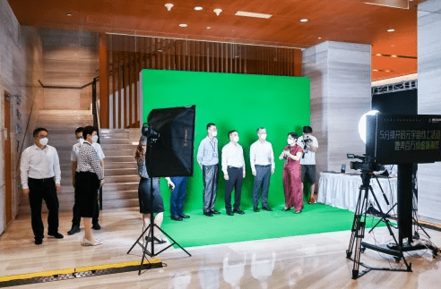
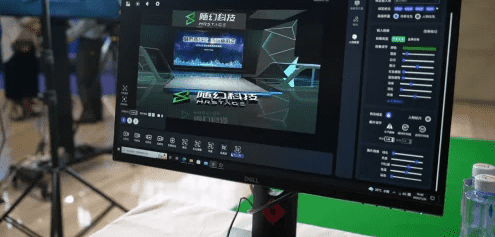
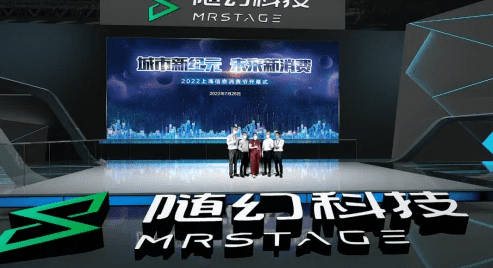

# “随幻空间”惊艳亮相上海信息消费节 共促元宇宙产业“由虚入实”

7月26日，由上海市经信委会、上海市商务委联合主办的2022全国信息消费城市行(上海站)暨上海信息消费节正式拉开序幕。随幻科技作为深耕元宇宙底层3D虚拟技术的科创公司，连续两天参与了开幕式的元宇宙@上海展 和“感知·消费·互联”2022 上海元宇宙峰会两场重磅活动，随幻空间软件也作为元宇宙技术产品在活动中惊艳亮相，吸引了媒体和与会者的广泛关注。

(上海市副市长张为现场体验“随幻空间”产品)

**贯彻“以虚强实”目标 随幻空间致力于让元宇宙空间“触手可及”**

日前，上海公布培育元宇宙新赛道行动方案，方案提出，上海发展元宇宙赛道的技术路线要以“虚实交互”为核心，“以虚强实”为目标。一大批元宇宙企业正从“虚实交互”出发探索元宇宙，随幻科技也不例外。

一个摄像头、一小块绿幕空间，体验者便可以置身发布会、时装周、展览论坛，“多人异地同场”不再是一个概念，而是一种“亲民”的“触手可及”。这种触手可及的元宇宙体验，正是由随幻科技的实时虚拟互动软件产品“随幻空间”所带来。

（“随幻空间”产品在活动现场进行展示）

“随幻空间通过游戏式便捷操作、自助式DIY创作引擎、多地同台的智能实时互动，让人人都能举办线上虚拟活动成为可能。随着技术的升级，我们把成本很高的设备变成了轻量级的设备，把门槛很高的执行动作变成了门槛非常低的自助式软件操作。”上海随幻智能科技有限公司联合创始人、首席架构师谭彬在信息消费节开幕式现场接受中新网记者采访时说道。

（“随幻空间”产品现场融合效果展示）

同样，在27日上海浦东软件园举办的“感知·消费·互联”2022 上海元宇宙峰会上，随幻科技联合生态合作伙伴PPIO边缘云共同进行了产品的重磅发布，当随幻空间软件的3D实时虚拟技术与PPIO边缘云的低延时云渲染方案相互配合，也真正融合打造出了门槛更低、更具普世价值的元宇宙基础设施和工具。

**随幻科技入选“张江元宇宙创新发展联盟” 继续发力元宇宙落地应用场景**

在本次2022 上海元宇宙峰会上，上海市科创办执行副主任、浦东新区区委常委彭崧，市经信委副主任张英，浦东新区科经委副主任夏玉忠，市经信委软件处处长裘薇，市投促中心主任王东，张江集团党委书记、董事长袁涛等人共同见证“张江元宇宙创新发展联盟”正式成立。该联盟旨在整合张江元宇宙产业资源，打造以提升元宇宙产业发展为核心，集研发生产、人才培养、创新应用、数字赋能、品牌推广于一体的合作平台。

**随幻科技作为联盟首批成员入选。**

作为深耕元宇宙底层3D虚拟技术的科创公司，随幻科技有着强大的元宇宙技术积淀，具备3D深度实时虚拟系统、实时光影融合算法、超写实虚拟人与多模态交互技术。随幻科技在此基础上研发并推出的“随幻空间”产品，则通过游戏式便捷操作 + 自助式DIY创作引擎 + 多地同台的智能实时互动，致力于让人人都能举办线上虚拟活动成为可能。

随幻空间产品以海量的3D资源、轻量化的操作和强大的功能自由度，获得了诸多品牌与企业的青睐，目前已经帮助起亚汽车、上汽大众、易车等汽车行业客户；上海时装周、潮宏基、施华蔻等时尚行业客户；中欧基金、德勤中国等金融行业客户；中国信通院、中国日报社、上海科协等企事业单位客户，在线上虚拟发布会、虚拟直播、虚拟线上活动等领域进行了大量落地合作。

（“随幻空间”助力打造中欧基金2022年中期投资策略会）

“元宇宙”作为沉浸式体验、跨空间融合的数字世界新入口，对实体经济的牵引赋能效应巨大。上海的元宇宙产业发展潜力无限，作为其中的一分子，随幻科技也将继续紧抓“以虚强实”的主线目标，持续发力元宇宙技术的实际落地应用，与实体经济发展“虚实结合”，助力实体产业的高质量、可持续发展。
