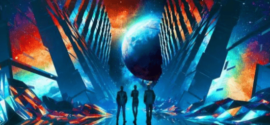

# 辩证地看待元宇宙的发展

我们经常讲原住民，现在有一种叫互联网的原住民，互联网的应用一般来说发展得比较快，都是在互联网原住民比较能接受的东西里面。比如说当年比较快先发的，就是像聊天，像游戏等。

像买菜，这是属于直到最近这两年互联网买菜才成为一个比较流行的，就是因为那个买菜的人群，可能他接触互联网本身就相对比较广的，所以元宇宙也是一样的。我觉得可能相比较快的是那些更能够接受数字技术的年轻人，跟这些有关联性的，可能会在元宇宙的发展会更快。

其实当前全社会基本上都已经学会了用互联网，尤其是都已经学会了移动互联网，所以整个元宇宙的迭代过程可能也会变得更快。我觉得这种互联网的原住民，他们能够去接触的领域可能会更快，但是这个界限也有可能未来会变得模糊。

我觉得区块链也好，元宇宙也好，都是数字经济的一个重要部分。数字经济发展的一个新的一个阶段，所有的这种新的技术，你每一个都可以说是资本的游戏，你也可以说人工智能是资本的游戏，你也可以说大数据是资本游戏，互联网是资本的游戏，我觉得是这样子的，就是第一个资本必然是逐利的，他之所以会被资本所看重，还是因为他本身有比较大的前景，这是第一。那么第二就是说，当然即使资本看对了，那么因为资本的逐利性，很多时候它有无序性，所以在短期之内它有可能会形成泡沫。我觉得我们需要客观辩证来去看，有一句也是被大家广泛引用的话，叫人们往往高估了短期的趋势，而低估了长期的趋势，元宇宙也是属于这种类型。

一方面呢，我们不能够去低估他长期的趋势，我相信元宇宙在未来长期来说是会有比较大的发展前景的，所以这个我们不能去低估，我们要去了解，去学习，包括去预判这样的趋势。企业发展也好，个人发展也好，能够跟这些大的趋势能够去契合起来，这是一个方面。

那么，还有一方面就是也不能够去高估这种短期的趋势，事实上元宇宙它肯定是需要时间，罗马不是一天建成的，所以说不太可能就马上说我们戴上头盔，每天18个小时沉浸在虚拟世界里面不出来，这短期实现不了。

所以你对这个短期的形式，你也有充分的认识，就不要被很多的舆论所引导了，就以为可能就马上就要进入完全元宇宙的时代，导致了这无论是资金上还是资源上，时间上做这种不合实际产业发展当下形式的这个投入，那可能也是徒劳的，无效的，甚至可能会有很大的浪费。
