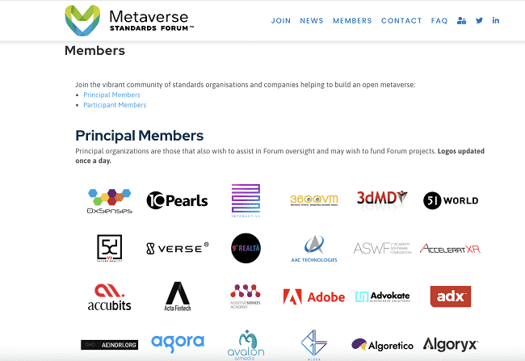
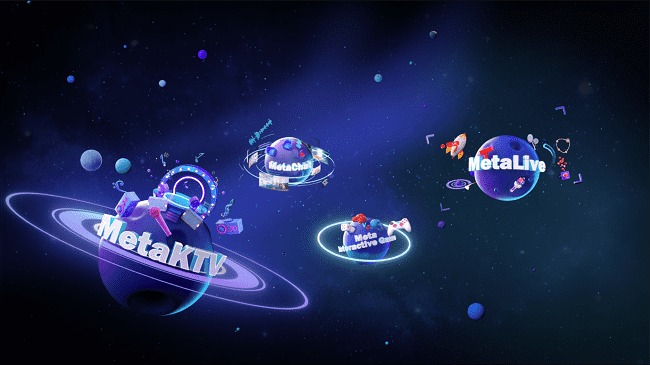

# 全球首个元宇宙国标联盟成立 声网加入成为主要成员

近日，首个元宇宙国际标准联盟“元宇宙标准论坛” Metaverse Standards Forum 正式成立。

**作为全球实时互动行业的开创者和引领者，声网加入其中并成为主要成员（Principal Member）。**该论坛由 Khronos Group 牵头组织，目前参与者包括 Meta、微软、Epic、英伟达、高通、索尼等37家国内外科技巨头。未来，声网将与这些投身元宇宙领域的企业共同构建开放元宇宙所需的互操作性标准。

尽管目前元宇宙还没有一个明确的定义，但科技巨头们已经开始为推动元宇宙的发展而进行合作。据“元宇宙标准论坛”发布的一份最新声明，该组织成立的目的是就构建开放元宇宙所需的互操作性标准进行全行业合作，未来将探讨缺乏互操作性阻碍元宇宙部署的原因，以及如何协调和加速标准开发组织（SDO）定义并推动元宇宙标准制定相关的工作。

“元宇宙”概念是2021年被各行业关注的热点，同时也被认为是下一代互联网新形态，是未来最具发展潜力的方向之一。根据Gartner的最新预测，2026 年 25% 的人每天将至少在元宇宙中工作、购物、学习、社交或娱乐一小时。

即使目前不同行业对于元宇宙最终的定位尚未明确，但虚拟现实融合之下，可以确定的是，元宇宙是一个需要具备高质量、稳定、且具有沉浸感的场景，所有的信息可以实现多向的实时传输与交互，用户在现实生活中的基础五感甚至是空间感、平衡感的感知系统都需要通过新技术得到调动，而这些正是声网提供的实时互动服务所能实现的。准确来说，实时互动技术是元宇宙的底层技术的支撑。

为不断推动元宇宙进化为更贴近于现实体验的技术方案，满足不同虚拟场景中用户对于互动体验的极致追求。声网从技术侧推出了囊括 K 歌、语聊、直播、互动游戏在内的元宇宙社交场景化解决方案，开发者与企业可以一站式接入相关场景功能，快速构建当下最火爆的元宇宙社交场景。并且元宇宙方案中还融入了空间音频技术，让元宇宙拥有更接近真实线下的沉浸感和真实感。

随着元宇宙产业的不断发展前进，开放性和包容性至关重要，因此建立标准才能促进元宇宙中的协作以及让这个新的生态系统真正蓬勃发展，声网将与“元宇宙标准论坛”中的参与者一起加速建设元宇宙新标准，共同完成元宇宙基础建设。
