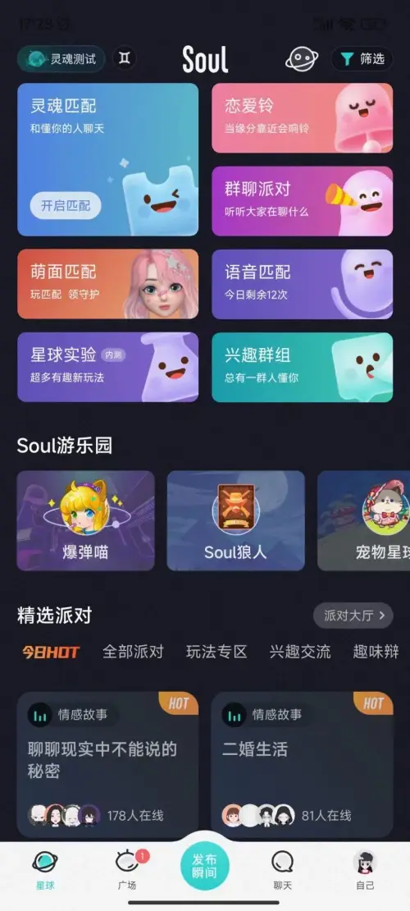
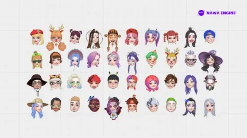

# 灵魂拟港股上市，Soul社交元宇宙概念获多方关注

  在技术飞速迭代的当下，以互联网为载体成长起来的社交App，面临着重重考验。作为国内首个提出元宇宙概念的人气社交产品，[soul](https://www.metabd.cc/navigation/soul/)自上线以来，始终关注提升用户体验。随着企业间竞争日趋激烈，[soul](https://www.metabd.cc/navigation/soul/)谋求发展的同时筹备冲刺港交所上市，拓展了互联网时代的行业发展新道路。

  APP软件依托互联网平台生产市场信息处理中的各种产品，使用户能够获得移动客户端所需的信息内容，使平台更便于用户访问，并实现进一步提高用户粘性的目标。Soul上线于2016年，是国内首个提出元宇宙概念的人气社交产品，基于在深度学习领域的研究能力，将技术与对行业场景的深刻洞察相结合，为用户提供更多优质服务和有趣体验，吸引了越来越多的用户加入。

  作为致力于构建社交元宇宙的平台，[soul](https://www.metabd.cc/navigation/soul/)坚持开放包容、内容共创生态方针，在底层技术创新的基础上助力元宇宙迎来全新的发展。发布自研引擎NAWAEngine(以下简称NAWA)，就是Soul的又一创新举措。该引擎作为Soul研发团队独立打造的渲染引擎，集AI、渲染与图像处理于一体，无论是在技术研发层面还是美术设计层面，都在一定程度上到达了行业头部水平，尤其是3DAvatar的能力。在场景打造与玩法设计等方面，很好地满足了Z世代对元宇宙的进阶需求。

  在互联网时代，行业也需要面对转型的发展。其中，探索用户多元需求是许多行业的未来发展趋势。[soul](https://www.metabd.cc/navigation/soul/)从创立之初便不支持真人照片作为头像，你可以使用Soul独创的“3D捏脸”功能，自已动手设计一个3D头像，创造一个独一无二的全新虚拟化身，并通过“灵魂测试”“引力签”找到真正的自己。在抛开颜值、地理位置等外在因素后，你可以凭借虚拟化身，漫游在各种社交场景中，无压力地自我表达、与他人交互，结交心灵相通的伙伴。

  每个用户都有自己所关心、喜欢的东西，只要了解他们的兴趣所在，自然而然就能够引起用户使用并自发的传播。[soul](https://www.metabd.cc/navigation/soul/)的“广场瞬间”功能，是用户表达情感的窗口。可以记录生活中的喜怒哀乐，并分享给灵魂相似的Souler，在收获即时、有质量的回应的同时，拥有无限温暖和力量。除此之外，[soul](https://www.metabd.cc/navigation/soul/)还创新推出了灵魂匹配、宠物星球、群聊派对、Soul狼人等多元的场景和功能，帮助用户即时互动，享受身临其境的共同体验。

  只有不断提高行业灵敏度，尽快适应相关技术的发展变化，才能在未来的的数字化浪潮中立于不败之地。冲刺港股上市的[soul](https://www.metabd.cc/navigation/soul/)持续增强自身内驱力，帮助优化用户体验，通过用户规模的壮大和用户粘性的提升，走出了一条创新的商业化道路。

  了解更多APP信息可直接在网站搜索。
