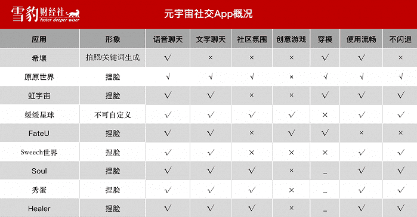
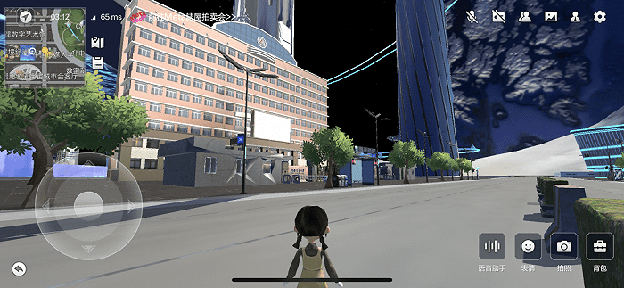
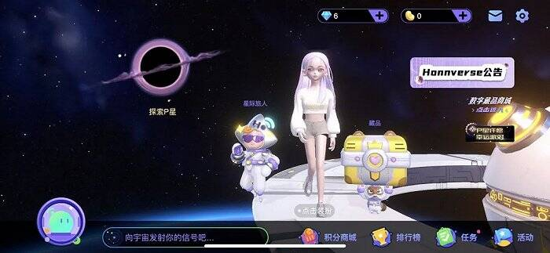
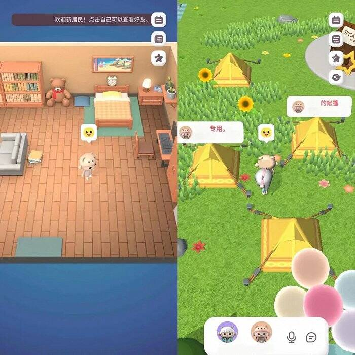
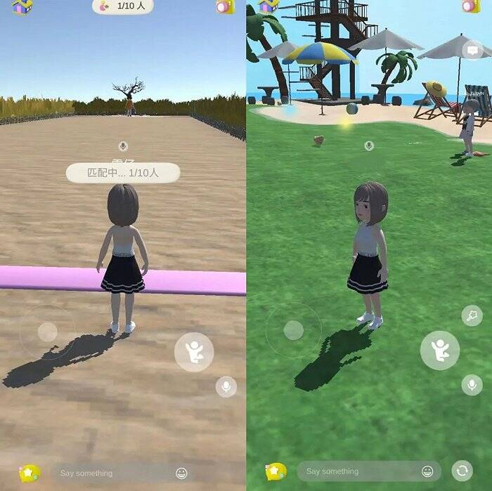

# 552个元宇宙App，70个搞社交，哪款真能交到朋友？

1971年，世界上第一封电子邮件拉开了社交网络发展的序幕。50年后，随着科技的飞速进步和人类精神需求的增加，元宇宙社交应运而生。

为了在这一新兴领域抢占先机，一场圈地运动悄然开启。Sensor Tower数据显示，自“元宇宙”概念爆发以来，平均每天都会新增一个“元宇宙”App。去年11月到今年1月，约有552个App在自己的描述中增添“元宇宙”3个字，平均每天超过6个，其中有70个自称是元宇宙社交App。

目前，元宇宙社交App主要有两种，一种是在虚拟社区的基础上增加了捏脸、虚拟场景等功能，另一种则试图打造一个新的世界或星球，让玩家以新身份在平行世界里生活。

同时，不少元宇宙App的生命周期极为短暂。啫喱、抖音的派对岛，都在引起一阵喧嚣之后光速下架，市面上可供下载的应用其实并不多。

雪豹财经社下载并体验了多个元宇宙社交App，从画面音效、社区氛围、使用体验等多个维度对以下9款进行重点测评，一探元宇宙社交的真面目。

它们是真元宇宙还是会移动的QQ秀？相信读完你会给出自己的判断。

（改图片为雪豹财经社制作）

### 应用测评

**希壤**

**App Store评分：2.2**

**雪豹评分：3**

**画面音效：4**

**社交体验：2**

**App体验：2**

在进入希壤的世界前，你可以选择系统设定的形象，比如男青年或是青蛇小青，也可以一句话生成或者拍照生成自己的专属形象。不过，这个形象可能和你的要求没什么关系。雪豹财经社说了一句“健身女孩”后，希壤生成了一个穿着旗袍的女性形象。

在希壤里，你可以去看看百度阿波罗的无人驾驶车，逛一逛中国传媒大学的校园，甚至可以在操场上跑两圈。

超写实的街道和建筑风格，是希壤区别于其他元宇宙社交App的明显特征。

一家虚拟内容制作公司的创始人告诉雪豹财经社，目前虚拟空间常用的两种建模工具，里面的免费素材包一砖一瓦都是欧式风格。因此，希壤应用介绍里那句“大量中国元素融入其中”背后，百度确实下了血本。

不过，至少从目前看来，这款应用的使用体验还远称不上好。

在希壤可以体验到的生活十分单调，可能也就只有逛逛地图场景，雪豹财经社连续一周在不同时间段登陆希壤，遇到的玩家寥寥无几，更别提交到朋友了。

让人哭笑不得的是，在希壤中随时可能撞上无处不在的穿模bug（物体间或者人物间，因为碰撞体积设定失误导致相互穿透、叠加）。比如，遇到大黄蜂会从他的身体里穿过，导航去某个地方时会看到自己一路穿墙，“目空一切”地奔向目的地。

即使只是静静地站着，也可能出现闪退现象，下载地图或点击屏幕上的其他按钮，属于更“高危”的动作。

**原原世界**

**App Store评分：4.3**

**雪豹评分：4.5**

**画面音效：4**

**社交体验：4.8**

**App体验：4.5**

如果说希壤是朝阳区，那原原世界可能就是朝阳公园的一角。应用里只有4个轰趴馆、4顶帐篷和一个露天舞台，堪称极简版元宇宙。

原原宇宙的画风也比较低幼，不太像面向成年人的应用。不过，由于玩家并不多，这款应用暂时还没有被小学生攻占。

与同类软件相比，让这款App显得更好玩的是其中的玩家。

在雪豹财经社加入的多个元宇宙社交App用户群里，原原世界的群聊人数只有90人，但活跃度和氛围都是最好的，在App中遇到的玩家也都很友好。

雪豹财经社进入原原宇宙后，意外遇到了一群在帐篷里围炉夜话的小伙伴，靠近任意玩家就会自动加入语音群，大家互相打过招呼后，还一起玩了一把狼人杀。

除了基础的社交功能外，原原宇宙首页还有“去k歌”按钮，点击就能够直达名叫“蓝翔音乐学院”的轰趴馆，轰趴馆里配有卡座。上麦后戴上耳机就能听到耳返的声音，取消和开启原唱、调节人声和伴奏音量等KTV常见的功能都有，可选歌曲也很多，歌单里还有周杰伦的歌。

每晚8点，在轰趴馆里有嗨唱环节，还有驻唱歌手，夜晚则在帐篷里有聊天室。

雪豹财经社还在App里遇到了原原宇宙的主创团队。一位开发人员说，他的梦想是同时在线1000人，这个梦想现在看来还有些遥远，但如果能持续维持运营，通过社区氛围留住用户也不失为一个办法。

可能这也是为什么，虽然只有22个评分，但这款应用在App Store里的评分高达4.3分。

**虹宇宙**

**App Store评分：已下线**

**雪豹评分：2.5**

**画面音效：3**

**社交体验：2**

**App体验：3**

“衣服款式很少，我还没有房子，只能天天坐在月亮上，蛮无聊的。”小红书上有人如此评价使用虹宇宙的体验，这句话也基本概括了雪豹财经社在宇宙遨游多日的生活。

综合来说，这是一款先来者吃肉，后来者喝不上汤的游戏。这里的主要社交方式就是串门，用户可以去任意玩家的房子里参观，还能够装修自己的房屋。不过，这也就意味着，如果没有房子，那这个游戏基本没得玩。

“炒房”是虹宇宙最显著的特色。

虹宇宙上的房子，根据级别高低可分为SSS、SS、S、A、B、C六级，其中最稀有的SSS级“闲庭”总发行量只有35套。这款游戏的大部分玩家关心的不是能不能交到朋友，而是手里的房子能不能卖出去，能卖多少钱，要不要再去拍一套。

前期参与内测的玩家，都能够通过做任务获得房屋，去年虚拟地产概念大火时，不少人将自己抽到的房屋拿出来倒卖。12月中旬，一位玩家在小红书称，自己只不过玩了3天，随便做了任务就抽到一个S级房子，在闲鱼卖了3000元，而他“辛辛苦苦工作一个月都赚不到3000块钱”。彼时，一套SS级、编号前100的房子，在闲鱼的报价已经达到了8.8万元人民币。

虹宇宙房产交易火爆以及随之而来的无序，使得闲鱼在去年12月底屏蔽了“元宇宙”“虹宇宙”等关键词，但微信、QQ等玩家群依然是虚拟房产拍卖的聚集地，就连组织拍卖也成了一门生意。

每天晚上8点，雪豹财经社加入的群都会举行一场拍卖会，如果成交额大于500元，拍卖员收取5%的手续费，即使流拍也要收2%的费用。

**缓缓星球**

**App Store评分：仅安卓可用**

**雪豹评分：4.5**

**画面音效：4.5**

**社交体验：4**

**App体验：4.8**

相比起其他元宇宙社交应用，缓缓星球用户数量较多，也较为活跃。雪豹财经社是缓缓星球的第15万+号居民。

缓缓星球的界面和原原世界类似，都是可爱的Q版画风，进入应用时可选择的形象有限，男生和女生各有6款形象可选，也不支持捏脸等自定义功能。好处是一进入就会拥有一个自己的小家，有沙发、桌椅和床可供坐卧。

在缓缓星球出门前，系统会提示选择目的地，包括初代居民聚集地缓缓岛、面向青少年的星星岛和音乐岛。除了能够进入帐篷、咖啡厅等空间聊天外，缓缓星球独特的玩法是能够进行3V3的足球比赛。应用内的沟通主要有两种形式，玩家靠近后就会自动形成语音组，同时相比其他应用会多一个文字聊天的对话框。

在任何时候进入缓缓星球，都能找到人聊天，3个岛加起来的实时在线人数在50人左右浮动。不过，雪豹财经社在缓缓星球体验的多日里，遇到的大多是十几岁的中小学生，常见用户名是“XX是大帅哥”“我长不高了”。

从交互体验看，在缓缓星球遇到障碍物的时候不会卡住，也不会从中穿过，而是会绕行甚至跳过去一下，已经算是元宇宙社交应用里比较顺眼的了。

**FateU**

**App Store评分：仅安卓可用**

**雪豹评分：1**

**画面音效：1**

**社交体验：1**

**App体验：1**

如今的FateU更像是在原本的泛娱乐社交应用上，强行加了一个元宇宙社交的一级入口，就自称“国内首款元宇宙社交App”。但这个宇宙可能生活的都是像“闪电”一样的生物，切换页面的平均时间大于一分钟。进入应用后，是通用的创建形象功能，虽然有换装和捏脸的功能，但是可选的服装并不多，作为较写实的人物形象，头身比也有些奇怪。

FateU首页有3个入口，分别是超级英雄、Club处CP和夏日派对岛。

超级英雄是大热网剧《鱿鱼游戏》同款的123木头人游戏，需要匹配到10个人才能够开始游戏，但雪豹财经社连续多日登录，都没能凑齐10个人。

最有挑战的是夏日派对岛，和好友一起玩躲猫猫时，角色能够随机变成任何东西，比如一个饮料瓶等，但雪豹财经社在岛上转了很多圈，一个人也没抓出来，向遇到的玩家发出好友申请也没有人通过。

从使用体验上来说，无论进入任何页面加载都很慢，人物跑动也很卡顿，因此我们给出的评分只有1分。

### 写在最后

在全球有45.5亿用户的社交媒体赛道融合新兴的元宇宙概念，已经成为让巨头们怦然心动的新蓝海。

清华大学《2020年-2021年元宇宙发展研究报告》称，元宇宙将是虚拟世界与现实世界在经济系统、社交系统和身份系统上的密切融合，在元宇宙世界中的社交媒体，将会是在社交场景中一个与现实平行、实时在线的虚拟世界。

陌生人社交软件Soul也提出过社交元宇宙的概念。按照它的设想，在社交元宇宙中，用户能够通过虚拟化身体来体验多样的沉浸式社交场景，在接近真实的共同体验中建立社交链接。社交元宇宙将具有虚拟化身、社交资产、沉浸感、经济体系和包容性五大特征。

但综合来看，如今的元宇宙社交App，不过是空有一层元宇宙的外壳，还远远达不到“沉浸式社交”。甚至这个外壳也并不精致，人物形象、场景的设置都有一些简单和粗糙。雪豹财经社已经提前做好了包容新兴产品的准备，但结果还是有一些令人失望。

扎克伯格所构想那个使用自己喜爱的虚拟形象，在虚拟空间完成一切活动的元宇宙，还非常遥远。
