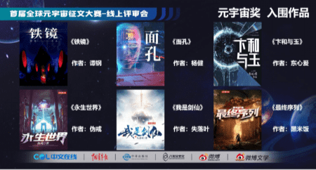
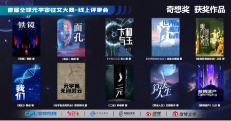
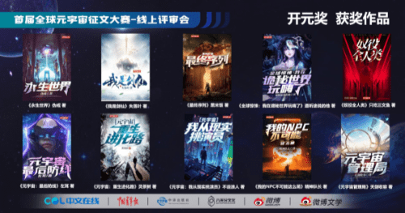

# “首届全球元宇宙征文大赛”获奖作品名单出炉

由中文在线发起的“首届全球元宇宙征文大赛”已于近日落下帷幕。超11000部作品鏖战初赛、60部作品入围，最终共20部作品分别斩获“奇想奖”、“开元奖”，6部作品入围总决选角逐百万“元宇宙奖”……本次大赛在当下荒无人烟的元宇宙世界中，建起了第一座内容的通天塔。

正如中文在线集团董事长兼总裁童之磊在致辞中所言：“每一代互联网，都要有新内容。”他认为，传统物理世界带给了人们“存量”的生命体验，“下一代互联网”元宇宙带给人们的是“增量”的生命体验。在从存量跨越到增量的过程中，有两个维度的“基建工程”必不可少：一个是技术，一个是内容。

“元宇宙”这一概念首次出现在1992年，美国科幻作家尼尔·斯蒂芬森在他的科幻小说《雪崩》中，生动描绘了人类通过数字化身，在脱离现实世界的虚拟世界中生活的场景。以《雪崩》为文学范本，本次大赛构筑了广受业界权威人士认可的元宇宙小说标准。大赛分为了“科幻”和“文学”两个赛区，科幻赛区的“元宇宙”科技硬核特点明显，而文学赛区则在“元宇宙”概念相关的故事雕刻上更加细腻。

“科幻硬核度、文学性、娱乐价值”，是科幻赛区对作品考核的三大标准。“科幻硬核度”即类似区块链、VR、AR等元宇宙技术须作为必要条件渗透在作品中，逻辑自洽且符合科学规律;“文学性”和“娱乐价值”则是要将技术浸入剧情之中而不能是“技术说明书”。科幻赛区“奇想奖”获奖作品《铁镜》就很好地诠释了这一点。著名科幻编辑、大赛评委姚海军对该作品评价道：“这是一篇读起来很有质感的小说，从现实一步步过渡到超现实的情节，在故事中作者对于元宇宙数字空间和现实空间互相倾轧的手段有所思考与超越;而故事中对觉醒人工智能的心理描写丰富且生动，让读者感受到她的困顿处境，并以此联动，让作品中各类角色更加饱满。”

而在“奇想奖”获奖作品《面孔》中，从医学整容为起点，发起对元宇宙的远征。诸如阶层跃迁、医学伦理、数字孪生、时空变幻等主题在剧情中逐次展开，现实世界的纷繁芜杂非常高效地嵌入虚拟世界。在中文在线科幻站总编辑唐风看来，这是一部有温度，有触感的高品质的硬科幻作品，甚至值得多向度的改编。

技术图标构建起元宇宙世界框架，故事则作为撑起元宇宙世界的“血与肉”充盈其中。在元宇宙世界里，人类在现实世界中遇到生存、伦理问题将如何解决，又将如何面对元宇宙的人文世界，在本次文学赛区“开元奖”的多部小说里都有清晰展现。

“开元奖”获奖作品《最终序列》描绘了一个失忆的少年，进入废土游戏，不断修炼，找寻真相，与异族战斗，解救被困在废土虚拟元宇宙世界同胞的励志故事。著名作家、电影编剧今何在评价道，“作者设定庞大新颖，创造了一个核污染的现实世界，与一个虚拟元宇宙的废土世界，将金手指“无限模拟未来”这一元素以主角心脏的形式呈现，完美融入其中。”

现实中昏迷的植物人少年，可以依靠元宇宙技术来重获新生。在“开元奖”获奖作品《我是剑仙》中，元宇宙不仅仅只是虚拟的游戏，而是可以影射且让现实变得更好的医疗工具。网络文学研究专家、北京大学中文系教授邵燕君评价称，“作品恢宏有趣，将不同风格的小说，以元宇宙的方式演化为一个个真实奇特的世界，体验不同人生。”

以技术和故事内核为驱动，既深入畅想技术，又将人文思考带入其中，最终获奖的这20部小说，丰富、立体地揭开了“元宇宙”的神秘面纱。

大赛中，大神作家伪戒的《永生世界》斩获文学赛区“开元奖”，同时也入围了“元宇宙奖”的总决选名单。这部作品用生动的故事传播科学知识，展现出一幅人类未来高科技时代的理想国，也鼓励更多人迈向科学探索之路。中国作家协会网络文学委员会副主任欧阳友权的评价是，“网络文学正在用创作的实践，证明它将不断破圈不断进步。”

入围总决赛的“奇想奖”获奖作品《卞和与玉》是一部被评委定义为“具备现实中元宇宙产业开发启发意义”的优质作品。未来事务管理局局长、大赛评委姬少亭对它的评价是：“这部小说，以物理算法锚定虚拟世界，以数学的确定性赋予虚拟世界的物品以价值的大胆设想，给予了现实中元宇宙技术的发展方向有价值的启示。”

在清华大学新闻与传播学院教授、博士生导师，大赛总决赛评委沈阳看来，“优秀元宇宙文学作品的涌现，对于促进元宇宙产业创新发展，完善元宇宙全产业链具有重大意义;同时，这也将有力推动我国元宇宙产业在部分领域领先世界，提升国内科技文化软实力。”
