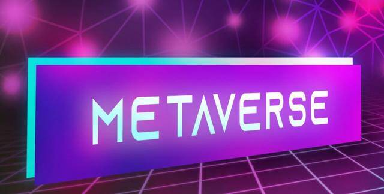

# 数字流行感，极地计划从元宇宙转移到现实世界

Polar 是著名的虚拟世界流行歌星，她计划将她的表演从虚拟世界转移到物理世界。数字流行音乐的团队正在寻求为 Polar 推出现实生活中的首秀。

### Polar 提议的真实世界首次亮相

元界创建的歌手只存在于虚拟环境和一些社交媒体平台上。然而，媒体公司 TheSoul Publishing 的成立将让该品牌进行首次实时冒险。

这位基于元宇宙的流行歌星去年在电子游戏“Avakin Life”中的一张专辑中首次亮相。

此外，她的 TikTok 帐户在 YouTube 上拥有约 160 万粉丝和超过 500,000 名订阅者。

根据 TheSoul Publishing 副总裁 Victor Potrel 的说法，上个月一年一度的太阳之声音乐节吸引了超过 400 万游客，粉丝们与这位虚拟歌手互动。

Polar 指出，她想在现实世界的场景中在实体场地的粉丝面前表演，这可能是迟早的事。

然而， Potrel补充说，虽然虚拟世界中的大量粉丝一直受到关注，但团队正在努力在现实世界中复制同样的内容。

未来合并现实世界和虚拟空间是可能的，因为它将为 Polar 品牌增加更多的流动性。

### 元宇宙如何重新定义娱乐

信不信由你，随着元宇宙的出现，娱乐业将得到巨大的推动。创造力将受到震撼，并获得新的生命。

尽管虚拟现实耳机和增强现实眼镜等高端设备尚未成为主流，但元界正在推动使这些设备更实惠的叙述。

然而，广为人知的图像清晰度仍然需要数年时间才能成为现实。元宇宙激发了人们对那些相信虚拟生态系统可以提供和补充现实世界的人足够的信心。

像马克扎克伯格这样的科技企业家已经投入了大量资源来开发一家以元宇宙为中心的公司，名为 Meta。

另一家科技巨头是谷歌的母公司微软，它进行了战略收购，为虚拟空间做好准备。

尽管元宇宙概念似乎不是下一件大事，但业界正在为此做准备。

一些影迷通过询问有关传统剧院将如何生存的问题，对元宇宙项目持怀疑态度。冠状病毒大流行再次引发了关于开放虚拟电影和音乐会的争论，因为在封锁期间没有使用传统的基础设施。

元宇宙热潮是否会胜利或减弱，由利益相关者决定。尽管如此，数字生态系统的支持者认为，对传统电影院的改变将是渐进的。

尽管存在分歧，但娱乐公司无需赢得整个世界，就可以成功地将元宇宙现实推向消费者。仍然有相当多的粉丝会确保 Metaverse 项目将接管大部分娱乐圈空间。
